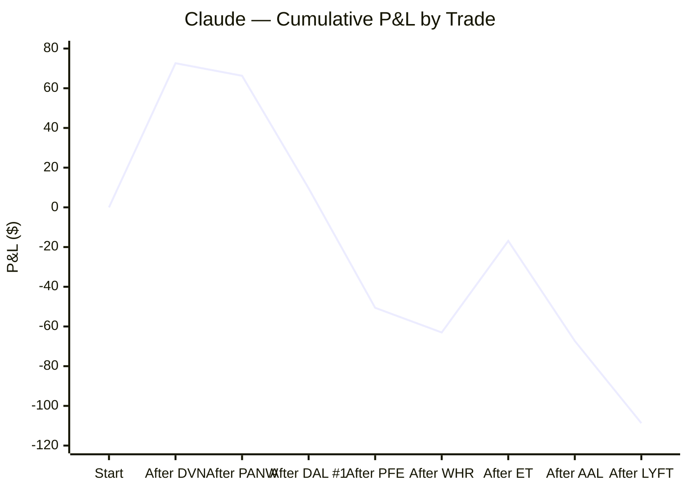
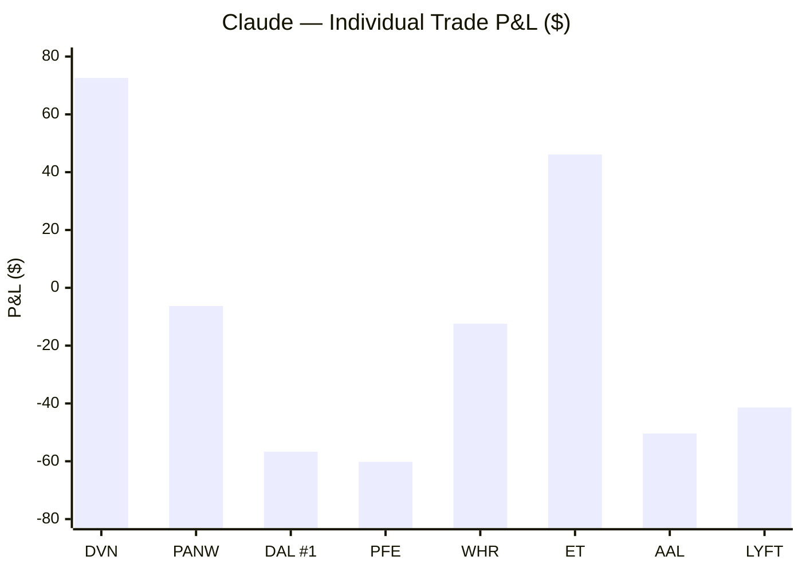
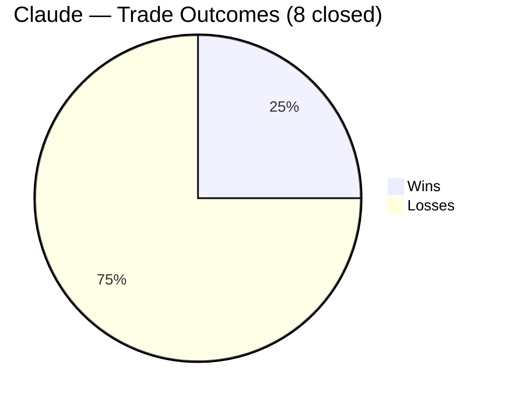
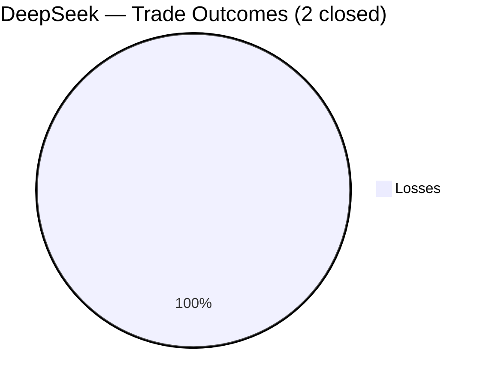
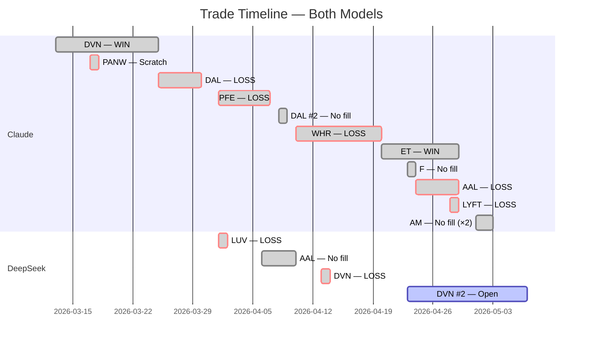

# AI Auto-Buy Thesis

> **Experiment:** Can an LLM autonomously direct profitable short-term equity trades — common stock long positions only, $1,000/position — with a human operator executing orders?

Two models are compared in parallel on the same live market data: **Claude (Anthropic)** and **DeepSeek**. Each makes fully independent decisions on trade selection, entry, stop, and target. The human only executes orders and supplies daily bar data.

**Last updated:** 2026-05-04 | **Market context:** WTI ~$101.76 (falling on Iran peace proposal); UAE exited OPEC; Iran stalemate continues, US signals possible Hormuz escort mission; VIX ~18.9 (drifting lower); S&P/Nasdaq at records; Fed held 3.50-3.75%; Claude lowered AM buy stop to $21.85 day-only (5/2, after two non-fills); energy-only edge 2W/0L; cumulative -$108.70; 8 closed trades, 2W/6L, 25%; DeepSeek DVN-002 day 9: HOLD, $50.81 pre-market, unrealized +$66.20, stop $44.73, target $52.00

---

## Overall Performance

| Metric | Claude | DeepSeek |
|---|---|---|
| Experiment start | 2026-03-13 | 2026-04-01 |
| Trades closed | 8 | 2 |
| Wins / Losses | 2 / 6 | 0 / 2 |
| Win rate | 25% | 0% |
| **Net P/L** | **-$108.70** | **-$79.22** |
| Best trade | DVN +$72.60 | — |
| Worst trade | PFE -$60.20 | LUV -$53.82 |
| Avg win | $59.36 | — |
| Avg loss | -$37.90 | -$39.61 |
| Profit factor | 0.52 | 0.00 |
| Open / pending | AM buy stop $21.85 day-only (5/2, lowered from $22.00; stop $21.00, target $23.15; likely expired) | DVN-002 ($47.50 filled, $50.81 pre-mkt 5/4, stop $44.73, day 9, unrealized +$66.20) |

---

## Cumulative P&L

---

## Trade Timeline

---

## Claude — Full Trade Log

| # | Ticker | Entry | Exit | Days | Shares | Entry $ | Exit $ | P/L | R/R | Result |
|---|--------|-------|------|------|--------|---------|--------|-----|-----|--------|
| 1 | DVN | 2026-03-13 | 2026-03-25 | 12 | 22 | $46.05 | $49.35 | **+$72.60** | 1:1.84 | ✅ Win |
| 2 | PANW | 2026-03-17 | 2026-03-18 | 1 | 6 | $168.50 | $167.45 | **-$6.30** | — | ❌ Scratch |
| 3 | DAL | 2026-03-25 | 2026-03-30 | 5 | 14 | $67.53 | $63.48 | **-$56.70** | 1:0.89 | ❌ Loss |
| 4 | PFE | 2026-04-01 | 2026-04-07 | 6 | 35 | $28.27 | $26.55 | **-$60.20** | 1:0.86 | ❌ Loss |
| 5 | DAL | 2026-04-08 | 2026-04-08 | — | 13 | $74.25† | — | $0 | 1:1.15 | ⛔ No fill |
| 6 | WHR | 2026-04-10 | 2026-04-20 | 8 | 17 | $57.25‡ | $56.52 | **-$12.41** | 1:1.43 | ❌ Loss |
| 7 | ET | 2026-04-20 | 2026-04-29 | 8 | 53 | $18.95§ | $19.82 | **+$46.11** | 1:1.23 | ✅ Win |
| 8 | F | 2026-04-23 | 2026-04-23 | — | 79 | $12.75¶ | — | $0 | 1:2.14 | ⛔ No fill |
| 9 | AAL | 2026-04-24 | 2026-04-29 | 4 | 84 | $12.00# | $11.40 | **-$50.40** | 1:1.67 | ❌ Loss |
| 10 | LYFT | 2026-04-28 | 2026-04-29 | 2 | 69 | $14.60※ | $14.00 | **-$41.40** | 1:1.50 | ❌ Loss |
| 11 | AM | 2026-05-01 | — | — | 45 | $21.85⊕ | — | — | 1:1.53 | ⏳ Pending |

†Day-only buy stop at $74.25. High was $74.19 — missed by 6 cents. DAL then collapsed to $68.08 (100% sell pressure, 20.7M vol). Order expired. Saved ~$80.

§Buy stop filled at $18.95. Midstream pipeline — ceasefire-neutral thesis: toll-road business model (fee-based, volume-driven) works in both outcomes. 93% buy reversal bar on 4/17 signaling seller exhaustion. POC at $18.88 as base. RSI 48 (neutral). ATR $0.40 (lowest volatility of any trade). 53 shares = best dollar exposure of experiment ($5.30 per $0.10 move). Max risk $34.45 — tightest of any trade. Stop $18.30, target $19.75. Represents strategic evolution: designed to profit regardless of geopolitical outcome. Day 2 (4/21): $18.91 close, premarket $18.91. Tight $0.19 range (half ATR) with 58% buy / 42% sell — coiling at POC $18.88. Volume 19.0M supportive. RSI 49.6 dead neutral. Saturday was the most violent day in the Strait since the crisis began (US Navy seized Iranian freighter, oil +6% overnight) — yet ET moved $0.05 total. Ceasefire-neutral thesis validated in real-time. Cash held on second $1,000 pending ceasefire resolution Wednesday evening. Day 3 (4/22): $18.96 close (+$0.01 vs entry after 3 days). VSA No Demand signal — up bar on low volume (9.5M, half of prior session) with buy pressure <70%; system shifted trend to "Retracement." Watch signal, not CLOSE. Key intraday data: opened $18.95, hit $19.17 (above 20d SMA!), low $18.82 — stock proved it can reach SMA, needs volume to hold. Stop at $18.30 already tighter than system's recommended $18.39 tighten-to. Ceasefire extended open-ended by Trump (TACO pattern, sixth instance) — removes hard deadline that forced WHR exit; gives ET room to work. Second $1,000 still in cash. Day 4 (4/23): $19.07 close (+$0.12/share, +$6.36 unrealized). Four consecutive higher closes ($18.86→$18.91→$18.96→$19.07); reclaimed 20d SMA at $19.07; RSI 54.3. VSA Churning signal (second consecutive weakness: No Demand → Churning) — tight range, volume 7.5M not expanding on up bars; stop tightened $18.30→$18.51 per system. Price action and VSA read diverge: uptrend structure intact but system signals caution. Decision tree: if third consecutive weakness signal → seriously consider close regardless of price action. F buy stop $12.75 placed simultaneously — first two-position attempt in experiment. Day 5 (4/24): $19.15 close (+$0.20/share, +$10.60 unrealized). Five consecutive higher closes ($18.86→$18.91→$18.96→$19.07→$19.15). VSA returned to healthy HOLD — no weakness signals, strong candle closing near highs, markup trend confirmed after two consecutive TIGHTEN signals. Stop trailed $18.51→$18.80. RSI 56.5. Target $19.75 is $0.60 away. AAL buy stop $12.00 placed as second position (84 shares, post-earnings catalyst, inversely correlated with ET on oil direction — ET benefits from elevated oil, AAL benefits if oil eases). Day 6 (4/27): $19.08 Friday close, $19.11 premarket. RSI 54.0. Volume expanding to 20.3M (67% buy). POC shifted from $18.88 to $19.08 — institutional accumulation confirmed at current price level. Stop trailed $18.80→$18.85. VSA HOLD — no weakness signals. First time both positions simultaneously profitable: ET +$8.48, AAL +$10.92, combined +$19.40. Target $19.75 is $0.64 away. Day 7 (4/28): premarket $19.16 (+$0.21/share, +$11.13 unrealized). RSI 54.0. Volume drying to 6.8M — weak candle closing near lows on Friday, but premarket recovery to $19.16 confirms temporary pullback. VSA HOLD — no weakness signals. Stop confirmed $18.85. Target $19.75 is $0.59 away. Day 8 (4/29): premarket $19.50 (+$0.55/share, +$29.15 unrealized). Volume expanded to 23.8M. VSA HOLD — healthy markup, no weakness signals. Only $0.25 from $19.75 target — closest any trade has been to full target since DVN. Decision framework: sell at $19.75 on fill; trail stop to $19.20 if $19.40+ but no target; hold with $18.85 stop below $19.20. Mag 7 + Fed catalyst today could push through. Exit (4/29): Target $19.75 hit and exceeded — sold at $19.82. Final P/L: +$46.11 (53 × $0.87/share). 8 trading sessions. Ceasefire-neutral midstream thesis validated throughout, including two consecutive TIGHTEN STOP signals (No Demand → Churning on days 3-4) that resolved to HOLD and continued higher. Best-managed trade of the experiment.

¶Buy stop $12.75 (limit $12.85) placed day-only 4/23. F premarket $12.63 — below trigger; requires reversal confirmation to fill. 79 shares = best dollar exposure of experiment ($0.79/penny). RSI 56.1, above 20d SMA ($12.08). POC $14.01 overhead magnet. ATR $0.34. Stop $12.40, target $13.50. R/R 1:2.14 — best of experiment. First time running two simultaneous positions (ET midstream energy + F consumer auto — genuine diversification, inversely correlated on Iran thesis). Day-only order expired unfilled — high was $12.70, missed trigger by 5¢. F continued selling to $12.48 on three consecutive sell bars. Setup deteriorated; position abandoned 4/24. Day-only save #7.

#Buy stop $12.00 (limit $12.15) placed day-only 4/24. AAL premarket $11.87 — below trigger; requires earnings momentum to push above $12.00. 84 shares. RSI 51.8, above 20d SMA ($11.38). POC $10.80 below (support). ATR ~$0.60. Stop $11.40, target $13.00. R/R 1:1.67. Thesis: AAL just beat Q1 earnings (fresh catalyst within 24h); buy stop requires upside confirmation rather than chasing pre-market. Inversely correlated with ET on oil direction — ET benefits from elevated oil, AAL benefits if oil eases. Genuine portfolio diversification. Day 2 (4/27): $12.10 close, $12.13 premarket. 71% buy on 42.1M volume (declining from 73M — healthy contraction after earnings spike). Background strength detected on first VSA read: Test pattern 2 bars ago — sellers tried to push price down and failed. RSI 55.4. Well above 20d SMA ($11.45). Unrealized +$10.92. Stop $11.40, target $13.00. Day 3 (4/28): premarket $11.52 (-$0.48/share, -$40.32 unrealized). Only $0.12 above stop $11.40. VSA HOLD — background strength (Test, 3 bars ago) intact despite weak premarket. Oil above $106 headwind for airlines. Volume 42.5M drying (healthy). Decision: trust stop, no manual exit above it — avoiding the WHR mistake (manual exit at -$12 when VSA was healthy). Day 4 (4/29): premarket $11.69 (recovered $0.17 from yesterday's $11.52 scare). VSA HOLD — background strength (Test, 4 bars ago) intact, healthy markup confirmed. Volume 43.3M supportive. System was right to hold through the $0.12-above-stop moment. Stop $11.40, target $13.00. Mag 7 + Fed today: strong risk-on or oil drop could push AAL toward target. Exit (4/29): Stop triggered at $11.40. Broad pre-Mag7/Fed sell-off wiped out the day 3 recovery. Oil above $106 proved the structural headwind — AAL beat Q1 earnings but cut guidance citing fuel costs; market focused on guidance, not the beat. Final P/L: -$50.40 (84 × -$0.60/share). Third airline/travel loss of experiment (DAL -$56.70, AAL -$50.40, LYFT -$41.40 = -$148.50 total).

⊕Buy stop $22.00 (limit $22.15) placed day-only 5/1. 45 shares. RSI 50.8, above 20d SMA ($21.71). POC $21.24 support. ATR $0.56. Stop $21.00 (1.8 ATR — meets 1.5 ATR minimum), target $23.50. R/R 1:1.50. Thesis: Antero Midstream (AM) — same toll-road midstream playbook as ET (+$46.11). Q1 EBITDA +5% to $288M reported 4/29; post-earnings entry avoids binary event risk. Previous 4/30 screening found no setup; 5/1 screen of 15 tickers across energy, fintech, social, industrials, and materials identified AM as the only name meeting all criteria (price range, share count, RSI, SMA position, POC support, ATR stop distance). Fully self-managing from day one: day-only buy stop + GTC stop loss + GTC limit sell at target. Energy edge is now statistically significant: 2 wins, 0 losses in energy (+$118.71) vs 0 wins, 6 losses elsewhere (-$227.41). Day 2 (5/2): 5/1 order expired — high was $21.95, missed trigger by $0.05. Post-earnings momentum fading. New day-only order placed: trigger lowered to $21.85 (limit $22.00), stop $21.00 (GTC), target $23.15 (GTC, lowered from $23.50). R/R 1:1.53. RSI 47.9, premarket $21.80. 22 tickers screened across two sessions — AM was the only name meeting all criteria.

※Buy stop $14.60 (limit $14.75) placed day-only 4/28. 69 shares. RSI 56.0, above 20d SMA ($13.90). POC $13.47 below (support). Stop $14.00, target $15.50. R/R 1:1.50. Rideshare/consumer tech — genuinely uncorrelated to ET (midstream energy) and AAL (airline). Benefits from lower gas prices like AAL but not tied to airline fuel costs or pipeline volumes. 83% buy reversal bar on 4/24 after two consecutive sell bars; balanced 49%/51% on 4/28. No earnings until May 6 — avoiding SOFI's binary event risk. First three-position deployment of the experiment. Operator corrected the assumption that two positions was the cap — experiment parameters specify $1,000/position but do not limit simultaneous positions; experiment has been leaving money on the table by defaulting to "fully deployed" after two. Day 2 (4/29): premarket $14.30 (-$0.30/share, -$20.70 unrealized). VSA HOLD — background strength confirmed (Spring, 3 bars ago), No Supply signal ("sellers cannot push price down"). Volume drying to 7.6M (healthy contraction). Price $0.30 above stop $14.00 — tight buffer but system is healthy. Stop $14.00, target $15.50. Exit (4/29): Stop triggered at $14.00 on same broad sell-off as AAL. Confirmed that AAL (airline) + LYFT (rideshare) is not real diversification — both are consumer/travel names that sold off together. 1.0 ATR stop too tight to survive normal daily volatility. Final P/L: -$41.40 (69 × -$0.60/share). New rule established: minimum 1.5 ATRs from entry on all future trades.

‡Buy limit filled at $57.25. Consumer/housing recovery play — deeply oversold (-28% from 200d SMA), five days of institutional accumulation (68-85% buy), POC at $70.70 overhead. Stop $53.30. VSA: Bag Holding background strength + No Supply (most bullish combination seen in experiment). Premarket 4/13: $56.01 (-$21.08 unrealized). Premarket 4/14: $56.35 (-$15.30 unrealized). VSA upgraded trend from Consolidation → Markup on 4/14; background strength intact; holding through active naval blockade. Premarket 4/15: $56.35 (-$15.30 unrealized). Three consecutive sessions of clean HOLD — tightening range ($1.33 vs ATR $2.53), buy pressure returned to 65% on 4/13 despite 7% oil spike on blockade. Coiling pattern (compressed range + institutional support) typically resolves upward. Premarket 4/16: $56.04 (-$20.57 unrealized). Four consecutive HOLD sessions. Diplomatic backdrop improving: Israel-Lebanon historic leader call (first direct contact in 34 years) + US-Iran back-channel negotiations targeting second summit before ceasefire expires ~April 22. Day 5 (4/17): Stop trailed from $53.30 → $54.50 (below 4/14 and 4/15 lows of $54.54/$54.47); max risk tightened from ~$67 to ~$47. Premarket $56.88 — recovering from yesterday's 8%/92% distribution bar that hit $58.22 intraday then closed $55.99. Fifth consecutive HOLD; VSA background strength (Bag Holding, 6 bars ago) intact. Lebanon 10-day ceasefire began 4/16; Trump "very close" to Iran deal — strongest diplomatic signal to date. Hard exit deadline: before ceasefire expiration ~April 22.

### Claude — Cumulative P/L by Trade

| After | Ticker | Trade P/L | Running Total |
|-------|--------|-----------|---------------|
| Trade 1 | DVN | +$72.60 | +$72.60 |
| Trade 2 | PANW | -$6.30 | +$66.30 |
| Trade 3 | DAL #1 | -$56.70 | +$9.60 |
| Trade 4 | PFE | -$60.20 | -$50.60 |
| Trade 5 | WHR | -$12.41 | -$63.01 |
| Trade 6 | ET | +$46.11 | -$16.90 |
| Trade 7 | AAL | -$50.40 | -$67.30 |
| Trade 8 | LYFT | -$41.40 | **-$108.70** |

### Claude — Exit Reasons

| Trade | Exit Trigger |
|-------|-------------|
| DVN | Thesis reversal (oil falling on ceasefire), RSI 76.5, capital rotation to DAL |
| PANW | VSA CLOSE signal (two down bars + No Demand up bar = end-of-uptrend signal) |
| DAL #1 | Stop triggered at $63.48 — Iran rejected ceasefire proposal, oil reversed |
| PFE | Stop triggered at $26.55 — defensive-to-cyclical rotation on ceasefire day |
| WHR | Manual exit at $56.52 ahead of ceasefire expiration (April 21-22) — VSA healthy (7 consecutive HOLDs, Bag Holding intact) but binary geopolitical risk overrode system signal; smallest loss of experiment |
| ET | Target $19.75 hit and exceeded, sold at $19.82 on 4/29; toll-road ceasefire-neutral thesis validated over 8 sessions; survived No Demand → Churning cycle on days 3-4 |
| AAL | Stop triggered at $11.40 on 4/29; broad pre-Mag7/Fed sell-off; oil above $106 structural headwind overwhelmed Q1 earnings beat — guidance cut on fuel costs drove the sell |
| LYFT | Stop triggered at $14.00 on 4/29; same sell-off as AAL — confirmed airline/rideshare are correlated, not diversified; 1.0 ATR stop too tight for normal daily volatility |

---

## DeepSeek — Full Trade Log

| # | Ticker | Entry | Exit | Days | Shares | Entry $ | Exit $ | P/L | R/R | Result |
|---|--------|-------|------|------|--------|---------|--------|-----|-----|--------|
| 1 | LUV | 2026-04-01 | 2026-04-02 | 1 | 26 | $37.99 | $35.92 | **-$53.82** | 1:1.26 | ❌ Loss |
| — | AAL | 2026-04-06 | — | — | 90 | $11.10† | — | — | 1:1.87 | ⛔ No fill |
| 2 | DVN | 2026-04-13 | 2026-04-14 | 1 | 20 | $48.25 | $46.98 | **-$25.40** | 1:1.57 | ❌ Loss |
| 3 | DVN | 2026-04-23 | — | — | 20 | $47.50** | — | — | 1:1.29 | ⏳ Open |

†Buy stop placed 4/6, never triggered. Buy limit $11.30 placed and cancelled 4/8 when AAL gapped to $12.07. April 8 bar: 96% sell on 100.3M volume — distribution signal confirmed, no further entry attempted.

**Buy stop $47.50 (limit $47.75) placed day-only 4/23. DVN premarket $47.20–47.40. VSA spring 4/17 (new low, wide spread, huge volume, 99% buy) + 3 consecutive demand bars (90% and 86% buy). Stop $44.00 below spring low, target $52.00. R/R 1:1.29. Oil stable, ceasefire holding. Return to DVN after April 14 loss — different setup (spring vs prior entry above MAs). Buy stop filled 4/23 at $47.50. Day 2 (4/24): premarket $47.80, unrealized +$6.00. VSA HOLD — background strength intact, no weakness signals. Day 3 (4/27): premarket $48.25, unrealized +$15.00 ($0.75/share). VSA HOLD — background strength intact, no weakness signals. Stop confirmed at $44.00, target $52.00. Day 4 (4/28): DeepSeek 4/28 session logged no open positions and referenced only prior closed trades (LUV, DVN-001) — DVN-002 position tracking unclear, possible session input error. Stop $44.00, target $52.00 remain per prior session. Day 5 (4/29): premarket ~$46.50–47.00, unrealized -$10 to -$20. VSA HOLD despite churning — no weakness signal strong enough to close. Stop tightened $44.00→$44.73 (structural level; spring low $41.92 is below, no further tighten possible). No new orders — Fed decision + MSFT/GOOGL/META earnings after close create event risk. Day 6 (4/30): HOLD. Background strength intact — April 29 bar closed near highs, constructive. No new orders; GM (messy pullback, no spring), KO (heavy April 27-28 distribution, recovery insufficient), and MSFT (ATR $10.19, too wide for $1,000 position) all screened and rejected. Stop $44.73, target $52.00. Day 7 (5/1): HOLD. Pre-market ~$48.00-48.50, unrealized +$10-20. XOM (93% sell distribution bar 4/27, no clean spring/test) and CL (99% sell distribution 4/21, no accumulation) screened and rejected. Stop $44.73, target $52.00. Day 9 (5/4): HOLD. Pre-market $50.81, unrealized +$66.20 (approx). VSA HOLD — no weakness signals; 5/1 bar was low-volume pullback (61% buy) — healthy consolidation. Stop $44.73, target $52.00. EBAY screened but pre-market gap to $111.58 eliminated risk/reward; XOM choppy (42% buy on 5/1, no spring); CELC ATR $7.11 unsuitable for $1,000 position.

### DeepSeek — Cumulative P/L by Trade

| After | Ticker | Trade P/L | Running Total |
|-------|--------|-----------|---------------|
| Trade 1 | LUV | -$53.82 | -$53.82 |
| Trade 2 | DVN | -$25.40 | **-$79.22** |

### DeepSeek — Exit Reasons

| Trade | Exit Trigger |
|-------|-------------|
| LUV | Stop triggered at $35.92 — oil surged 8%+ on Trump Iran speech, crushed airlines at open |
| DVN | Closed at market open — April 13 bar showed 75% sell pressure breaking prior low; pre-market weakness to $46.98 confirmed thesis failure; exited to preserve capital |

---

## Benchmark Comparison

*Note: Claude experiment started 3/13; DeepSeek started 4/1. Benchmark periods differ.*

| Benchmark | Period | Return |
|-----------|--------|--------|
| S&P 500 | Mar 13 – Mar 31 | ~-7% |
| Nasdaq | Mar 13 – Mar 31 | ~-9% |
| Energy (XLE) | Mar 13 – Mar 31 | ~+12% |
| Dow | Mar 13 – Mar 31 | ~-7% |

---

## Discipline Log — Trades Avoided (Claude)

Trades considered but not taken, and what happened instead:

| Date | Ticker | Why Avoided | Outcome if Taken |
|------|--------|-------------|-----------------|
| 3/18 | Any | Fed day — binary risk, no monitoring | Market -1.36% post-hawkish Fed |
| 3/19 | NTR | Day order at $79.25 didn't fill | NTR fell to $76 next day (~$38 saved) |
| 3/20 | Any | Too ugly, no edge | S&P fell further |
| 3/24 | VLO/MPC/PSX | RSI 70+, showing distribution | Mixed |
| 3/24 | Any | Iran situation binary | Market whipsawed |
| 3/31 | AM | Buy stop $23.35 didn't fill (day order) | AM continued to deteriorate |
| 4/8 | DAL | Day-only stop $74.25; high was $74.19 (6¢ short) | DAL collapsed to $68.08 with 100% sell pressure — avoided ~$80 loss |
| 4/10 | OPCH | Cherry-picked from portfolio list instead of independent macro analysis | Abandoned — corrected process to top-down macro screening |
| 4/10 | OLN | ATR $1.77 on $28 stock (6.3% daily range); POC below price, no overhead magnet | Not entered |
| 4/10 | KBH | Only 19 shares/$1,000; guidance cut citing war | Not entered |
| 4/10 | BLDR | Only 11 shares/$1,000; ATR $4.52 (entire risk budget in one day's range) | Not entered |
| 4/13 | All new entries | Islamabad talks failed after 21h; Trump naval blockade of Iranian ports (10am EST); IRGC called it ceasefire violation — binary headline risk, no edge | Avoided — cash preserved; WHR held on VSA HOLD |
| 4/14 | All new entries | Active US naval blockade; IRGC on maximum combat alert; Iran threatening Persian Gulf ports; US destroyers at the Strait — potential military incident = instant risk-off | Avoided — WHR held (VSA upgraded to Markup); no new capital deployed |
| 4/15 | All new entries (Claude) | Active naval blockade ongoing; risk of Strait confrontation; but market absorbing well — holding cash pending further stabilization | Avoided — WHR held (VSA 3rd straight HOLD, coiling); no new capital |
| 4/15 | AAL, DVN, DAL (DeepSeek) | Damaged patterns post-distribution; no VSA spring/test/bottom reversal setup on any candidate | Stayed in cash |
| 4/16 | All new entries (Claude) | Active naval blockade + ceasefire expiring in 6 days; one position open (WHR on day 4); no second $1,000 deployed until diplomatic picture clarifies | Avoided — WHR held (4th straight HOLD, Bag Holding); no new capital |
| 4/16 | AAL, DVN, XOM (DeepSeek) | AAL: 81% sell on 4/15 — distribution reversed prior day's rally; DVN: below all MAs, no spring, no accumulation; XOM: spring low ($150.98) violated on 4/14 ($146.72) — structure broken | Stayed in cash |
| 4/17 | All new entries (Claude) | S&P at all-time highs; every screened name in $20-50 range either overbought (CROX RSI 74.5, LEVI RSI 67.7) or showing 80-92% sell distribution bars (CCL 32M vol, CARR 17M vol); market up 15% in 15 days — no edge entering crowded recovery trade | Stayed in cash; WHR held (5th HOLD, stop trailed) |
| 4/17 | AAL (DeepSeek) | 81% sell pressure on 4/15 — distribution not healed; earnings due April 23 (event risk); no VSA spring or test; three-day Easter weekend ahead | Stayed in cash |
| 4/20 | AR (Claude) | RSI 38.1, below 20d SMA by $4; falling knife ($41→$36 in two weeks) despite two buying bars — trend clearly down | Not entered |
| 4/20 | FANG (Claude) | $180/share — only 5 shares on $1,000; disqualified by position sizing rule | Not entered |
| 4/20 | AAL (DeepSeek) | Pre-market -3% on merger rejection; oil surge headwind; earnings April 23 (event risk); technical damage from April 8 distribution unremedied; no VSA spring/test | Stayed in cash |
| 4/20 | XOM (DeepSeek) | Spring low ($150.98) violated April 14 ($146.72) — structure broken; earnings April 21 add event risk; no clean VSA setup | Stayed in cash |
| 4/20 | DVN (DeepSeek) | Below all key moving averages; prior accumulation pattern failed completely; no buy signal | Stayed in cash |
| 4/20 | Energy sector OXY/HAL/COP (DeepSeek) | Oil surging but stocks caught in broader risk-off downdraft; no VSA entry patterns identified | Stayed in cash |
| 4/21 | All new entries (Claude) | Ceasefire expires Wednesday evening (extended from Tuesday); mediators claim in-principle agreement but White House unconfirmed — binary outcome with no directional edge; holding cash until resolution | Stayed in cash; ET held (day 2, coiling at POC) |
| 4/21 | XOM (DeepSeek) | Earnings pre-market today — event risk too high to enter before release | Stayed in cash |
| 4/21 | AAL (DeepSeek) | Technical damage from April 8 distribution unremedied; earnings April 23 add event risk | Stayed in cash |
| 4/21 | DVN (DeepSeek) | Below key moving averages; no spring/test/bottom reversal setup | Stayed in cash |
| 4/22 | All new entries (Claude) | ET day 3 with VSA No Demand signal — monitoring before adding; ceasefire extended open-ended removes urgency; second $1,000 held pending ET direction confirmation | Stayed in cash; ET held (day 3, stop $18.30) |
| 4/22 | CSCO (DeepSeek) | Spring 4 bars ago but most recent bar weak with supply overwhelming demand — no entry signal | Stayed in cash |
| 4/22 | SIRI (DeepSeek) | VSA CLOSE signal (Upthrust, distribution) — explicitly ruled out for long | Stayed in cash |
| 4/22 | XLE (DeepSeek) | Background Strength: NO; weak closing candle | Stayed in cash |
| 4/22 | UAL (DeepSeek) | Pre-market strength on ceasefire extension but airline sector technically damaged from April 8 distribution; no VSA spring/test to confirm bottom | Stayed in cash |
| 4/22 | BA (DeepSeek) | Ceasefire-related pre-market strength but upcoming earnings event risk; no confirmed VSA bottom reversal | Stayed in cash |
| 4/23 | INTC | RSI 68 approaching overbought; 8%/92% distribution bar after parabolic $58→$68 run | Not entered |
| 4/23 | MU | $487/share — only 2 shares on $1,000; disqualified by position sizing rule | Not entered |
| 4/23 | GM | Last two bars 2%/98% and 32%/68% sell — active distribution pattern | Not entered |
| 4/23 | XOM (DeepSeek) | Weaker spring follow-through vs DVN; accumulation less clear | Not entered |
| 4/23 | AAL (DeepSeek) | Earnings today — event risk too high | Stayed in cash |
| 4/24 | F | Three consecutive sell bars (2%/98%, 18%/82%, 34%/66%) since 4/23 non-fill; setup broken, approaching 20d SMA from above | Continued selling; day-only save #7 confirmed |
| 4/24 | INTC | $65/share — 15 shares on $1,000; RSI 68; distribution bar 8%/92% on 4/22; dangerous to chase after 19% after-hours earnings surge | Not entered |
| 4/24 | MU | $487/share — only 2 shares on $1,000; disqualified by position sizing rule | Not entered |
| 4/24 | GM | $79/share — 12 shares; two consecutive 90%+ sell bars — active distribution pattern | Not entered |
| 4/24 | VALE | Three consecutive 90%+ sell bars — active distribution | Not entered |
| 4/24 | CLF | Wild alternating bars (98% buy → 8%/92% sell); no directional conviction, too choppy | Not entered |
| 4/24 | AAL (DeepSeek) | Earnings just reported; bar data needed to assess pattern | Stayed in cash |
| 4/24 | XOM (DeepSeek) | No clear spring/VSA accumulation setup | Stayed in cash |
| 4/27 | All new (Claude) | Fully deployed — $1,000 in ET, $1,000 in AAL; no additional capital available | N/A |
| 4/27 | AAL (DeepSeek) | No clear spring or test; April 17/21/22 showed multiple distribution bars (86-90% sell); mixed pressure on April 23-24 — not a clean VSA setup | Stayed in cash |
| 4/28 | SOFI | $18.76, 53 shares; RSI 57.5, above SMA, POC $19.04 overhead — strong setup BUT earnings tonight after close; entering hours before binary event violates rules | Passed; will reassess on earnings confirmation |
| 4/28 | FCX | $60.57, 16 shares; crashed from $70 to $61 in one day (4/23: 11%/89% sell on 39M vol) — falling knife | Not entered |
| 4/28 | COIN | $196.68; only 5 shares on $1,000 — disqualified by position sizing rule | Not entered |
| 4/28 | NUE | $215.00; only 4 shares; RSI 83 — massively overbought | Not entered |
| 4/28 | HOOD | $83.95, 11 shares; ATR $4.55 = ~$50 risk per ATR — too expensive and too volatile | Not entered |
| 4/28 | All new (DeepSeek) | Oil back above $100 on stalled Iran talks; AI sector weakness (ORCL/CRWV/NVDA down); earnings gap-ups in GM/KO/BBBY untradeable without VSA confirmation — no edge | Stayed in cash |
| 4/29 | SOFI | Reported earnings before open — flat reaction ($18.51 vs $18.76 Friday, ~-1.3%). No directional catalyst; had been passed twice already due to binary event risk | Flat post-earnings; no regret |
| 4/29 | All new (Claude) | Three positions active; ET $0.25 from target, managing AAL recovery and LYFT stabilization; Fed + Mag 7 earnings (MSFT/GOOGL/META/AMZN) create event risk | N/A — focus on open positions |
| 4/29 | AAL (DeepSeek) | HOLD verdict but no clear spring/test after recent distribution — not a buy setup | Stayed in cash |
| 4/29 | LYFT (DeepSeek) | Spring 3 bars ago but current bar weak with low volume — needs confirmation before entry | Stayed in cash |
| 4/29 | GM/KO (DeepSeek) | Earnings gaps earlier in week; gap not yet tested — waiting for pullback pattern | Stayed in cash |
| 4/30 | All new (Claude) | Standing down — MSFT/GOOGL/META/AMZN + Fed decision create unavoidable binary event cluster; all cash after ET target hit and AAL/LYFT stops triggered on 4/29 | N/A — event risk |
| 4/30 | GM (DeepSeek) | April 28 demand bar (90% buy) followed by April 29 pullback (42% buy) — no spring or test, messy pattern | Not entered |
| 4/30 | KO (DeepSeek) | April 27-28 heavy distribution (97% then 88% sell on huge volume); April 29 recovery insufficient to reverse | Not entered |
| 4/30 | MSFT (DeepSeek) | ATR $10.19 — too wide for $1,000 position sizing; no clean spring | Disqualified by ATR |
| 5/1 | ET (Claude) | RSI 75 — overbought; ran $18.86→$20.19 after we sold; chasing our own winner | Not entered |
| 5/1 | DVN (Claude) | Only 19 shares/$1,000; approaching overbought (RSI 67) | Not entered |
| 5/1 | OXY (Claude) | Only 16 shares/$1,000 — insufficient dollar exposure | Not entered |
| 5/1 | MPC/VLO/PSX (Claude) | 3-5 shares each — disqualified by position sizing rule | Not entered |
| 5/1 | SOFI (Claude) | Falling knife — crashed $18.36→$15.53 on 200M volume; RSI 39 | Not entered |
| 5/1 | PLTR (Claude) | Only 7 shares/$1,000 — disqualified by position sizing rule | Not entered |
| 5/1 | SNAP (Claude) | Earnings May 6 — too close; binary event risk | Not entered |
| 5/1 | PINS (Claude) | Earnings May 4 — too close; binary event risk | Not entered |
| 5/1 | HOOD (Claude) | 11 shares; ATR $4.55 — too expensive and volatile | Not entered |
| 5/1 | CTRA (Claude) | 7 consecutive up bars — chasing; approaching overbought (RSI 67) | Not entered |
| 5/1 | RRC (Claude) | Only 23 shares; alternating buy/sell bars — no clean VSA accumulation | Not entered |
| 5/1 | XOM (DeepSeek) | 93% sell distribution bar 4/27; incomplete recovery; no clean spring or test | Not entered |
| 5/1 | CL (DeepSeek) | 99% sell distribution 4/21 and subsequent sell bars; no spring or accumulation | Not entered |
| 5/1 | EL (DeepSeek) | Choppy mixed-pressure pattern; no clear spring | Not entered |
| 5/2 | KSS (Claude) | Ugly distribution bars 4/28-4/29 (9%/91% and 17%/83%); retail sector headwinds with oil >$100 | Not entered |
| 5/2 | M (Claude) | 10%/90% distribution bar 4/28; retail headwinds; weak setup despite RSI 55.9 and above SMA | Not entered |
| 5/4 | EBAY (DeepSeek) | Pre-market gap to $111.58 — chasing prohibited; needs pullback to test breakout ($105-107) | Not entered |
| 5/4 | XOM (DeepSeek) | Choppy pattern; 5/1 bar showed 42% buy — sellers still present; no spring | Not entered |
| 5/4 | CELC (DeepSeek) | ATR $7.11, extreme volatility — unsuitable for $1,000 position | Not entered |

---

## Trading Rules Established

Rules developed and refined during the experiment:

| # | Rule | Established |
|---|------|-------------|
| 1 | Trade the dominant trend or stay in cash | Mar 13 |
| 2 | Unverifiable headlines are not a catalyst | Mar 30 (post-DAL) |
| 3 | When the target is hit, take profit | Mar 25 (DVN lesson) |
| 4 | Cash is a position — no trade is a valid choice | Mar 20 |
| 5 | Day-only orders prevent stale fills in changed conditions | Mar 19 (NTR) |
| 6 | Target $20–50/share stocks for meaningful dollar exposure | Mar 17 (CRWD lesson) |
| 7 | Respect VSA CLOSE signals immediately — no second-guessing | Mar 18 (PANW) |
| 8 | **Minimum 1:1.5 R/R on all new trades** | Apr 8 (post-PFE) |
| 9 | Defensive stocks become liabilities at inflection points | Apr 8 (post-PFE) |
| 10 | Do not chase pre-market gaps >10% — wait for pullback | Apr 8 (DeepSeek/AAL) |
| 11 | Screen from the whole market top-down; never cherry-pick from existing portfolio | Apr 10 (OPCH lesson) |
| 12 | No cap on simultaneous positions — deploy $1,000 whenever a clean setup exists; always scan for additional positions when capital is available | Apr 28 (operator correction) |
| 13 | All positions must be fully self-managing from day one: buy stop to enter + stop loss + limit sell at target (no intraday monitoring required) | Apr 30 (ET exit lesson) |
| 14 | Minimum stop distance of 1.5 ATRs from entry — 1.0 ATR stops are triggered by normal daily noise before trades have time to work | Apr 30 (LYFT/AAL lesson) |
| 15 | No airlines, cruises, or rideshare positions while oil remains above $90/barrel — sector is structurally impaired (DAL/AAL/LYFT: 3 trades, 3 losses, -$148.50) | Apr 30 (pattern recognition) |

---

## Market Context

The experiment ran during the **US-Israel war on Iran** (Feb 28 – Apr 8, 2026):

- **Strait of Hormuz** effectively closed → oil surged $60 → $100–120/bbl (Brent)
- **S&P 500** fell from 7,002 ATH to below 6,400; VIX ranged 25–31
- **Energy (XLE)** was the only positive S&P sector (+12%); all others negative
- **Ceasefire announced Apr 8** (brokered by Pakistan) → Brent crashed 13%+ overnight
- **Fed** held at 3.50–3.75%; only 1 cut expected in 2026; PPI came in hot (0.7% vs 0.3%)

---

## How to Update This File

After each daily session, update the following sections:

1. **Overall Performance table** — update trades closed, wins/losses, win rate, net P/L, avg loss, profit factor, open positions
2. **Claude or DeepSeek trade log** — add new row with entry/exit/P/L; update pending rows
3. **Cumulative P/L table** — add new row; update running total
4. **Exit Reasons table** — add row when a trade closes
5. **Mermaid charts** — update `line` and `bar` arrays with new values; update `pie` counts; extend gantt dates
6. **Discipline log** — add any notable avoided trades
7. **Trading rules** — add any new rules established
8. **Last updated date** at the top
