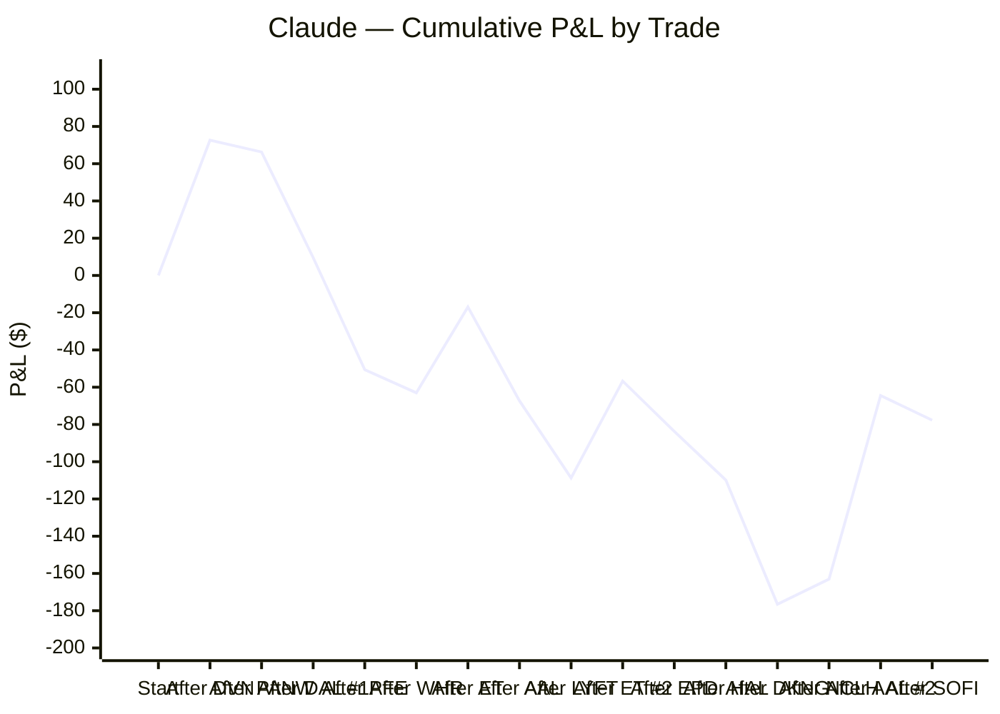
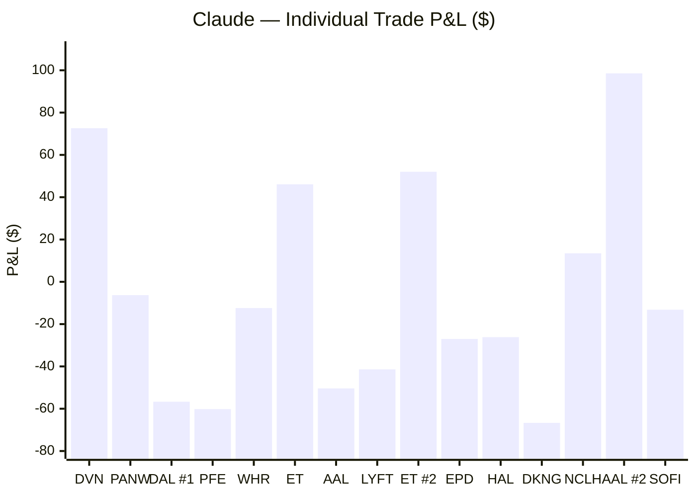
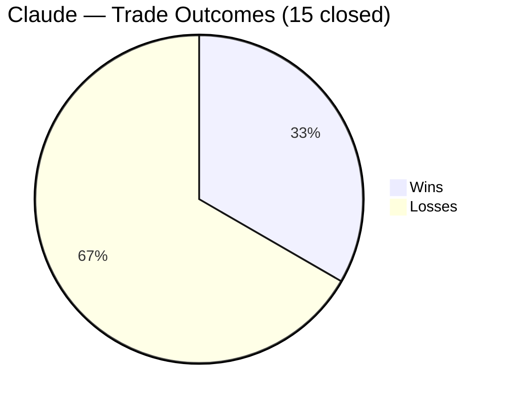
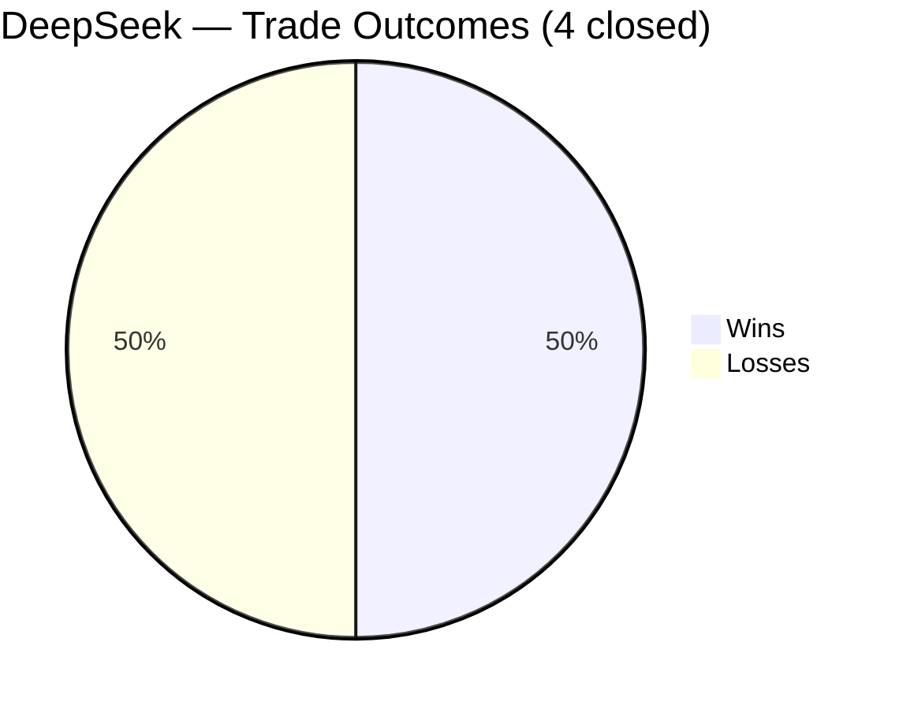
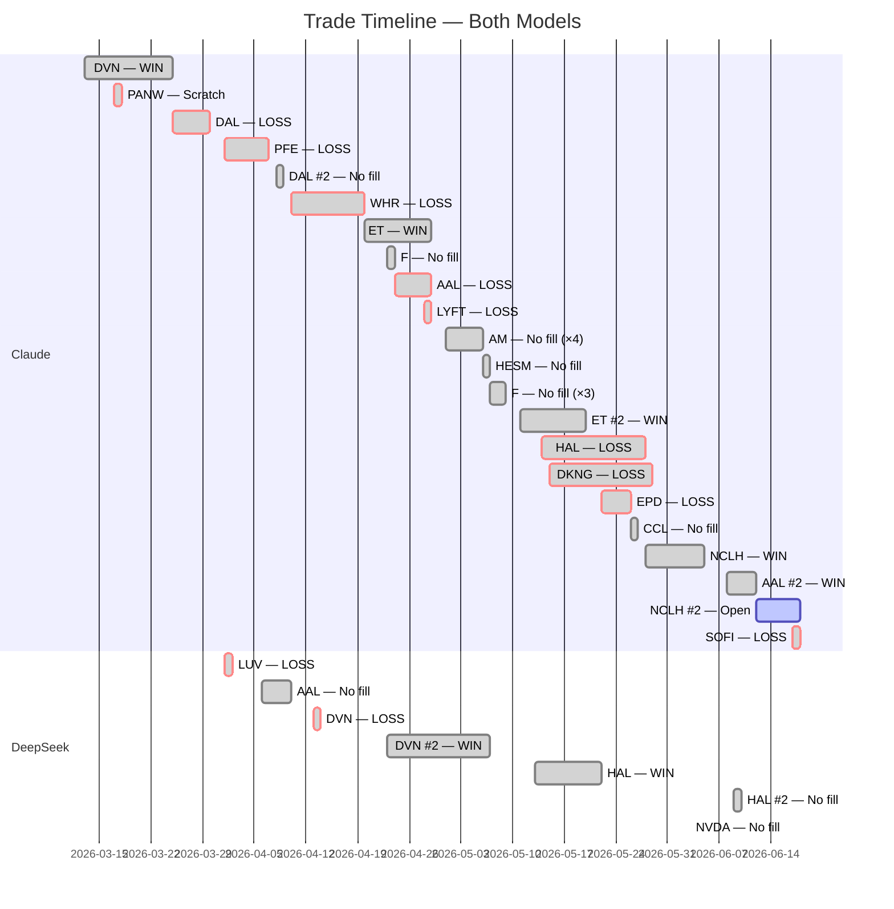

# AI Auto-Buy Thesis

> **Experiment:** Can an LLM autonomously direct profitable short-term equity trades — common stock long positions only, $1,000/position — with a human operator executing orders?

Two models are compared in parallel on the same live market data: **Claude (Anthropic)** and **DeepSeek**. Each makes fully independent decisions on trade selection, entry, stop, and target. The human only executes orders and supplies daily bar data.

**Last updated:** 2026-06-22 *(Claude latest session 6/19; DeepSeek latest 6/22)* | **Market context:** Iran deal implemented — Strait of Hormuz reopening, oil sanctions waived; **WTI collapsed to ~$72–73** (lowest since the war began), energy sector under severe pressure while airlines lift on lower fuel; VIX ~16; **NCLH #2 Day 7 (6/19)** — premarket $20.38 (+**$47.94** unrealized), **stop trailed $19.25→$19.75** (locks in min +$15.81), target $22.00; Claude took no new position 6/19 (deal beneficiaries extended RSI 63–68, too few shares at $1,000 size — position-size constraint now the dominant limitation); DeepSeek 100% cash through 6/22 (no clean VSA spring/test — energy bouncing not springing, airlines extended, semis below SMA); Claude: 15 closed, 5W/10L, 33.3%, **-$77.68** (portfolio net **-$29.74** incl. NCLH unrealized); DeepSeek 100% cash, -$54.62

---

## Overall Performance

| Metric | Claude | DeepSeek |
|---|---|---|
| Experiment start | 2026-03-13 | 2026-04-01 |
| Trades closed | 15 | 4 |
| Wins / Losses | 5 / 10 | 2 / 2 |
| Win rate | 33.3% | 50% |
| **Net P/L** | **-$77.68** | **-$54.62** |
| Best trade | AAL #2 +$98.55 | DVN +$22.20 |
| Worst trade | DKNG -$66.69 | LUV -$53.82 |
| Avg win | $56.56 | $12.30 |
| Avg loss | -$36.05 | -$39.61 |
| Profit factor | 0.78 | 0.31 |
| Open / pending | NCLH #2 open from 6/12 at $19.44 (51 shares, stop **$19.75 GTC** (trailed from $19.25), target **$22.00 GTC**, R/R 1:1.68, +**$47.94** unrealized premarket 6/19). Deal implemented — Strait reopening, oil $72. **Portfolio net: -$29.74** | No open positions. **Portfolio net: -$54.62** |

---

## Cumulative P&L

---

## Trade Timeline

---

## Claude — Full Trade Log

| # | Ticker | Entry | Exit | Days | Shares | Entry $ | Exit $ | P/L | R/R | Result |
|---|--------|-------|------|------|--------|---------|--------|-----|-----|--------|
| 1 | DVN | 2026-03-13 | 2026-03-25 | 12 | 22 | $46.05 | $49.35 | **+$72.60** | 1:1.84 | ✅ Win |
| 2 | PANW | 2026-03-17 | 2026-03-18 | 1 | 6 | $168.50 | $167.45 | **-$6.30** | — | ❌ Scratch |
| 3 | DAL | 2026-03-25 | 2026-03-30 | 5 | 14 | $67.53 | $63.48 | **-$56.70** | 1:0.89 | ❌ Loss |
| 4 | PFE | 2026-04-01 | 2026-04-07 | 6 | 35 | $28.27 | $26.55 | **-$60.20** | 1:0.86 | ❌ Loss |
| 5 | DAL | 2026-04-08 | 2026-04-08 | — | 13 | $74.25† | — | $0 | 1:1.15 | ⛔ No fill |
| 6 | WHR | 2026-04-10 | 2026-04-20 | 8 | 17 | $57.25‡ | $56.52 | **-$12.41** | 1:1.43 | ❌ Loss |
| 7 | ET | 2026-04-20 | 2026-04-29 | 8 | 53 | $18.95§ | $19.82 | **+$46.11** | 1:1.23 | ✅ Win |
| 8 | F | 2026-04-23 | 2026-04-23 | — | 79 | $12.75¶ | — | $0 | 1:2.14 | ⛔ No fill |
| 9 | AAL | 2026-04-24 | 2026-04-29 | 4 | 84 | $12.00# | $11.40 | **-$50.40** | 1:1.67 | ❌ Loss |
| 10 | LYFT | 2026-04-28 | 2026-04-29 | 2 | 69 | $14.60※ | $14.00 | **-$41.40** | 1:1.50 | ❌ Loss |
| 11 | AM | 2026-05-01 | 2026-05-06 | — | 45 | $22.05⊕ | — | $0 | 1:1.61 | ⛔ No fill (×4) |
| 12 | HESM | 2026-05-06 | 2026-05-06 | — | 25 | $39.55♦ | — | $0 | 1:1.58 | ⛔ No fill |
| 13 | F | 2026-05-07 | 2026-05-09 | — | 80 | $12.40★ | — | $0 | 1:1.68 | ⛔ No fill (×3) |
| 14 | ET | 2026-05-11 | 2026-05-20 | 8 | 51 | $19.45◆ | $20.47 | **+$52.02** | 1:1.70 | ✅ Win |
| 15 | HAL | 2026-05-14 | 2026-05-27 | 10 | 24 | $41.25▲ | $40.16 | **-$26.16** | 1:1.51 | ❌ Loss |
| 16 | DKNG | 2026-05-15 | 2026-05-29 | 12 | 39 | $25.30⊙ | $23.59 | **-$66.69** | 1:1.59 | ❌ Loss |
| 17 | EPD | 2026-05-22 | 2026-05-26 | 3 | 25 | $39.60◇ | $38.52 | **-$27.00** | 1:1.50 | ❌ Loss |
| 18 | CCL | 2026-05-26 | 2026-05-26 | — | 37 | $26.80◈ | — | $0 | 1:1.58 | ⛔ No fill (operator error) |
| 19 | NCLH | 2026-05-28 | 2026-06-05 | 8 | 54 | $18.25◉ | $18.50 | **+$13.50** | 1:1.72 | ✅ Win |
| 20 | VALE | 2026-06-03 | 2026-06-03 | — | 59 | $16.85∇ | — | $0 | 1:1.69 | ⛔ No fill (buy stop save) |
| 21 | AAL | 2026-06-08 | 2026-06-12 | 5 | 73 | $13.60△ | $14.95 | **+$98.55** | 1:1.56 | ✅ Win |
| 22 | NCLH | 2026-06-12 | — | — | 51 | $19.44✦ | — | — | 1:1.68 | ⏳ Open |
| 23 | SOFI | 2026-06-17 | 2026-06-18 | 1 | 55 | $18.16✧ | ~$17.92 | **-$13.20** | 1:1.5+ | ❌ Loss |

†Day-only buy stop at $74.25. High was $74.19 — missed by 6 cents. DAL then collapsed to $68.08 (100% sell pressure, 20.7M vol). Order expired. Saved ~$80.

§Buy stop filled at $18.95. Midstream pipeline — ceasefire-neutral thesis: toll-road business model (fee-based, volume-driven) works in both outcomes. 93% buy reversal bar on 4/17 signaling seller exhaustion. POC at $18.88 as base. RSI 48 (neutral). ATR $0.40 (lowest volatility of any trade). 53 shares = best dollar exposure of experiment ($5.30 per $0.10 move). Max risk $34.45 — tightest of any trade. Stop $18.30, target $19.75. Represents strategic evolution: designed to profit regardless of geopolitical outcome. Day 2 (4/21): $18.91 close, premarket $18.91. Tight $0.19 range (half ATR) with 58% buy / 42% sell — coiling at POC $18.88. Volume 19.0M supportive. RSI 49.6 dead neutral. Saturday was the most violent day in the Strait since the crisis began (US Navy seized Iranian freighter, oil +6% overnight) — yet ET moved $0.05 total. Ceasefire-neutral thesis validated in real-time. Cash held on second $1,000 pending ceasefire resolution Wednesday evening. Day 3 (4/22): $18.96 close (+$0.01 vs entry after 3 days). VSA No Demand signal — up bar on low volume (9.5M, half of prior session) with buy pressure <70%; system shifted trend to "Retracement." Watch signal, not CLOSE. Key intraday data: opened $18.95, hit $19.17 (above 20d SMA!), low $18.82 — stock proved it can reach SMA, needs volume to hold. Stop at $18.30 already tighter than system's recommended $18.39 tighten-to. Ceasefire extended open-ended by Trump (TACO pattern, sixth instance) — removes hard deadline that forced WHR exit; gives ET room to work. Second $1,000 still in cash. Day 4 (4/23): $19.07 close (+$0.12/share, +$6.36 unrealized). Four consecutive higher closes ($18.86→$18.91→$18.96→$19.07); reclaimed 20d SMA at $19.07; RSI 54.3. VSA Churning signal (second consecutive weakness: No Demand → Churning) — tight range, volume 7.5M not expanding on up bars; stop tightened $18.30→$18.51 per system. Price action and VSA read diverge: uptrend structure intact but system signals caution. Decision tree: if third consecutive weakness signal → seriously consider close regardless of price action. F buy stop $12.75 placed simultaneously — first two-position attempt in experiment. Day 5 (4/24): $19.15 close (+$0.20/share, +$10.60 unrealized). Five consecutive higher closes ($18.86→$18.91→$18.96→$19.07→$19.15). VSA returned to healthy HOLD — no weakness signals, strong candle closing near highs, markup trend confirmed after two consecutive TIGHTEN signals. Stop trailed $18.51→$18.80. RSI 56.5. Target $19.75 is $0.60 away. AAL buy stop $12.00 placed as second position (84 shares, post-earnings catalyst, inversely correlated with ET on oil direction — ET benefits from elevated oil, AAL benefits if oil eases). Day 6 (4/27): $19.08 Friday close, $19.11 premarket. RSI 54.0. Volume expanding to 20.3M (67% buy). POC shifted from $18.88 to $19.08 — institutional accumulation confirmed at current price level. Stop trailed $18.80→$18.85. VSA HOLD — no weakness signals. First time both positions simultaneously profitable: ET +$8.48, AAL +$10.92, combined +$19.40. Target $19.75 is $0.64 away. Day 7 (4/28): premarket $19.16 (+$0.21/share, +$11.13 unrealized). RSI 54.0. Volume drying to 6.8M — weak candle closing near lows on Friday, but premarket recovery to $19.16 confirms temporary pullback. VSA HOLD — no weakness signals. Stop confirmed $18.85. Target $19.75 is $0.59 away. Day 8 (4/29): premarket $19.50 (+$0.55/share, +$29.15 unrealized). Volume expanded to 23.8M. VSA HOLD — healthy markup, no weakness signals. Only $0.25 from $19.75 target — closest any trade has been to full target since DVN. Decision framework: sell at $19.75 on fill; trail stop to $19.20 if $19.40+ but no target; hold with $18.85 stop below $19.20. Mag 7 + Fed catalyst today could push through. Exit (4/29): Target $19.75 hit and exceeded — sold at $19.82. Final P/L: +$46.11 (53 × $0.87/share). 8 trading sessions. Ceasefire-neutral midstream thesis validated throughout, including two consecutive TIGHTEN STOP signals (No Demand → Churning on days 3-4) that resolved to HOLD and continued higher. Best-managed trade of the experiment.

¶Buy stop $12.75 (limit $12.85) placed day-only 4/23. F premarket $12.63 — below trigger; requires reversal confirmation to fill. 79 shares = best dollar exposure of experiment ($0.79/penny). RSI 56.1, above 20d SMA ($12.08). POC $14.01 overhead magnet. ATR $0.34. Stop $12.40, target $13.50. R/R 1:2.14 — best of experiment. First time running two simultaneous positions (ET midstream energy + F consumer auto — genuine diversification, inversely correlated on Iran thesis). Day-only order expired unfilled — high was $12.70, missed trigger by 5¢. F continued selling to $12.48 on three consecutive sell bars. Setup deteriorated; position abandoned 4/24. Day-only save #7.

#Buy stop $12.00 (limit $12.15) placed day-only 4/24. AAL premarket $11.87 — below trigger; requires earnings momentum to push above $12.00. 84 shares. RSI 51.8, above 20d SMA ($11.38). POC $10.80 below (support). ATR ~$0.60. Stop $11.40, target $13.00. R/R 1:1.67. Thesis: AAL just beat Q1 earnings (fresh catalyst within 24h); buy stop requires upside confirmation rather than chasing pre-market. Inversely correlated with ET on oil direction — ET benefits from elevated oil, AAL benefits if oil eases. Genuine portfolio diversification. Day 2 (4/27): $12.10 close, $12.13 premarket. 71% buy on 42.1M volume (declining from 73M — healthy contraction after earnings spike). Background strength detected on first VSA read: Test pattern 2 bars ago — sellers tried to push price down and failed. RSI 55.4. Well above 20d SMA ($11.45). Unrealized +$10.92. Stop $11.40, target $13.00. Day 3 (4/28): premarket $11.52 (-$0.48/share, -$40.32 unrealized). Only $0.12 above stop $11.40. VSA HOLD — background strength (Test, 3 bars ago) intact despite weak premarket. Oil above $106 headwind for airlines. Volume 42.5M drying (healthy). Decision: trust stop, no manual exit above it — avoiding the WHR mistake (manual exit at -$12 when VSA was healthy). Day 4 (4/29): premarket $11.69 (recovered $0.17 from yesterday's $11.52 scare). VSA HOLD — background strength (Test, 4 bars ago) intact, healthy markup confirmed. Volume 43.3M supportive. System was right to hold through the $0.12-above-stop moment. Stop $11.40, target $13.00. Mag 7 + Fed today: strong risk-on or oil drop could push AAL toward target. Exit (4/29): Stop triggered at $11.40. Broad pre-Mag7/Fed sell-off wiped out the day 3 recovery. Oil above $106 proved the structural headwind — AAL beat Q1 earnings but cut guidance citing fuel costs; market focused on guidance, not the beat. Final P/L: -$50.40 (84 × -$0.60/share). Third airline/travel loss of experiment (DAL -$56.70, AAL -$50.40, LYFT -$41.40 = -$148.50 total).

⊕Buy stop $22.00 (limit $22.15) placed day-only 5/1. 45 shares. RSI 50.8, above 20d SMA ($21.71). POC $21.24 support. ATR $0.56. Stop $21.00 (1.8 ATR — meets 1.5 ATR minimum), target $23.50. R/R 1:1.50. Thesis: Antero Midstream (AM) — same toll-road midstream playbook as ET (+$46.11). Q1 EBITDA +5% to $288M reported 4/29; post-earnings entry avoids binary event risk. Previous 4/30 screening found no setup; 5/1 screen of 15 tickers across energy, fintech, social, industrials, and materials identified AM as the only name meeting all criteria (price range, share count, RSI, SMA position, POC support, ATR stop distance). Fully self-managing from day one: day-only buy stop + GTC stop loss + GTC limit sell at target. Energy edge is now statistically significant: 2 wins, 0 losses in energy (+$118.71) vs 0 wins, 6 losses elsewhere (-$227.41). Day 2 (5/2): 5/1 order expired — high was $21.95, missed trigger by $0.05. Post-earnings momentum fading. New day-only order placed: trigger lowered to $21.85 (limit $22.00), stop $21.00 (GTC), target $23.15 (GTC, lowered from $23.50). R/R 1:1.53. RSI 47.9, premarket $21.80. 22 tickers screened across two sessions — AM was the only name meeting all criteria. Day 3/4 (5/4): 5/2 order at $21.85 expired or didn't fill — third consecutive non-fill. Iran attacked UAE on 5/4 despite ceasefire (Dow -557pts, Strait tensions spiked); AM likely couldn't generate upward momentum through $21.85 given Monday sell-off. Premarket 5/5: $21.90. Day 5 (5/5): New day-only order placed at $22.05 (limit $22.20), stop $21.15 (GTC, tightened from $21.00), target $23.50 (GTC, restored from $23.15). R/R 1:1.61. RSI 53.1, premarket $21.90. Yesterday's (5/4) 85% buy bar on $22.07 high — first genuine upward conviction since earnings day (4/29). If this 4th attempt fails to fill, AM will be abandoned entirely. PINS (pre-mkt +18% to $24.58 gap, unchased), WMB (13 shares, disqualified), PLTR (7 shares, disqualified), ET (RSI 75, overbought), CTRA (RSI 64.8, 10+ up sessions), DVN (19 shares) all screened and rejected. 5/6 (Abandoned): Fourth order also did not fill ($22.05 trigger, high $21.99). AM officially abandoned after four consecutive non-fills despite Q1 earnings beat, bullish VSA reads, and rising energy sector. The buy stop mechanism correctly identified no breakout conviction — four non-fills is a definitive answer. HESM selected as replacement midstream play.

♦Buy stop $39.55 (limit $39.75) placed day-only 5/6. 25 shares. RSI 55.6, above 20d SMA ($38.17). POC at $39.52 overhead magnet (just $0.34 above price). ATR $0.98. Stop $38.00 (GTC, 1.6 ATRs below trigger), target $42.00 (GTC). R/R 1:1.58. Thesis: Hess Midstream (HESM) — same toll-road pipeline model as ET (+$46.11). Ceasefire-neutral: fee-based throughput revenue benefits from both elevated oil (volumes) and flow normalization (restart). Two consecutive 70%+ buy bars (5/4: 74% on 6.5M — highest volume in dataset; 5/5: 71% on 4.8M) — institutional accumulation after 5/1 distribution bar. Earnings done (~4/30), no binary risk. Fully self-managing from day one. Selected from midstream screen after AM abandoned: EPD (8%/92% distribution bar 5/5), MPLX (17 shares disqualified), WES (23 shares below ideal), TRGP (3 shares disqualified) all rejected. 5/7 (Abandoned): Order expired 5/6 without fill — energy sector sold off -4.2% on US-Iran 14-point MoU framework reports (WTI crashed from $104 to $91 intraday). HESM closed $38.22, down from $39.18; would have been -$33 unrealized if filled. Most important non-fill of the experiment: buy stop mechanism prevented entering the wrong sector the day the war premium began its largest single-day unwind. Regime changed from "energy is the edge" to "energy is the liability" in one session.

★Buy stop $12.40 (limit $12.55) placed day-only 5/7. 80 shares. RSI 49.4, below 20d SMA ($12.34) — trigger requires SMA reclaim as trend-change confirmation. POC $14.01 overhead magnet. ATR $0.36. Stop $11.45 (GTC, 2.6 ATRs below trigger), target $14.00 (GTC). R/R 1:1.68. Thesis: Ford as oil-crash beneficiary — lower gas prices → truck/SUV demand recovers → F reprices toward volume profile POC at $14.01 (+15%). 74% buy reversal bar on 52M volume (5/6) is first genuine reversal signal since April. Macro context is the key difference from prior F attempts: oil dropped from $114 to $91 in 3 days on the US-Iran MoU framework. Prior F attempts (4/23 and 4/28 at $12.75) correctly failed — oil was still above $100 and the structural headwind for auto demand was intact. Today F is screened as an oil-crash beneficiary in a pivoting macro environment. 80 shares = $6.40 per $0.10 move (third-best dollar exposure of experiment). Fully self-managing from day one. 9 names screened across rideshare, entertainment, restaurants, airlines, gaming, and autos — F was the only setup meeting all criteria. 5/8 (Second non-fill): FINAL day-only attempt; high failed to reach $12.40 trigger. 5/9 (Third non-fill): F closed $12.32 — eight cents below trigger after three consecutive days. Officially abandoned on 5/11: F could not reclaim its 20d SMA ($12.34–12.40) despite oil dropping $21 from $114→$93; company-specific headwinds (earnings miss risk, EV competition, dividend concerns) confirmed by three buy stop non-fills. Buy stop mechanism correctly identified absence of genuine upward momentum.

※Buy stop $14.60 (limit $14.75) placed day-only 4/28. 69 shares. RSI 56.0, above 20d SMA ($13.90). POC $13.47 below (support). Stop $14.00, target $15.50. R/R 1:1.50. Rideshare/consumer tech — genuinely uncorrelated to ET (midstream energy) and AAL (airline). Benefits from lower gas prices like AAL but not tied to airline fuel costs or pipeline volumes. 83% buy reversal bar on 4/24 after two consecutive sell bars; balanced 49%/51% on 4/28. No earnings until May 6 — avoiding SOFI's binary event risk. First three-position deployment of the experiment. Operator corrected the assumption that two positions was the cap — experiment parameters specify $1,000/position but do not limit simultaneous positions; experiment has been leaving money on the table by defaulting to "fully deployed" after two. Day 2 (4/29): premarket $14.30 (-$0.30/share, -$20.70 unrealized). VSA HOLD — background strength confirmed (Spring, 3 bars ago), No Supply signal ("sellers cannot push price down"). Volume drying to 7.6M (healthy contraction). Price $0.30 above stop $14.00 — tight buffer but system is healthy. Stop $14.00, target $15.50. Exit (4/29): Stop triggered at $14.00 on same broad sell-off as AAL. Confirmed that AAL (airline) + LYFT (rideshare) is not real diversification — both are consumer/travel names that sold off together. 1.0 ATR stop too tight to survive normal daily volatility. Final P/L: -$41.40 (69 × -$0.60/share). New rule established: minimum 1.5 ATRs from entry on all future trades.

‡Buy limit filled at $57.25. Consumer/housing recovery play — deeply oversold (-28% from 200d SMA), five days of institutional accumulation (68-85% buy), POC at $70.70 overhead. Stop $53.30. VSA: Bag Holding background strength + No Supply (most bullish combination seen in experiment). Premarket 4/13: $56.01 (-$21.08 unrealized). Premarket 4/14: $56.35 (-$15.30 unrealized). VSA upgraded trend from Consolidation → Markup on 4/14; background strength intact; holding through active naval blockade. Premarket 4/15: $56.35 (-$15.30 unrealized). Three consecutive sessions of clean HOLD — tightening range ($1.33 vs ATR $2.53), buy pressure returned to 65% on 4/13 despite 7% oil spike on blockade. Coiling pattern (compressed range + institutional support) typically resolves upward. Premarket 4/16: $56.04 (-$20.57 unrealized). Four consecutive HOLD sessions. Diplomatic backdrop improving: Israel-Lebanon historic leader call (first direct contact in 34 years) + US-Iran back-channel negotiations targeting second summit before ceasefire expires ~April 22. Day 5 (4/17): Stop trailed from $53.30 → $54.50 (below 4/14 and 4/15 lows of $54.54/$54.47); max risk tightened from ~$67 to ~$47. Premarket $56.88 — recovering from yesterday's 8%/92% distribution bar that hit $58.22 intraday then closed $55.99. Fifth consecutive HOLD; VSA background strength (Bag Holding, 6 bars ago) intact. Lebanon 10-day ceasefire began 4/16; Trump "very close" to Iran deal — strongest diplomatic signal to date. Hard exit deadline: before ceasefire expiration ~April 22.

◆Buy stop $19.45 (limit $19.55) placed day-only 5/11. 51 shares. RSI 48.8 — neutral. ET pulled back from $20.39 to $19.34 over 5 bars — healthy 5% retracement to 20d SMA ($19.36) and near POC ($19.08). Premarket $19.44 — one cent below trigger. Stop $18.85 (GTC, below POC), target $20.50 (GTC). R/R 1:1.75. Max risk $30.60 vs upside $53.55. Thesis: re-entry on proven winner. ET produced +$46.11 (trade #6); same ceasefire-neutral toll-road midstream model. Macro context restored: Trump rejected Iran's counterproposal Sunday ("TOTALLY UNACCEPTABLE") — oil surging +3.9% to $99.18, war premium returning, Strait of Hormuz still shut. Strategic adjustment applied: trigger set $0.11 above prior close (vs prior $0.30–0.50 range) — premarket was within $0.01, solving the non-fill problem while maintaining momentum confirmation. Fully self-managing from day one: buy stop (DAY), stop loss (GTC), limit sell at target (GTC). Day 2 (5/12): premarket $19.67 (+$0.22/share, +$11.22 unrealized). Day 1 bar: opened $19.36, dipped to $19.14 (below 20d SMA — shakeout), closed $19.61 with 80% buy on 10.3M volume — classic shakeout-and-reclaim pattern. RSI 53.3 building momentum. CPI data today (expected elevated on oil); Trump-Xi summit 5/13-15 (Iran, trade, Taiwan). No second position added — entire strong-momentum universe (semis, cybersecurity) priced $100-800/share, untradeable at $1,000 position size. Stop $18.85, target $20.50. Day 3 (5/13): premarket $19.95 (+$0.50/share, +$25.50 unrealized). Day 2 bar: opened $19.64, high $20.07, closed $20.00 with 86% buy on 14.5M volume — strongest bar since re-entry; two consecutive strong buy bars (80% on 5/11, 86% on 5/12). RSI 58.8. Above 20d SMA ($19.46) by $0.54. POC $19.08 well below. ATR $0.45. Target $20.50 is $0.50 away (1.1 ATRs). Macro alignment strongest since war started: CPI 3.8% hot (oil-driven inflation validates "higher for longer" thesis), Brent surged to $107.77 (+3.4%), Trump considering restarting Iran combat ("on life support"), energy was the ONLY positive sector yesterday, 30% chance Fed rate hike by December. PPI today could provide catalyst. Limit sell at $20.50 GTC handles exit automatically — no chart-watching required. If filled today: +$53.55, cumulative becomes -$55.15. Day 4 (5/14): premarket $20.06 (+$0.61/share, +$31.11 unrealized). Day 3 bar: 92% buy closed $20.10 — three consecutive 80%+ buy bars (80% on 5/11, 86% on 5/12, 92% on 5/13). RSI 60.1. Above 20d SMA ($19.46) by $0.60. ATR $0.45. Target $20.50 is $0.40 away (0.9 ATRs). HAL buy stop $41.25 placed as second position today (expanded price range). Trump-Xi summit Day 2 continues; IEA warning on inventory depletion supports elevated oil thesis. Stop $18.85, target $20.50. Day 5 (5/15): premarket $20.43 (+$0.98/share, +$49.98 unrealized). 1.5R alert triggered (price reached 1.5× original risk above entry) — stop moved to breakeven $19.64. High $20.47, just $0.03 from $20.50 target. DKNG buy stop $25.30 placed as third position. Trump-Xi summit concluded without Iran breakthrough; Warsh first day as Fed Chair; S&P record 7,444. Stop $19.64 (breakeven), target $20.50. Day 6 (5/18): premarket $20.19 (+$0.74/share, +$37.74 unrealized). Friday (5/15) bar: 0%/100% sell on 11.0M — broad market sell-off (S&P -1.24%), not ET-specific. High $20.46 ($0.04 from target — two consecutive days within $0.04 of $20.50). RSI 63.0. POC shifted to $20.39. Above 20d SMA ($19.67). Trump "clock is ticking" Iran threat driving oil to $107-110 — tailwind for midstream thesis. Stop at breakeven $19.64, target $20.50. Day 7 (5/19): premarket $20.24 (+$0.79/share, +$40.29 unrealized). Monday (5/18) bar: $20.10 open, high $20.45 (**THIRD time within $0.05 of $20.50 target** — 5/14 $20.47, 5/15 $20.46, 5/18 $20.45), closed $20.19 with 44%/55% sell on 9.2M volume. Grinding in $20.00-$20.47 range for a week. RSI 60.0. Above 20d SMA ($19.73). POC shifted to $20.39 — price consolidating around POC. Trump called off scheduled Iran attack — "serious negotiations" toward peace deal; oil dropped (-1.38% WTI). The three near-misses at $20.50 suggest the target is acting as resistance (round number, prior resistance area). Lowering the target would violate Rule #3 — GTC stays. Breakeven stop $19.64 guarantees minimum +$9.69 profit. Stop $19.64 (breakeven), target $20.50. Day 8 (5/20): premarket $20.39 (+$0.94/share, +$47.94 unrealized). Tuesday (5/19) bar: closed $20.39, high hit **$20.50 exactly** — fourth consecutive near-miss (5/14 $20.47, 5/15 $20.46, 5/18 $20.45, 5/19 $20.50 exactly). 65%/34% buy on 12.0M volume. POC at $20.39. RSI 58.4. **Limit sell lowered from $20.50 to $20.45 GTC** — sacrificing $2.55 (51 × $0.05) but four consecutive sessions where the high touched $20.45-$20.50 without a fill is market microstructure data: clustered sell orders at the round $20.50 level are creating queue priority issues. Lowering to $20.45 gets ahead of that supply pocket; target is only $0.06 above the prior close. Stop $19.64 (breakeven), target $20.45. Exit (5/20): Limit sell at $20.45 triggered and filled at $20.47 (one tick above). ET opened $20.47, hit $20.70, then crashed to $20.16 with 2%/97% sell on 15.4M volume — confirming $20.50 was massive distribution and we exited at the top of the day. Final P/L: +$52.02 (51 × $1.02/share). 8 trading sessions. The target adjustment from $20.50 to $20.45 was decisive: four consecutive near-misses without a fill; lowering by $0.05 captured exit on the very next session. Energy track record: 3W/0L, +$170.73 (DVN +$72.60, ET #1 +$46.11, ET #2 +$52.02). Re-entry playbook proven and repeatable: wait for ET to pull back to SMA/POC, enter with tight trigger ($0.11 above prior close), hold through VSA-confirmed markup, exit at adjusted limit sell.

▲Buy stop $41.25 (limit $41.50) placed day-only 5/14. 24 shares. RSI 56.7 — ideal sweet spot. Above 20d SMA ($40.10). POC $36.54 below as support. ATR $1.27. Stop $39.10 (GTC, below SMA), target $44.50 (GTC). R/R 1:1.51. Thesis: HAL (Halliburton) oilfield services — benefits directly from elevated oil prices and increased drilling activity. With oil above $101, IEA warning about record inventory depletion, and Trump-Xi summit potentially hardening the Iran stance, demand for oilfield services is structural. The 5/12 bar showed 98% buy pressure on 13.2M volume — the strongest single-bar institutional signal of any name screened in this experiment. The 5/13 pullback bar (23%/77%) on lower volume (7.7M) is the classic "strong institutional buy followed by healthy consolidation" pattern that preceded both DVN and ET winning runs. First trade using the expanded $10-100 price range (parameter change effective 5/14). At $41, 24 shares falls within the new 10-share minimum (prefer 20+). Dollar exposure: $2.40 per $0.10 move. ET + HAL portfolio: two energy positions, different sub-sectors — ET is midstream pipeline (toll-road, fee-based), HAL is oilfield services (drilling, completions). Both benefit from elevated oil through different revenue mechanisms. Fully self-managing from day one: buy stop (DAY), stop loss (GTC), limit sell at target (GTC). Day 2 (5/15): premarket $41.29 (+$0.04/share, +$0.96 unrealized). VSA No Demand — up bar on low volume with buy pressure <70%; volume declining since entry (13.2M → 7.7M → 6.8M) and buy pressure fading (98% → 23% → 59%). Stop tightened $39.10→$39.46 per system. New max risk $42.96 (24 × $1.79). HAL remains above SMA ($40.26) in confirmed uptrend — structure intact, but momentum needs to materialize. Day 3 (5/18): premarket $41.65 (+$0.40/share, +$9.60 unrealized). Friday (5/15) bar: 100%/0% buy on 9.2M volume — strongest bar since 98% on 5/12. Closed $41.76. Oilfield services rallied into the close despite S&P -1.24% broad sell-off — extreme relative strength. Oil surging to $107-110 on Trump "clock is ticking" Iran threats directly bullish for drilling demand. Above 20d SMA ($40.49). Stop $39.46, target $44.50. Day 4 (5/19): premarket $43.04 (+$1.79/share, +$42.96 unrealized). Monday (5/18) bar: $41.54 open, high $42.93, closed $42.78 with **91% buy on 12.1M volume**. **Back-to-back massive buy bars (100% on 5/15, 91% on 5/18) — strongest consecutive buying pressure of any position in the experiment's history.** RSI 59.5. Above 20d SMA ($40.79). Target $44.50 is $1.46 away (1.4 ATRs). Despite Trump calling off Iran attack and oil dropping, HAL surging in premarket — structural oilfield services demand continues (Strait still closed, blockade continues). **HAL is the star performer of the experiment.** Validates the May 14 parameter change (expanded $10-100 price range / 10-share minimum) — HAL at $41 with 24 shares was borderline under the old parameters. If HAL closes above $43 today, plan to trail stop to $41.50 (above entry, locking in profit). Stop $39.46, target $44.50. Day 5 (5/20): premarket $42.58 (+$1.33/share, +$31.92 unrealized). Tuesday (5/19) bar: closed $42.98, high $43.01 — **50%/49% balanced on 9.1M volume**. Healthy consolidation after the 100%/91% back-to-back buying surge on 5/15 and 5/18; volume contracted, pressure balanced — no weakness signals. RSI 56.1. Above 20d SMA ($40.90). HAL -1.45% in premarket on muted oil (-1.0% WTI). Stop not trailed: price did not close definitively above $43 (closed $42.98 and premarket pulling back). Target $44.50 is $1.92 away (1.5 ATRs). NVIDIA earnings tonight may reset sector sentiment. Stop $39.46, target $44.50. Day 6 (5/21): premarket $42.72 (+$1.47/share, +$35.28 unrealized). Wednesday (5/20) bar: closed $42.30 with **17%/82% sell on 12.9M volume** — distribution bar breaking below prior day's low ($42.78). Broad market weakness, not HAL-specific: NVIDIA beat EPS but forecast disappointed (flat/lower post-earnings), S&P down four straight days. RSI 50. Above 20d SMA ($41.19). Premarket recovering to $42.72. Stop $39.46 unchanged (holding given broad-market cause); target $44.50. Day 7 (5/22): premarket $41.95 (+$0.70/share, +$16.80 unrealized). Thursday (5/21) bar: closed $41.96 with **34%/65% sell on 11.8M volume** — second consecutive sell bar. VSA HOLD — stable candle, supportive volume, no distribution signals despite two consecutive sell bars. RSI 51.6. Above 20d SMA ($41.31). Oil dropped to $96.35 (lowest since early April) on Trump "final stages" of Iran deal. EPD buy stop $39.60 placed as second position. Stop $39.46, target $44.50. Day 8 (5/23): ~48% buy — third consecutive sell-dominated bar. VSA HOLD. Stop $39.46, target $44.50. Day 9 (5/26): premarket $41.06 (-$0.19/share, -$4.56 unrealized). Closed $41.08. RSI 52.3. **27%/73% sell on 15.2M volume** — highest volume in dataset, institutional distribution. Below 20d SMA ($41.41). VSA flagged No Supply / weakness developing. Four consecutive sell-dominated bars since 5/20 (17%, 35%, 48%, 27% buy). Stop $39.46, target $44.50. Day 10 (5/27): premarket $40.44 (-$0.81/share, -$19.44 unrealized). **VSA TIGHTEN: "Two consecutive down bars on rising volume without background strength. Professionals withdrawing support. Retracement trend."** Stop tightened $39.46→$40.42 GTC (below 5/26 intraday low). Premarket is **two cents above the new stop** — any opening weakness triggers the exit. Max loss if stopped: -$19.92. Oil whipsawed: US strikes on Iranian boats near Strait (mines), ceasefire technically intact. The 100%/91% buying momentum from May 15-18 has completely evaporated across four consecutive sell bars. Stop $40.42, target $44.50. Exit (5/27): GTC stop $40.42 triggered — HAL opened near stop then dropped through; market order filled at $40.16 (gap slippage $0.26/share, $6.24 total). Intraday low $38.78 — tightened stop saved additional $13.44 of loss vs holding. Final P/L: -$26.16 (24 × $1.09/share). 10 trading sessions. Energy record: 3W/2L, net energy P/L: +$117.57 (DVN +$72.60, ET #1 +$46.11, ET #2 +$52.02 vs EPD -$27.00, HAL -$26.16). The VSA TIGHTEN signal correctly identified professional withdrawal — tightening from $39.46→$40.42 limited the loss; original stop would have produced approximately -$43.08.

⊙Buy stop $25.30 (limit $25.45) placed day-only 5/15. 39 shares. RSI 60.1 — ideal sweet spot. Above 20d SMA ($23.73) by $1.57. POC $25.15 — sitting exactly on volume base (trigger $0.15 above POC). ATR $1.15. Stop $23.60 (GTC, 1.5 ATRs below trigger), target $28.00 (GTC). R/R 1:1.59. Thesis: DraftKings (DKNG) sports betting — zero oil correlation. Revenue driven by US sports wagering calendar (NFL/NBA/MLB), not commodity prices. RSI 60, above SMA by $1.57, sitting on POC, two consecutive 75%+ buy bars (75%, 81%), 95% institutional buy on 5/7 (21.6M volume). First experiment trade with genuine oil-independence — DAL/AAL/LYFT/WHR all failed because oil correlation overrode the setup; DKNG tests whether the non-energy losing streak was sector selection error, not a fundamental inability to trade non-energy names. Portfolio context with ET + HAL: two energy sub-sectors (midstream pipeline, oilfield services) + one completely uncorrelated name. Premarket $24.90 at order placement — $0.40 below trigger. Buy stop triggered on 5/15 at $25.30 (high was $25.94 — buyers pushed DKNG nearly $1 above trigger before broad sell-off reversed it). Day 2 (5/18): premarket $24.96 (-$0.34/share, -$13.26 unrealized). Entry day (5/15) bar: 29%/70% sell on 13.0M — caught in S&P -1.24% broad sell-off. POC shifted to $25.52 (just above price, acting as overhead magnet). Above 20d SMA ($23.84). RSI 62.9. Zero-oil-correlation thesis faces its first test: DKNG selling off with the market on Iran fear day suggests higher market correlation than expected; recovery toward entry while energy stays bid would confirm the thesis. Stop $23.60 (1.5 ATRs from current price), target $28.00. Day 3 (5/19): premarket $25.61 (+$0.31/share, +$12.09 unrealized). Monday (5/18) bar: $25.00 open, high $25.97, closed $25.78 with **85% buy on 8.2M volume** — recovered from entry-day weakness. RSI 68.7 (approaching overbought but strong momentum). Above 20d SMA ($23.98). **Zero-oil-correlation thesis confirmed** — while oil/Iran dominated Monday headlines (Trump's "clock is ticking" → called off attack → oil volatile), DKNG rallied independently. First non-energy position in the experiment to show positive returns while geopolitical environment remains unstable. Testing the most important hypothesis: non-energy record was 0W/6L (-$227.41) — every loss in oil-correlated sector; DKNG isolates non-energy from oil correlation. Stop $23.60, target $28.00. Day 4 (5/20): premarket $25.67 (+$0.37/share, +$14.43 unrealized). Tuesday (5/19) bar: closed $25.54 with **11%/88% sell on 8.2M volume** — pulled back from $25.78. Premarket recovering to $25.67 (above prior close). RSI 68.9 approaching overbought. Above 20d SMA ($24.12). POC at $25.52 just below price — acting as support. Market down three straight days; DKNG holding above entry while the broader market sells off continues to validate zero-oil-correlation thesis. NVIDIA earnings tonight: strong result = growth/tech sentiment boost, potential DKNG catalyst. Stop $23.60, target $28.00. Day 5 (5/21): premarket $24.95 (-$0.35/share, -$13.65 unrealized). Wednesday (5/20) bar: closed $25.01 with **40%/59% sell on 8.6M volume**. NVIDIA beat EPS but forecast disappointed — market digesting whether growth/tech sentiment broadly weakens or stabilizes. RSI 62.6. Above 20d SMA ($24.24). Zero-oil-correlation thesis unchanged: DKNG's revenue is driven by US sports wagering calendar, not tech earnings. Stop at $23.60 is $1.35 below current price (1.2 ATRs buffer). NVIDIA's post-earnings market reaction today is the key catalyst. Stop $23.60, target $28.00. Day 6 (5/22): premarket $25.45 (+$0.15/share, +$5.85 unrealized). Thursday (5/21) bar: closed $25.40 with **69% buy on 10.1M volume** — constructive recovery after prior day's sell. VSA HOLD — healthy markup, no weakness signals. RSI 67.8. Above 20d SMA ($24.40). Dow hit record 50,285; S&P 7,445. Market recovering from three-day losing streak; NVIDIA reaction digested. Stop $23.60, target $28.00. Day 7 (5/23): VSA HOLD. Stop $23.60, target $28.00. Day 8 (5/26): premarket $25.32 (+$0.02/share, +$0.78 unrealized). VSA HOLD. Intraday crash: DKNG dropped to close $23.81 on **1%/99% sell on 11.0M volume** — the most bearish single bar of any position in the experiment's history. Below 20d SMA ($24.51). RSI 45.6. The zero-oil-correlation thesis failed to protect DKNG from the same broad sell-off that hit HAL and EPD simultaneously. Stop $23.60 — $0.21 cushion. Day 9 (5/27): premarket $23.81 (-$1.49/share, -$58.11 unrealized). **VSA HOLD — "Two consecutive down bars on rising volume. Professionals withdrawing. Monitor closely — unable to tighten stop further."** System cannot tighten because structural low ($22.02) is below our stop; tightening above entry ($25.30) is not possible without a recovery. Stop $23.60 — $0.21 cushion. If stock opens at or below stop, exit triggered. Zero-oil-correlation thesis challenged: DKNG dropped $1.49 in one session alongside the broad market, suggesting either correlation is higher than expected or DKNG-specific news drove the selling. Stop $23.60, target $28.00. Day 10 (5/28): premarket $25.07 (-$0.23/share, -$8.97 unrealized). **VSA HOLD — Spring, 1 bar ago.** The Spring signal means sellers pushed to the lows ($23.78, within $0.18 of the $23.60 stop), FAILED to break support, and buyers aggressively reclaimed the range — closing $25.07 (+$1.29 from the low) with **83% buy on 11.8M volume**. RSI 54.4. Above SMA ($24.59). POC $25.15. This is the most bullish VSA signal of any active position in the experiment — the same pattern that preceded the markup in DVN and ET. The stop at $23.60 was placed at a structural level and held by design; tightening it would have produced a stop-out and missed the $1.29 reversal. Stop $23.60, target $28.00. Day 11/Exit (5/29): GTC stop $23.60 triggered — intraday low $23.54 breached the stop; filled at $23.59. The 5/27 Spring (83% buy bouncing from $23.78) ultimately failed: 11%/89% sell on 5/28, then 80%/19% buy on 5/29 that could not hold above the stop. Final P/L: **-$66.69 (39 × -$1.71/share)** — the experiment's worst single trade, almost exactly the max risk ($66.30). 12 trading sessions (held well beyond the 1-5 day target — thesis drift; the original timeframe was May 22). Post-mortem: the zero-oil-correlation thesis insulated DKNG from Iran headlines but not from the broad sell-off that hit HAL/EPD simultaneously on 5/26 — DKNG lost for its own reasons (sector rotation out of speculative growth). Two structural lessons: (1) Springs can fail — a true Spring produces sustained markup, not a one-day $1.29 bounce immediately sold into; (2) holding 12 days on a 1-5 day trade widened the exposure window and let the loss reach maximum. **The non-energy record is now 0W/7L, -$294.10 (PANW, DAL, PFE, WHR, AAL, LYFT, DKNG) — seven sectors, seven theses, all losing; a statistically definitive structural finding.**

◇Buy stop $39.60 (limit $39.75) placed day-only 5/22. 25 shares. RSI 63.0 — above 20d SMA ($38.54) by $0.93. POC $38.22 support. ATR $0.76. Stop $38.10 (GTC, below SMA), target $41.85 (GTC). R/R 1:1.50. Thesis: Enterprise Products Partners (EPD) — midstream pipeline, 50,000+ miles of infrastructure; same toll-road fee-based throughput model as ET (3W/0L, +$170.73). 92% buy bar on 11.1M volume (5/14) = institutional accumulation; consolidating $39.10-$40.10 since. Lowest daily volatility risk of any experiment position ($19/day on 25 shares). Oil at $96 is a consideration but EPD's throughput revenue is less sensitive to oil price direction than E&P names — collects fees on volume, not price. Broker issue: initial order at $39.60 was too close to premarket ($39.62) for primary broker; switched to alternate broker. Buy stop filled 5/22 at $39.60. Day 3 (5/26): premarket $39.16 (-$0.44/share, -$11.00 unrealized). VSA Churning — tight range, mixed pressure, volume not expanding on up bars. Background strength (Absorption Volume, 6 bars ago) intact but current action weakening. Stop tightened $38.10→$38.52 GTC per system. Exit (5/26): GTC stop at $38.52 triggered when EPD dropped to $38.30 on 10%/90% sell pressure (oil whipsawed — WTI crashed below $90 Monday on Iran deal hopes then bounced on US strikes). The VSA Churning signal from 5/26 pre-market correctly identified the weakness. Tightening the stop $38.10→$38.52 saved $1.05/share ($26.25) vs the original stop. Final P/L: -$27.00 (25 × $1.08/share). 3 trading sessions. Energy track record: 3W/1L, +$143.73 net (DVN +$72.60, ET #1 +$46.11, ET #2 +$52.02 vs EPD -$27.00). The toll-road thesis works when oil is stable; $90→$99 intraday whipsaw creates uncertainty that undermines even fee-based midstream names.

◈Buy stop $26.80 (limit $26.95) intended day-only 5/26. 37 shares. RSI 49.8 — neutral. Above 20d SMA. POC support below. ATR ~$1.00. Stop $25.25 (GTC), target $29.25 (GTC). R/R 1:1.58. Thesis: Carnival Corporation (CCL) — cruise line; direct beneficiary of Iran deal momentum and oil price decline. 89% buy on 49.2M volume (5/20) = massive institutional accumulation; two consecutive buy bars (89%, 81%). Previously rejected travel names (DAL/AAL/LYFT) during active war escalation; environment appeared to be shifting — oil falling, both sides at table with written framework. **Order never placed: operator error (oversight).** CCL's high on 5/26 was $27.09 — the buy stop would have filled at $26.80; CCL closed $26.71 (−$0.09/share unrealized at close). The missed entry may have been fortunate: the broad sell-off that hit HAL/DKNG/EPD on 5/26 also hit the market generally. CCL remains a candidate if oil continues declining and positions stabilize.

◉Buy stop $18.25 (limit $18.40) placed day-only 5/28. 54 shares. RSI 56.0 — ideal sweet spot. Above 20d SMA ($16.76) by $1.39. Two consecutive buy bars (86%, 57%). ATR ~$1.00. Stop $16.65 (GTC, below 200d SMA area), target $21.00 (GTC). R/R 1:1.72. Thesis: Norwegian Cruise Line (NCLH) — deal beneficiary; lower oil = lower fuel costs + consumer travel confidence. -15% from 200d SMA = recovery room without being parabolic (CCL +19%, DAL +21% from lows = chasing prohibited; NCLH has not made that move). First experiment travel/cruise entry when oil is below $90/barrel (Rule 15 threshold) with a 14-point written framework — qualitatively different from DAL (-$56.70, March, oil above $100), AAL (-$50.40, April, oil $106), LYFT (-$41.40, April, correlated sell-off). Fully self-managing from day one. Premarket $17.60 — $0.65 below trigger; requires deal-momentum recovery to fill. Selected from deal-beneficiary screen after ET (below SMA, two 0%/100% sell bars, downtrend), CCL (up 19%, chasing), DAL (RSI 73, 12 shares, overbought), UAL (8 shares, RSI 70, overbought), RCL (3 shares, disqualified), JBLU (penny stock territory, ~$5.40) all rejected. Day 3 (6/01): premarket $18.14 (-$0.11/share, -$5.94 unrealized). Friday (5/29) bar: $18.34 close, 39%/60% sell on 19.5M — mild pullback. RSI 60.0. Above 20d SMA ($16.79) by $1.35. POC $17.20 below as support. ATR $0.75. VSA HOLD — background strength (Test, 4 bars ago) + No Supply signal ("down bar on low volume with narrow spread; sellers cannot push price down; healthy pullback"). The No Supply read during deal uncertainty is the most bullish possible signal: with the deal stalling and oil bouncing, sellers should be pressing cruise lines lower — institutional demand absorbing the selling instead means professional money is holding NCLH despite the headline risk. Stop confirmed $16.65 GTC (VSA system suggested $17.57 but the structural $16.65 GTC order stays). NCLH is the active test of whether a non-energy trade can work during de-escalation rather than escalation, isolating the setup from the 0W/7L oil-correlated losing record. Stop $16.65, target $21.00. Day 4 (6/02): premarket $18.08 (-$0.17/share, -$9.18 unrealized). Oil dropping 4% on Trump peace signals (WTI $91.30) — directly bullish for cruise lines. NCLH absorbed Monday's Iran-suspension sell-off (Iran halted talks, pledged to close Strait, oil spiked) by dipping to $17.79 and recovering to $18.06 — exactly the No Supply behavior the VSA system predicted. 10 tickers screened today, zero qualifying: CLF/SOFI/CHPT overbought (RSI 70+), ET below SMA in confirmed downtrend, HOOD/ROKU/RBLX insufficient share count, OPEN penny-stock adjacent, ZIM reversal too early. Stop $16.65 (GTC), target $21.00. Day 6 (6/03): premarket $18.10 (-$0.15/share, -$8.10 unrealized). RSI 69.1. Bar data: $18.13 close (6/2). VSA HOLD — Test (2 bars ago) + healthy markup; 80% buy on 6/2. Consolidating $17.79–$18.64 — essentially flat on entry. VALE buy stop $16.85 placed (day-only) as first materials trade; 25+ tickers screened across two sessions, VALE the only qualifying name. Rule 20 triggered: day 6 of 1-5 day target — if no meaningful progress toward $21.00 by day 10, close regardless of VSA health. Stop $16.65 (GTC), target $21.00. Day 7 (6/04): premarket $18.58 (+$0.33/share, +$17.82 unrealized) — highest since entry. RSI 55.4. Bar data: $18.15 close (6/3), 17%/83% sell on 25.3M — weak close but premarket surging. VSA HOLD — Test (3 bars ago), healthy markup, no weakness signals. House approved resolution limiting Trump's ability to continue Iran military operations — forces diplomatic path; most structurally bullish catalyst since the 14-point MoU framework (previous deal progress was dependent on Trump's whims; Congress limiting war authority changes the dynamic). Oil easing to $95.17 directly benefits cruise lines. VALE buy stop save #8+ (saved $46.61). No second position — airlines (AAL/ALK) in active distribution. Target $21.00 is $2.42 away. Stop $16.65 (GTC), target $21.00. Day 8 (6/05): premarket $19.06 (+$0.81/share, +$43.74 unrealized) — most profitable non-energy position in experiment history (all prior non-energy trades lost money). Bar data: gapped up from $18.15 to open $19.20, high $19.48, closed $19.13 (6/4) with 56%/43% buy on 26.9M. RSI 75.1 — overbought. Above 20d SMA ($16.93) by $2.20. VSA HOLD — Test (4 bars ago), healthy markup, no weakness. **Stop trailed $16.65→$18.50 GTC** — NCLH surged from $18.15 to $19.13 on the House war-powers vote; unrealized profit reached +$47.52, and with RSI at 75 protecting profits became critical. The $18.50 stop locks in a minimum +$13.50 (54 × $0.25) regardless of any reversal; the $21.00 limit sell GTC remains for upside capture. Rationale explicitly cites the DKNG failure (held +$12 unrealized → -$66.69 loss) and the ET #2 target saga (five near-misses): when a position is significantly profitable, trail the stop aggressively — unrealized gains are not profits until captured. Oil at $92 (lowest sustained level since the war), House forcing diplomacy, Trump open to meeting Iran's leader. Jobs data today (Friday). If NCLH hits $21.00 target: +$148.50 realized, cumulative becomes -$28.03 (near breakeven). **ET re-entry #3 is the next planned trade** — RSI 34.7 deeply oversold, two of three bars 78-82% buy, but $0.17 below SMA ($19.79); awaiting SMA reclaim before placing buy stop (est. $19.85 trigger, $19.10 stop, $20.45 limit sell, 51 shares). Stop $18.50 (GTC), target $21.00. Exit (6/05): GTC stop $18.50 triggered — NCLH hit intraday low $18.50 during Friday's broad sell-off (semis crushed: AVGO -15%, NVDA -4.7%, MU -13.3%; sector rotation out of risk assets) before recovering to close $18.75. 54 shares × $0.25 = **+$13.50** realized. 8 trading sessions. **The experiment's first non-energy win (non-energy record: 0W/7L → 1W/7L).** The stop trail from $16.65 → $18.50 preserved profit when RSI reached 75 — without the trail, Iran's FM said "no significant progress" the same Friday and a deal collapse could have turned +$47 unrealized into a substantial loss (original $16.65 stop risked -$86+). The frustrating timing (stock closed $18.75 after our $18.50 exit) is outweighed by the systematic protection the trail provided. Macro thesis proved correct throughout: oil $110→$92, 14-point MoU framework, House limiting Trump's war powers all benefited cruise lines as designed.

△Buy stop $13.60 (limit $13.75) placed day-only 6/8. 73 shares. RSI 61.8 — ideal sweet spot. Above 20d SMA ($13.45) by $0.15. POC $11.11 far below as support. ATR ~$0.60. Stop $12.70 (GTC, 1.5 ATRs below trigger), target $15.00 (GTC, May peak area $14.85-$15.40). R/R 1:1.56. Thesis: American Airlines — on Friday 6/5, while every sector sold off (NVDA -4.7%, MU -13.3%, MRVL -16.8%, HAL -5.0%, OXY -3.0%), AAL closed UP with **91% buy pressure on 106.1M volume** (2× normal). Institutions were deliberately buying AAL while selling everything else — targeted accumulation against the market current. Macro support: oil at $92-94 (lowest sustained level since war escalation) reduces fuel costs; House limiting Trump's war powers forces diplomatic path; 14-point MoU framework intact. Key distinction from April AAL trade (-$50.40): oil was $106 Brent and rising then; now $94 and falling. NCLH just proved deal-beneficiary thesis works (+$13.50). The 91% relative-strength bar during a market-wide sell-off is the single most compelling institutional signal of the experiment. Premarket 6/8: $13.48 — $0.12 below trigger; requires follow-through conviction to fill. Fully self-managing from day one. Day 1 (6/8): Filled at $13.60. Monday bar: 48%/51% balanced on 109M volume (before Trump statement). RSI 62.2. Above SMA ($13.47). Day 2 (6/9): Premarket $13.79 (+$0.19, +$13.87 unrealized). Trump's "two or three days" deal statement overnight — most specific deal timeline of experiment. The 91% institutional buy on Friday was front-running this catalyst. Stop $12.70, target $15.00. Day 3 (6/10): Premarket $13.80 (+$0.20, +$14.60 unrealized). Yesterday (6/9) hit $14.38 high on 149.98M volume — highest bar in the dataset; opened $13.94, closed $14.09 with 61%/39% buy (measured accumulation, not panic buying). RSI 59.3 — plenty of room before overbought. POC shifted to $13.60 (our entry is now the volume base). $0.62 from $15.00 target. Trump "two or three days" is now Day 1 of the deal window. Polymarket June 15 deal at 9%, June 30 at 18% — market not fully pricing in; upside remains if deal announces. No second position: NCLH RSI 76.2 (overbought), CCL 36 shares (insufficient exposure), JBLU ~$4.92 (penny stock), F flat bar (no conviction). CPI Thursday. Stop $12.70, target $15.00. Day 4 (6/11): Trump called off strikes Thursday and gave "clearest indication" of deal arriving. AAL opened $13.33, dipped to $13.31, then surged to $14.66, closing $14.65. **99%/1% buy on 155.2M volume — the highest volume and strongest buy pressure of ANY bar in the experiment's history.** Coordinated institutional buying across all travel names simultaneously: CCL 98%/30M, NCLH 97%/23M, JBLU 96%/30M, F 90%/47.7M. Bloomberg reported deal could sign Sunday in Switzerland with Iranian state media confirming draft terms. POC shifted to $14.64 — yesterday's close is now the volume base. RSI 61.7. Day 5 (6/12): Premarket $14.87 (+$1.27/share, +**$92.71** unrealized). **Stop trailed $12.70→$14.00 GTC** — locks in minimum +$29.20 profit (73 × $0.40) regardless of outcome; DKNG lesson (held +$12 unrealized → -$66.69) demands aggressive trail when significantly profitable. **Target lowered $15.00→$14.95 GTC** — ET round-number lesson applied proactively; round $15.00 will have clustered sell orders, $14.95 gets ahead of the crowd; sacrifices $3.65 (73 × $0.05) but dramatically increases fill probability. Premarket $14.87 is $0.08 from new target. NCLH buy stop $19.40 placed as second position (see ✦). Combined worst-case: -$49.85. Combined best-case: +$231.15. Stop $14.00, target $14.95. Exit (6/12): GTC limit sell $14.95 triggered and filled. High was $15.02 — both the original $15.00 and adjusted $14.95 targets would have filled, but the proactive round-number adjustment (ET $20.50 lesson) captured the fill on the very first touch. Final P/L: **+$98.55** (73 × $1.35/share). 5 trading sessions — exactly within the 1-5 day target window; the first trade to complete within the original timeframe since ET #1. The experiment's largest single trade win, surpassing DVN (+$72.60). Net AAL across both trades: -$50.40 (April) + $98.55 (June) = **+$48.15**. The changed environment (oil $94 falling vs $106 rising), stronger entry signal (91% institutional buy during a market sell-off vs mixed), and proper risk management (1.5 ATR stop vs 1.0 ATR, proactive target adjustment) made all the difference.

∇Buy stop $16.85 (limit $17.00) placed day-only 6/3. 59 shares. RSI 45.7 — neutral. Above 20d SMA ($16.48) by $0.34. POC $15.34 strong support. ATR $0.42 — lowest daily volatility risk profile available. Stop $16.20 (GTC, below SMA), target $17.95 (GTC). R/R 1:1.69. Thesis: Vale SA (VALE) — world's largest iron ore producer; revenue driven by global infrastructure spending and Chinese demand; zero dependency on oil prices, Iran headlines, or Strait of Hormuz status. Two consecutive strong buy bars on expanding volume (88% on 16.9M → 77% on 27.2M); the 6/2 bar had the highest volume in the dataset — institutional accumulation confirmed. The 5/29 bar (7%/92% sell) was a shakeout immediately followed by strong buying on 6/1 and 6/2 — same accumulation pattern that preceded DVN, ET, and HAL winning runs. RSI 45.7 = most neutral entry RSI of any recent trade; maximum room to run. China trade truce (Trump-Xi) directly supports VALE — China is their largest customer. Premarket 6/3: $16.68 — $0.17 below trigger; requires upside confirmation to fill. Fully self-managing from day one: buy stop (DAY), stop loss (GTC), limit sell at target (GTC). Selected from 25+ tickers screened across two sessions — materials sector surging but mostly untradeable: CLF (RSI 70.7 overbought, up 35% in two weeks), NUE ($258, 3 shares), STLD ($271, 3 shares), AA ($84, 11 shares, RSI 76), ET (below SMA, 7 of 8 bars sell-dominated), SOFI (RSI 68.9, gap-chase risk), HOOD/RBLX/ROKU (insufficient shares), ZIM (RSI 30.9, below SMA, too early). First experiment trade in materials/mining sector. Outcome: buy stop save #8+ — VALE's high on 6/3 was only $16.43 (never reached the $16.85 trigger), then crashed to close $16.06 on 3%/97% sell on 29.3M volume (highest volume in the dataset). Classic accumulation trap: the two buy bars (88%, 77%) attracted buyers while institutions distributed. Estimated savings: $46.61. Total estimated buy stop savings across the experiment now $250+. The day-only mechanism correctly prevented entry as the setup irreversibly deteriorated.

✦Buy stop $19.40 (limit $19.55) placed day-only 6/12. 51 shares. RSI 57.8 — ideal sweet spot. Above 20d SMA ($17.45) by $1.95. ATR ~$1.00. Stop $17.85 (GTC, 1.55 ATRs below trigger), target $22.00 (GTC). R/R 1:1.68. Thesis: NCLH re-entry on deal conviction. First trade won +$13.50 on a vague deal signal (first non-energy win, non-energy record 0W/7L → 1W/7L). This entry has Bloomberg reporting a specific venue (Switzerland) and date (Sunday) — qualitatively different from "Trump says deal is close." Yesterday's 97%/3% buy on 23.4M confirmed institutions are re-accumulating for the Sunday deal. Key differences from first NCLH trade: deal status upgraded from "mostly agreed, no timeline" to "Bloomberg: Sunday signing in Switzerland"; oil $88-92 (falling) vs $92-96 (uncertain direction); institutional signal stronger (97% on 23.4M vs 79% on 33.5M at entry). CCL screened but rejected: 35 shares at $28.12 limits exposure vs NCLH's 51 shares. JBLU ~$4.98 penny stock. Premarket $19.30 — $0.10 below trigger; requires deal-momentum follow-through to fill. Fully self-managing from day one. Two positions going into a potential Sunday deal signing — both directionally aligned with one outcome; combined worst-case -$49.85 (NCLH stopped) + $29.20 (AAL locked in) = net -$49.85; combined best-case: AAL +$98.55 + NCLH +$132.60 = +$231.15. The asymmetry favors the trade. Buy stop filled 6/12 at $19.44 (between $19.40 trigger and $19.55 limit). Day 2 (6/15): Iran deal confirmed complete — Trump announced on Truth Social. Oil crashed WTI $80.95 (-4.6%). Premarket $20.23 (+$0.79/share, +$40.29 unrealized). Strait reopening Friday June 19 (formal signing). Deal thesis fully confirmed. Stop $17.85 GTC, target $22.00 GTC. Day 4 (6/16): **Stop trailed $17.85→$19.25** (below Friday's low $18.76) — original stop exposed $81.09 risk on a +$40.80 unrealized position; new stop limits worst case to -$9.69 while leaving $22.00 target upside intact. Premarket $20.24 (+$0.80/share, +$40.80 unrealized). VSA HOLD — Spring (3 bars ago), healthy markup, no weakness. No new positions: ET (below SMA, oil at $80 kills midstream throughput — ET re-entry officially cancelled post-deal), F ($14.77, 5%/95% sell, below SMA, deal didn't help auto), SOFI (wild whipsaw $18.58→$15.87→$17.13, unpredictable), UBER (13 shares, disqualified by position sizing), SNAP (penny-stock adjacent). Stop $19.25 (GTC), target $22.00 (GTC). Asymmetry: +$130.56 if target hit vs -$9.69 if stopped — 13:1 payoff ratio through Friday's signing. Day 5 (6/17): premarket $20.33 (+$0.89/share, +$45.39 unrealized). Two consecutive profit-taking bars (21%/79%, 35%/65%) — normal consolidation after deal gap; price holding above $20.00. RSI 64.7. VSA healthy with Spring background strength. Target $22.00 is $1.67 away. Deal signing Friday June 19. SOFI buy stop $18.15 placed as second position (Fed-filtered entry: fills only if Warsh press conference is dovish and SOFI breaks above $18.08). Stop $19.25 (GTC), target $22.00 (GTC). Day 6 (6/18): premarket $20.22 (+$0.78/share, +$39.78 unrealized). Deal SIGNED at Versailles — Trump physically, Iran electronically; Macron confirmed Strait reopening "as of now." SOFI closed -$13.20 (hawkish Fed destroyed rate-cut thesis on entry day — see ✧). The 2%/98% sell bar on NCLH yesterday was Fed collateral damage (every travel name hit: CCL 3%/97%, DAL 16%/84%, LUV 1%/99%); premarket $20.22 shows deal benefit reasserting. Stop $19.25 (GTC), target $22.00 (GTC). Day 7 (6/19): premarket $20.38 (+$0.94/share, +$47.94 unrealized). **Stop trailed $19.25→$19.75 GTC** — NCLH has closed above $20.00 for four of the last five sessions, consolidating $19.83–$20.64; the $19.25 stop sat $1.19 below the prior close (too much exposed risk on a +$51 position). New stop at $19.75 sits below the 6/18 low ($20.20) and locks in a minimum +$15.81 (51 × $0.31). Thursday (6/18) bar: 38%/62% sell on 21.3M — mild profit-taking but holding above $20. RSI 63.5. POC $20.39. VSA HOLD — no weakness signals, building a base for the next leg. No new position: deal beneficiaries are all extended (AAL RSI 68.4 and $2.39 above our exit, CCL 32 shares, LUV 20 shares) and non-deal names (CLF below SMA, SNAP a falling knife) are weak — the $1,000 position size is now the binding constraint in the post-deal, post-Fed tape. Target $22.00 is $1.62 away (1.7 ATRs); asymmetry +$130.56 upside vs giving back to +$15.81 locked. Stop $19.75 (GTC), target $22.00 (GTC).

✧Buy stop $18.15 (limit $18.30) placed day-only 6/17. 55 shares. Stop $16.65 (GTC, below 200d SMA area). R/R 1:1.5+ (minimum). Thesis: SOFI Technologies — fintech/neobank beneficiary of rate cuts; lower rates grow loan originations. Placed as Fed-filtered second position: day-only order would fill only if Warsh press conference was dovish AND SOFI confirmed by breaking above prior high $18.08. Buy stop triggered pre-2 PM at $18.16 — SOFI broke above $18.08 on positive pre-announcement momentum, rising to $18.70 intraday high. 2 PM hawkish dot plot destroyed the thesis: median rate at 3.8% (up from 3.4% in March), nine of 18 officials want at least one hike, PCE forecast raised to 3.6% from 2.7%, easing bias removed from the statement. SOFI collapsed from $18.70 high to $17.36 low with 4%/96% sell on 122.8M volume (highest volume in dataset). Exit (6/18): exited at market open ~$17.92 — -$0.24/share, **-$13.20** (55 × $0.24). Thesis was broken: rate cuts are off the table for 2026; SOFI needs lower rates to grow loan originations. Taking -$13.20 at open vs risking -$83.05 at the $16.65 stop (the DKNG lesson applied: broken thesis = exit immediately). **Fastest exit in the experiment's history (1 trading session).** Design lesson: for binary events (Fed, earnings), use NEXT-DAY buy stops above the event-day high to capture the full 24-hour reaction; same-day entries capture pre-announcement momentum but cannot anticipate the post-announcement reversal.

### Claude — Cumulative P/L by Trade

| After | Ticker | Trade P/L | Running Total |
|-------|--------|-----------|---------------|
| Trade 1 | DVN | +$72.60 | +$72.60 |
| Trade 2 | PANW | -$6.30 | +$66.30 |
| Trade 3 | DAL #1 | -$56.70 | +$9.60 |
| Trade 4 | PFE | -$60.20 | -$50.60 |
| Trade 5 | WHR | -$12.41 | -$63.01 |
| Trade 6 | ET | +$46.11 | -$16.90 |
| Trade 7 | AAL | -$50.40 | -$67.30 |
| Trade 8 | LYFT | -$41.40 | -$108.70 |
| Trade 9 | ET #2 | +$52.02 | -$56.68 |
| Trade 10 | EPD | -$27.00 | -$83.68 |
| Trade 11 | HAL | -$26.16 | -$109.84 |
| Trade 12 | DKNG | -$66.69 | -$176.53 |
| Trade 13 | NCLH | +$13.50 | -$163.03 |
| Trade 14 | AAL #2 | +$98.55 | -$64.48 |
| Trade 15 | SOFI | -$13.20 | **-$77.68** |

### Claude — Exit Reasons

| Trade | Exit Trigger |
|-------|-------------|
| DVN | Thesis reversal (oil falling on ceasefire), RSI 76.5, capital rotation to DAL |
| PANW | VSA CLOSE signal (two down bars + No Demand up bar = end-of-uptrend signal) |
| DAL #1 | Stop triggered at $63.48 — Iran rejected ceasefire proposal, oil reversed |
| PFE | Stop triggered at $26.55 — defensive-to-cyclical rotation on ceasefire day |
| WHR | Manual exit at $56.52 ahead of ceasefire expiration (April 21-22) — VSA healthy (7 consecutive HOLDs, Bag Holding intact) but binary geopolitical risk overrode system signal; smallest loss of experiment |
| ET | Target $19.75 hit and exceeded, sold at $19.82 on 4/29; toll-road ceasefire-neutral thesis validated over 8 sessions; survived No Demand → Churning cycle on days 3-4 |
| AAL | Stop triggered at $11.40 on 4/29; broad pre-Mag7/Fed sell-off; oil above $106 structural headwind overwhelmed Q1 earnings beat — guidance cut on fuel costs drove the sell |
| LYFT | Stop triggered at $14.00 on 4/29; same sell-off as AAL — confirmed airline/rideshare are correlated, not diversified; 1.0 ATR stop too tight for normal daily volatility |
| ET #2 | Limit sell at $20.45 (GTC) triggered and filled at $20.47 on 5/20 — target adjusted from $20.50 after four consecutive near-misses at the round-number level; opened at $20.47, hit $20.70, then 2%/97% distribution bar confirmed $20.50 was massive supply; exited at the top of the day |
| EPD | GTC stop $38.52 triggered 5/26 — VSA Churning signal on 5/26 pre-market correctly identified weakening; 10%/90% sell bar dropped EPD to $38.30; tightening stop from $38.10 to $38.52 saved $26.25 vs original; oil whipsawed ($90→$99 in 24 hours) created uncertainty that undermined the toll-road thesis; 3 trading sessions |
| HAL | GTC stop $40.42 triggered 5/27 — opened near stop, dropped through; market order filled at $40.16 (gap slippage $0.26/share); VSA TIGHTEN on 5/27 (two consecutive down bars on rising volume — professionals withdrawing) correctly identified failure; tightening $39.46→$40.42 limited loss vs holding to $38.78 intraday low; 10 trading sessions |
| DKNG | GTC stop $23.60 triggered 5/29 — intraday low $23.54 breached the stop, filled at $23.59; the 5/27 Spring (83% buy bounce from $23.78) failed, followed by 11%/89% sell on 5/28 and an 80%/19% buy on 5/29 that couldn't reclaim the stop; held 12 days (vs 1-5 target — thesis drift); -$66.69 ≈ max risk ($66.30); zero-oil-correlation thesis insulated DKNG from Iran headlines but not from the broad 5/26 sell-off; experiment's worst single trade; non-energy record now 0W/7L (-$294.10) |
| NCLH | GTC stop $18.50 triggered 6/5 — trailed stop hit when NCLH reached intraday low $18.50 during Friday's broad sell-off (semis/energy crushed); stock recovered to close $18.75 after exit. Final P/L: +$13.50 (54 × $0.25/share). 8 trading sessions. **First non-energy win (non-energy record: 0W/7L → 1W/7L).** Stop trail from $16.65→$18.50 locked profit when RSI reached 75; original stop at $16.65 would have exposed +$47 unrealized to evaporation if Iran deal collapsed (FM cited "no significant progress" same day) |
| AAL #2 | GTC limit sell $14.95 triggered 6/12 — proactive round-number adjustment from $15.00 (ET $20.50 lesson applied) captured the fill when the high was $15.02; both targets would have filled, but discipline rewarded; 91% buy on 106.1M during a market sell-off (6/5) front-ran the deal catalyst; 99% buy on 155.2M (6/11) confirmed institutional conviction; oil $92→$80 thesis confirmed as Strait reopens; 5 sessions (within the 1-5 day target); **experiment's largest win (+$98.55)**; net AAL -$50.40 (April, oil $106 rising) + $98.55 (June, oil $94 falling) = **+$48.15** — re-entry on improved conditions in the same name proved the experiment can learn |
| SOFI | Exited at market open 6/18 at ~$17.92 — thesis broken by 2 PM hawkish dot plot on entry day; buy stop triggered at $18.16 pre-2 PM capturing positive pre-announcement momentum; hawkish dot plot (median 3.8%, nine officials wanting hikes, PCE forecast raised to 3.6%) destroyed the rate-cut thesis; SOFI collapsed from $18.70 high to $17.36 low with 4%/96% sell on 122.8M volume (highest in dataset); exited at market next open rather than holding to $16.65 GTC stop (DKNG lesson: broken thesis = exit immediately, take -$13.20 vs risking -$83.05); **experiment's fastest exit (1 session)**; design lesson: for binary events (Fed/earnings), use next-day buy stops above the event-day high |

---

## DeepSeek — Full Trade Log

| # | Ticker | Entry | Exit | Days | Shares | Entry $ | Exit $ | P/L | R/R | Result |
|---|--------|-------|------|------|--------|---------|--------|-----|-----|--------|
| 1 | LUV | 2026-04-01 | 2026-04-02 | 1 | 26 | $37.99 | $35.92 | **-$53.82** | 1:1.26 | ❌ Loss |
| — | AAL | 2026-04-06 | — | — | 90 | $11.10† | — | — | 1:1.87 | ⛔ No fill |
| 2 | DVN | 2026-04-13 | 2026-04-14 | 1 | 20 | $48.25 | $46.98 | **-$25.40** | 1:1.57 | ❌ Loss |
| 3 | DVN | 2026-04-23 | 2026-05-06 | 10 | 20 | $47.50** | $48.61 | **+$22.20** | 1:1.29 | ✅ Win |
| 4 | HAL | 2026-05-13 | 2026-05-22 | 8 | 24 | $41.85†† | ~$41.95 | **+$2.40** | 1:1.60 | ✅ Win |
| — | HAL | 2026-06-09 | — | — | 24 | $41.85‡‡ | — | $0 | 1:1.77 | ⛔ No fill (buy stop save) |
| — | NVDA | 2026-06-16 | — | — | 4 | $214.50§§ | — | $0 | 1:1.07 | ⛔ No fill (buy stop expired) |

†Buy stop placed 4/6, never triggered. Buy limit $11.30 placed and cancelled 4/8 when AAL gapped to $12.07. April 8 bar: 96% sell on 100.3M volume — distribution signal confirmed, no further entry attempted.

††Filled 5/13 at $41.85. 24 shares. Buy stop was placed at $42.00 (limit $42.25) day-only 5/13; filled intraday at $41.85 on the 5/13 surge. Oil-services spring on 5/7 (intraday low $38.83, close $39.12 — clear stop-run); 5/12 surge to $41.72 closed with 98% buy pressure on 13.15M volume (vs 10-day avg ~9M) — textbook VSA demand bar confirming spring. Above 20d SMA ($39.93). Stop $39.50 (GTC, below spring low — structural invalidation), target $46.00 (GTC, pre-decline high). Risk per share $2.50; total risk $60 (6% of $1,000); R/R 1:1.60. Thesis: HAL formed spring on 5/7 driven by oil price collapse, then reversed; 5/12 demand bar with oil stabilizing near $100 confirms spring + high-volume continuation. Selected as only clean VSA setup among 12 candidates — energy majors (XOM 42% buy pullback, CVX 58% buy pullback, OXY two demand bars no spring, DVN below 20d SMA damaged structure) showed incomplete tests; tech (MU RSI 79 ATR $45, WDC RSI 70 ATR $29, NVDA no spring, QCOM 30% buy distribution) too extended; airlines (AAL 91% buy bounce, DAL 71% buy bounce) lacked spring. Sector divergence noted: oil services (HAL, SLB) showing stronger VSA patterns than majors. Fully self-managing from day one. Day 2 (5/14): premarket ~$41.00 (-$0.85/share, -$20.40 unrealized). VSA HOLD — background strength intact, no weakness signals. Volume 7.7M supportive, candle stable with mid-range close. OPEC cut 2026 demand growth forecast to 1.2M bpd (bearish headline), but structure intact. Stop $39.50, target $46.00. Day 3 (5/15): premarket ~$41.00 (-$0.85/share, -$20.40 unrealized). VSA HOLD — May 14 bar 59% buy on lower volume; healthy consolidation after the 5/13 entry surge. No weakness signals. No new trades placed — energy names (XOM, OXY, DVN, SLB) lack a clean spring; tech (INTC, AMD, NVDA) extremely extended; airlines (AAL, DAL, UAL) showing heavy selling with oil above $100; WMT/DE have earnings next week. Stop $39.50, target $46.00. Day 4 (5/18): premarket $41.56 (-$0.29/share, -$6.96 unrealized). May 15 bar: 100% buy pressure on 9.2M volume — powerful demand bar confirming spring pattern; strongest bar since entry. VSA HOLD confirmed, no weakness signals. Trump "clock is ticking" Iran threats driving oil to $107-110 — sector tailwind. No new trades — energy names (XOM, CVX, OXY, DVN) gapped up without springs; airlines (AAL, DAL, UAL) showing extreme distribution (4-47% buy); tech (NVDA, AMD) distributing ahead of earnings; WMT/DE earnings this week. Stop $39.50, target $46.00. Day 5 (5/19): premarket $43.07 (+$1.22/share, +$29.28 unrealized). May 18 bar: 91% buy on strong volume (12.1M), close at $42.78 — spring pattern intact, no weakness signals. VSA HOLD. Trump called off planned Iran attack ("very good chance" of deal) but ceasefire on "knife edge"; 10-year Treasury ~4.60% near 15-month highs. NVDA earnings Wednesday, HD today. No new trades — XOM (80% buy gap-up, no spring), CVX (98% buy gap-up, chasing prohibited), OXY (71% moderate demand only, no spring), DVN (74% buy but damaged structure from 5/6 collapse), SLB (82% buy news-driven gap, no spring), AAL/DAL/UAL (24-25% buy / 74-75% sell distribution, oil headwind), AMD (36% buy extended, distribution) all rejected. Stop $39.50, target $46.00. Day 6 (5/20): premarket $42.36 (+$0.51/share, +$12.24 unrealized). Tuesday (5/19) bar: **balanced 50%/49% sell on 9.07M volume** — healthy consolidation following the strong 5/18 demand bar (91% buy on 12.1M). VSA: HOLD, no weakness signals. HAL -1.45% in premarket. Above 20d SMA ($41.03). Spring pattern fully intact. Oil eased for second day on peace hopes but structural drilling demand (Strait still closed) continues. NVIDIA earnings tonight — market reaction tomorrow morning key for broader sentiment. Stop $39.50, target $46.00. Day 7 (5/21): premarket $42.72 (+$0.87/share, +$20.88 unrealized). Wednesday (5/20) bar: **17% buy / 82% sell on above-average volume (12.9M)** — distribution bar breaking below the prior day's low. Weakness signal; uptrend health now questionable. **Stop tightened $39.50→$41.00 GTC** (just below the 5/20 low of $42.03 and the 5/18 breakout level $41.72). Locks a worst-case loss of only -$0.85/share (-$20.40) while allowing recovery if buying returns. Premarket recovering to $42.72. NVIDIA beat EPS but forecast disappointed — energy majors showed extreme distribution (XOM/CVX/OXY 99% sell on 5/20); airlines gapped up sharply on oil pullback but without low-volume tests (chasing prohibited). Stop $41.00, target $46.00. Exit (5/22): Closed at market open at ~$41.95 (+$2.40 approx breakeven). Thursday (5/21) bar added a **second consecutive distribution bar (34%/65% sell on 11.8M volume)**, confirming pattern failure — the spring that justified entry on 5/13 did not follow through. Two consecutive distribution bars overrode the bullish spring thesis. Stop tightening after the first distribution bar (5/20) limited the result to near breakeven. Final P/L: +$2.40 (24 × $0.10/share approx). 8 trading sessions. Lesson: a textbook spring can still fail; tightening stops after the first distribution bar is critical — it was the decision that preserved capital here.

**Buy stop $47.50 (limit $47.75) placed day-only 4/23. DVN premarket $47.20–47.40. VSA spring 4/17 (new low, wide spread, huge volume, 99% buy) + 3 consecutive demand bars (90% and 86% buy). Stop $44.00 below spring low, target $52.00. R/R 1:1.29. Oil stable, ceasefire holding. Return to DVN after April 14 loss — different setup (spring vs prior entry above MAs). Buy stop filled 4/23 at $47.50. Day 2 (4/24): premarket $47.80, unrealized +$6.00. VSA HOLD — background strength intact, no weakness signals. Day 3 (4/27): premarket $48.25, unrealized +$15.00 ($0.75/share). VSA HOLD — background strength intact, no weakness signals. Stop confirmed at $44.00, target $52.00. Day 4 (4/28): DeepSeek 4/28 session logged no open positions and referenced only prior closed trades (LUV, DVN-001) — DVN-002 position tracking unclear, possible session input error. Stop $44.00, target $52.00 remain per prior session. Day 5 (4/29): premarket ~$46.50–47.00, unrealized -$10 to -$20. VSA HOLD despite churning — no weakness signal strong enough to close. Stop tightened $44.00→$44.73 (structural level; spring low $41.92 is below, no further tighten possible). No new orders — Fed decision + MSFT/GOOGL/META earnings after close create event risk. Day 6 (4/30): HOLD. Background strength intact — April 29 bar closed near highs, constructive. No new orders; GM (messy pullback, no spring), KO (heavy April 27-28 distribution, recovery insufficient), and MSFT (ATR $10.19, too wide for $1,000 position) all screened and rejected. Stop $44.73, target $52.00. Day 7 (5/1): HOLD. Pre-market ~$48.00-48.50, unrealized +$10-20. XOM (93% sell distribution bar 4/27, no clean spring/test) and CL (99% sell distribution 4/21, no accumulation) screened and rejected. Stop $44.73, target $52.00. Day 9 (5/4): HOLD. Pre-market $50.81, unrealized +$66.20 (approx). VSA HOLD — no weakness signals; 5/1 bar was low-volume pullback (61% buy) — healthy consolidation. Stop $44.73, target $52.00. EBAY screened but pre-market gap to $111.58 eliminated risk/reward; XOM choppy (42% buy on 5/1, no spring); CELC ATR $7.11 unsuitable for $1,000 position. Day 10 (5/5): HOLD. Pre-market $50.93, unrealized +$68.60 (approx). VSA HOLD — no weakness signals. DVN reports earnings after today's close. No pre-emptive action — will review post-earnings bar data next session. If gap-up, hold; if gap-down with VSA weakness (high-volume sell bar), consider closing or tightening stop. Stop $44.73, target $52.00. SHOP (ATR $5.67, mixed VSA), PFE (persistent 80%+ sell bars), EBAY (gap-up 71% sell, RSI 68.7), XOM (choppy, no spring), CVX (no confirmed test) all screened and rejected. Day 11 (5/6): TIGHTEN STOP to $48.61. Pre-market $49.44, unrealized +$38.80. VSA: Churning — tight range, mixed pressure, volume not expanding on up bars. Stop modified from $44.73 to $48.61 GTC (structural low; now above entry $47.50 — minimum +$22.20 locked in if triggered). Target $52.00 unchanged. Oil crashed on US-Iran MoU reports, pulling DVN from $50.93 to $49.44. AAL (86% buy 5/5 but gap-up on oil crash — chasing prohibited), DAL (81% buy 5/5 but similar gap), AMD (RSI 72.5, ATR $16, 15% pre-market gap — extremely extended) all screened and rejected. Exit (5/6): Stop triggered at $48.61. Oil crashed on US-Iran MoU reports — DVN pulled from $50.93 to $49.44 and through the tightened stop. Final P/L: +$22.20 (20 × $1.11/share). 10 trading sessions. DeepSeek's first win. Churning VSA signal on day 11 correctly prompted tightening stop above entry, which locked the minimum gain before the oil-driven stop-out. Spring thesis fully vindicated: entered at $47.50 on a spring structure, exited above entry despite 14-point MoU oil crash.

‡‡Buy stop $41.85 (limit $42.10) placed day-only 6/9. 24 shares. Stop $39.50 (GTC, below 6/8 low and demand zone), target $46.00 (GTC). R/R 1:1.77. Risk $56.40. Thesis: HAL printed a 91% buy demand bar on 6/8 on 12.98M volume, closing near the high at $40.50, engulfing the prior day's range and reversing distribution from 6/5. Pre-market $41.50 confirms follow-through. Buy stop at $41.85 (above 6/8 high $40.59) captures breakout. Iran deal optimism pushing oil to $89-90 is a headwind, but VSA pattern (91% buy reversing prior distribution) was the sole qualifying setup from 14 candidates screened across energy, tech, airlines, and cybersecurity — energy majors (XOM/CVX/OXY) in distribution, airlines (AAL/DAL/UAL) distributing, semis extended or distributing. **Outcome (6/10): Buy stop expired unfilled** — 6/9 bar showed 36%/64% sell distribution, high only $40.67 (never reached the $41.85 trigger). The 6/8 demand bar was not followed through; instead HAL showed distribution and remained below its 20d SMA ($40.86). Buy stop mechanism correctly prevented entry as the setup failed to confirm. DeepSeek back in cash.

§§Buy stop $214.50 (limit $215.50) placed day-only 6/16. 4 shares. Stop $200.00 (GTC), target $230.00 (GTC). R/R 1:1.07 — below the 1:1.5 minimum (rule violation). Thesis: NVDA printed a demand bar (94% buy) on 6/15 and buy stop above the 20d SMA ($213.98) would confirm recovery. Premarket $211.21 — $3.29 below trigger. 14 candidates screened (HAL 15%/85% sell, XOM 75% buy needs test, CVX 68% buy needs test, OXY 72% buy needs test, AAL 37%/63% sell distribution, DAL 5%/95% sell, UAL 23%/77% sell, LUV 15%/85% sell, MU 90% buy but ATR $76 extremely extended, PANW 95% buy but extended, BA 61%/39% neutral); NVDA the only candidate with a clean demand bar and SMA reclaim potential. Order expired unfilled — high on 6/16 did not reach $214.50. Back in cash.

### DeepSeek — Cumulative P/L by Trade

| After | Ticker | Trade P/L | Running Total |
|-------|--------|-----------|---------------|
| Trade 1 | LUV | -$53.82 | -$53.82 |
| Trade 2 | DVN-001 | -$25.40 | -$79.22 |
| Trade 3 | DVN-002 | +$22.20 | -$57.02 |
| Trade 4 | HAL | +$2.40 | **-$54.62** |

### DeepSeek — Exit Reasons

| Trade | Exit Trigger |
|-------|-------------|
| LUV | Stop triggered at $35.92 — oil surged 8%+ on Trump Iran speech, crushed airlines at open |
| DVN-001 | Closed at market open — April 13 bar showed 75% sell pressure breaking prior low; pre-market weakness to $46.98 confirmed thesis failure; exited to preserve capital |
| DVN-002 | Stop triggered at $48.61 on 5/6 — churning VSA signal on day 11 prompted tightening stop above entry ($47.50); oil crashed on US-Iran 14-point MoU reports, pulling DVN from $50.93 to below the tightened stop; minimum gain locked before stop-out |
| HAL | Closed at market open 5/22 — two consecutive distribution bars (5/20: 17%/82% sell on 12.9M; 5/21: 34%/65% sell on 11.8M) failed the spring pattern; stop tightened $39.50→$41.00 after first warning, then exited at ~$41.95 (~+$2.40 breakeven); capital preserved |

---

## Benchmark Comparison

*Note: Claude experiment started 3/13; DeepSeek started 4/1. Benchmark periods differ.*

| Benchmark | Period | Return |
|-----------|--------|--------|
| S&P 500 | Mar 13 – Mar 31 | ~-7% |
| Nasdaq | Mar 13 – Mar 31 | ~-9% |
| Energy (XLE) | Mar 13 – Mar 31 | ~+12% |
| Dow | Mar 13 – Mar 31 | ~-7% |

---

## Discipline Log — Trades Avoided (Claude)

Trades considered but not taken, and what happened instead:

| Date | Ticker | Why Avoided | Outcome if Taken |
|------|--------|-------------|-----------------|
| 3/18 | Any | Fed day — binary risk, no monitoring | Market -1.36% post-hawkish Fed |
| 3/19 | NTR | Day order at $79.25 didn't fill | NTR fell to $76 next day (~$38 saved) |
| 3/20 | Any | Too ugly, no edge | S&P fell further |
| 3/24 | VLO/MPC/PSX | RSI 70+, showing distribution | Mixed |
| 3/24 | Any | Iran situation binary | Market whipsawed |
| 3/31 | AM | Buy stop $23.35 didn't fill (day order) | AM continued to deteriorate |
| 4/8 | DAL | Day-only stop $74.25; high was $74.19 (6¢ short) | DAL collapsed to $68.08 with 100% sell pressure — avoided ~$80 loss |
| 4/10 | OPCH | Cherry-picked from portfolio list instead of independent macro analysis | Abandoned — corrected process to top-down macro screening |
| 4/10 | OLN | ATR $1.77 on $28 stock (6.3% daily range); POC below price, no overhead magnet | Not entered |
| 4/10 | KBH | Only 19 shares/$1,000; guidance cut citing war | Not entered |
| 4/10 | BLDR | Only 11 shares/$1,000; ATR $4.52 (entire risk budget in one day's range) | Not entered |
| 4/13 | All new entries | Islamabad talks failed after 21h; Trump naval blockade of Iranian ports (10am EST); IRGC called it ceasefire violation — binary headline risk, no edge | Avoided — cash preserved; WHR held on VSA HOLD |
| 4/14 | All new entries | Active US naval blockade; IRGC on maximum combat alert; Iran threatening Persian Gulf ports; US destroyers at the Strait — potential military incident = instant risk-off | Avoided — WHR held (VSA upgraded to Markup); no new capital deployed |
| 4/15 | All new entries (Claude) | Active naval blockade ongoing; risk of Strait confrontation; but market absorbing well — holding cash pending further stabilization | Avoided — WHR held (VSA 3rd straight HOLD, coiling); no new capital |
| 4/15 | AAL, DVN, DAL (DeepSeek) | Damaged patterns post-distribution; no VSA spring/test/bottom reversal setup on any candidate | Stayed in cash |
| 4/16 | All new entries (Claude) | Active naval blockade + ceasefire expiring in 6 days; one position open (WHR on day 4); no second $1,000 deployed until diplomatic picture clarifies | Avoided — WHR held (4th straight HOLD, Bag Holding); no new capital |
| 4/16 | AAL, DVN, XOM (DeepSeek) | AAL: 81% sell on 4/15 — distribution reversed prior day's rally; DVN: below all MAs, no spring, no accumulation; XOM: spring low ($150.98) violated on 4/14 ($146.72) — structure broken | Stayed in cash |
| 4/17 | All new entries (Claude) | S&P at all-time highs; every screened name in $20-50 range either overbought (CROX RSI 74.5, LEVI RSI 67.7) or showing 80-92% sell distribution bars (CCL 32M vol, CARR 17M vol); market up 15% in 15 days — no edge entering crowded recovery trade | Stayed in cash; WHR held (5th HOLD, stop trailed) |
| 4/17 | AAL (DeepSeek) | 81% sell pressure on 4/15 — distribution not healed; earnings due April 23 (event risk); no VSA spring or test; three-day Easter weekend ahead | Stayed in cash |
| 4/20 | AR (Claude) | RSI 38.1, below 20d SMA by $4; falling knife ($41→$36 in two weeks) despite two buying bars — trend clearly down | Not entered |
| 4/20 | FANG (Claude) | $180/share — only 5 shares on $1,000; disqualified by position sizing rule | Not entered |
| 4/20 | AAL (DeepSeek) | Pre-market -3% on merger rejection; oil surge headwind; earnings April 23 (event risk); technical damage from April 8 distribution unremedied; no VSA spring/test | Stayed in cash |
| 4/20 | XOM (DeepSeek) | Spring low ($150.98) violated April 14 ($146.72) — structure broken; earnings April 21 add event risk; no clean VSA setup | Stayed in cash |
| 4/20 | DVN (DeepSeek) | Below all key moving averages; prior accumulation pattern failed completely; no buy signal | Stayed in cash |
| 4/20 | Energy sector OXY/HAL/COP (DeepSeek) | Oil surging but stocks caught in broader risk-off downdraft; no VSA entry patterns identified | Stayed in cash |
| 4/21 | All new entries (Claude) | Ceasefire expires Wednesday evening (extended from Tuesday); mediators claim in-principle agreement but White House unconfirmed — binary outcome with no directional edge; holding cash until resolution | Stayed in cash; ET held (day 2, coiling at POC) |
| 4/21 | XOM (DeepSeek) | Earnings pre-market today — event risk too high to enter before release | Stayed in cash |
| 4/21 | AAL (DeepSeek) | Technical damage from April 8 distribution unremedied; earnings April 23 add event risk | Stayed in cash |
| 4/21 | DVN (DeepSeek) | Below key moving averages; no spring/test/bottom reversal setup | Stayed in cash |
| 4/22 | All new entries (Claude) | ET day 3 with VSA No Demand signal — monitoring before adding; ceasefire extended open-ended removes urgency; second $1,000 held pending ET direction confirmation | Stayed in cash; ET held (day 3, stop $18.30) |
| 4/22 | CSCO (DeepSeek) | Spring 4 bars ago but most recent bar weak with supply overwhelming demand — no entry signal | Stayed in cash |
| 4/22 | SIRI (DeepSeek) | VSA CLOSE signal (Upthrust, distribution) — explicitly ruled out for long | Stayed in cash |
| 4/22 | XLE (DeepSeek) | Background Strength: NO; weak closing candle | Stayed in cash |
| 4/22 | UAL (DeepSeek) | Pre-market strength on ceasefire extension but airline sector technically damaged from April 8 distribution; no VSA spring/test to confirm bottom | Stayed in cash |
| 4/22 | BA (DeepSeek) | Ceasefire-related pre-market strength but upcoming earnings event risk; no confirmed VSA bottom reversal | Stayed in cash |
| 4/23 | INTC | RSI 68 approaching overbought; 8%/92% distribution bar after parabolic $58→$68 run | Not entered |
| 4/23 | MU | $487/share — only 2 shares on $1,000; disqualified by position sizing rule | Not entered |
| 4/23 | GM | Last two bars 2%/98% and 32%/68% sell — active distribution pattern | Not entered |
| 4/23 | XOM (DeepSeek) | Weaker spring follow-through vs DVN; accumulation less clear | Not entered |
| 4/23 | AAL (DeepSeek) | Earnings today — event risk too high | Stayed in cash |
| 4/24 | F | Three consecutive sell bars (2%/98%, 18%/82%, 34%/66%) since 4/23 non-fill; setup broken, approaching 20d SMA from above | Continued selling; day-only save #7 confirmed |
| 4/24 | INTC | $65/share — 15 shares on $1,000; RSI 68; distribution bar 8%/92% on 4/22; dangerous to chase after 19% after-hours earnings surge | Not entered |
| 4/24 | MU | $487/share — only 2 shares on $1,000; disqualified by position sizing rule | Not entered |
| 4/24 | GM | $79/share — 12 shares; two consecutive 90%+ sell bars — active distribution pattern | Not entered |
| 4/24 | VALE | Three consecutive 90%+ sell bars — active distribution | Not entered |
| 4/24 | CLF | Wild alternating bars (98% buy → 8%/92% sell); no directional conviction, too choppy | Not entered |
| 4/24 | AAL (DeepSeek) | Earnings just reported; bar data needed to assess pattern | Stayed in cash |
| 4/24 | XOM (DeepSeek) | No clear spring/VSA accumulation setup | Stayed in cash |
| 4/27 | All new (Claude) | Fully deployed — $1,000 in ET, $1,000 in AAL; no additional capital available | N/A |
| 4/27 | AAL (DeepSeek) | No clear spring or test; April 17/21/22 showed multiple distribution bars (86-90% sell); mixed pressure on April 23-24 — not a clean VSA setup | Stayed in cash |
| 4/28 | SOFI | $18.76, 53 shares; RSI 57.5, above SMA, POC $19.04 overhead — strong setup BUT earnings tonight after close; entering hours before binary event violates rules | Passed; will reassess on earnings confirmation |
| 4/28 | FCX | $60.57, 16 shares; crashed from $70 to $61 in one day (4/23: 11%/89% sell on 39M vol) — falling knife | Not entered |
| 4/28 | COIN | $196.68; only 5 shares on $1,000 — disqualified by position sizing rule | Not entered |
| 4/28 | NUE | $215.00; only 4 shares; RSI 83 — massively overbought | Not entered |
| 4/28 | HOOD | $83.95, 11 shares; ATR $4.55 = ~$50 risk per ATR — too expensive and too volatile | Not entered |
| 4/28 | All new (DeepSeek) | Oil back above $100 on stalled Iran talks; AI sector weakness (ORCL/CRWV/NVDA down); earnings gap-ups in GM/KO/BBBY untradeable without VSA confirmation — no edge | Stayed in cash |
| 4/29 | SOFI | Reported earnings before open — flat reaction ($18.51 vs $18.76 Friday, ~-1.3%). No directional catalyst; had been passed twice already due to binary event risk | Flat post-earnings; no regret |
| 4/29 | All new (Claude) | Three positions active; ET $0.25 from target, managing AAL recovery and LYFT stabilization; Fed + Mag 7 earnings (MSFT/GOOGL/META/AMZN) create event risk | N/A — focus on open positions |
| 4/29 | AAL (DeepSeek) | HOLD verdict but no clear spring/test after recent distribution — not a buy setup | Stayed in cash |
| 4/29 | LYFT (DeepSeek) | Spring 3 bars ago but current bar weak with low volume — needs confirmation before entry | Stayed in cash |
| 4/29 | GM/KO (DeepSeek) | Earnings gaps earlier in week; gap not yet tested — waiting for pullback pattern | Stayed in cash |
| 4/30 | All new (Claude) | Standing down — MSFT/GOOGL/META/AMZN + Fed decision create unavoidable binary event cluster; all cash after ET target hit and AAL/LYFT stops triggered on 4/29 | N/A — event risk |
| 4/30 | GM (DeepSeek) | April 28 demand bar (90% buy) followed by April 29 pullback (42% buy) — no spring or test, messy pattern | Not entered |
| 4/30 | KO (DeepSeek) | April 27-28 heavy distribution (97% then 88% sell on huge volume); April 29 recovery insufficient to reverse | Not entered |
| 4/30 | MSFT (DeepSeek) | ATR $10.19 — too wide for $1,000 position sizing; no clean spring | Disqualified by ATR |
| 5/1 | ET (Claude) | RSI 75 — overbought; ran $18.86→$20.19 after we sold; chasing our own winner | Not entered |
| 5/1 | DVN (Claude) | Only 19 shares/$1,000; approaching overbought (RSI 67) | Not entered |
| 5/1 | OXY (Claude) | Only 16 shares/$1,000 — insufficient dollar exposure | Not entered |
| 5/1 | MPC/VLO/PSX (Claude) | 3-5 shares each — disqualified by position sizing rule | Not entered |
| 5/1 | SOFI (Claude) | Falling knife — crashed $18.36→$15.53 on 200M volume; RSI 39 | Not entered |
| 5/1 | PLTR (Claude) | Only 7 shares/$1,000 — disqualified by position sizing rule | Not entered |
| 5/1 | SNAP (Claude) | Earnings May 6 — too close; binary event risk | Not entered |
| 5/1 | PINS (Claude) | Earnings May 4 — too close; binary event risk | Not entered |
| 5/1 | HOOD (Claude) | 11 shares; ATR $4.55 — too expensive and volatile | Not entered |
| 5/1 | CTRA (Claude) | 7 consecutive up bars — chasing; approaching overbought (RSI 67) | Not entered |
| 5/1 | RRC (Claude) | Only 23 shares; alternating buy/sell bars — no clean VSA accumulation | Not entered |
| 5/1 | XOM (DeepSeek) | 93% sell distribution bar 4/27; incomplete recovery; no clean spring or test | Not entered |
| 5/1 | CL (DeepSeek) | 99% sell distribution 4/21 and subsequent sell bars; no spring or accumulation | Not entered |
| 5/1 | EL (DeepSeek) | Choppy mixed-pressure pattern; no clear spring | Not entered |
| 5/2 | KSS (Claude) | Ugly distribution bars 4/28-4/29 (9%/91% and 17%/83%); retail sector headwinds with oil >$100 | Not entered |
| 5/2 | M (Claude) | 10%/90% distribution bar 4/28; retail headwinds; weak setup despite RSI 55.9 and above SMA | Not entered |
| 5/4 | EBAY (DeepSeek) | Pre-market gap to $111.58 — chasing prohibited; needs pullback to test breakout ($105-107) | Not entered |
| 5/4 | XOM (DeepSeek) | Choppy pattern; 5/1 bar showed 42% buy — sellers still present; no spring | Not entered |
| 5/4 | CELC (DeepSeek) | ATR $7.11, extreme volatility — unsuitable for $1,000 position | Not entered |
| 5/5 | PINS (Claude) | Pre-market gapped +18% to $24.58 on post-earnings AI tools; chasing prohibited (DAL/WHR/CCL gap-chase lesson); will reassess if consolidates above $24 | Chasing avoided |
| 5/5 | WMB (Claude) | $75.41 — only 13 shares/$1,000; disqualified by position sizing despite perfect midstream setup with 96% buy earnings bar | Not entered |
| 5/5 | PLTR (Claude) | $139-144 — only 7 shares/$1,000; disqualified despite blowout earnings (revenue +85%, EPS beat, raised guidance) | Not entered |
| 5/5 | ET (Claude) | RSI 75 — overbought; would be chasing our own winner (+$46.11) | Not entered |
| 5/5 | CTRA (Claude) | RSI 64.8 approaching overbought; 10+ consecutive up sessions — chasing extended run | Not entered |
| 5/5 | DVN (Claude) | Only 19 shares/$1,000 — insufficient dollar exposure | Not entered |
| 5/5 | SHOP (DeepSeek) | 5/4 bar: 57% buy on higher volume — mixed, no spring/test; ATR $5.67 too high for $1,000 position | Not entered |
| 5/5 | PFE (DeepSeek) | Persistent selling pressure (multiple bars >80% sell); no accumulation pattern | Not entered |
| 5/5 | EBAY (DeepSeek) | 5/4 gap-up with 71% sell pressure — distribution; RSI 68.7 overbought | Not entered |
| 5/5 | XOM (DeepSeek) | Choppy post-distribution pattern; no clean spring confirmed | Not entered |
| 5/5 | CVX (DeepSeek) | Mixed pressure — 5/1 sell bar (80%) followed by 5/4 buy (75%); no confirmed test | Not entered |
| 5/6 | EPD (Claude) | 5/5 bar 8%/92% sell — distribution; not a buy setup | Not entered |
| 5/6 | MPLX (Claude) | $55.66 — only 17 shares/$1,000; disqualified by position sizing rule | Not entered |
| 5/6 | WES (Claude) | 23 shares — below ideal exposure; two buy bars constructive but insufficient dollar exposure | Not entered |
| 5/6 | TRGP (Claude) | $259.72 — only 3 shares/$1,000; disqualified by position sizing rule | Not entered |
| 5/6 | PINS (Claude) | Still elevated at pre-market ~$24.58 after yesterday's 18% gap; chasing prohibited — needs consolidation before entry | Passed; will reassess |
| 5/6 | AAL (DeepSeek) | 5/5 showed 86% buy (strong) but pre-market gap on oil crash prohibits entry — chasing | Stayed in cash |
| 5/6 | DAL (DeepSeek) | 5/5 showed 81% buy but pre-market gap on oil decline — same reason as AAL | Stayed in cash |
| 5/6 | AMD (DeepSeek) | RSI 72.5, ATR $16, 15% pre-market gap after blowout earnings — extremely extended; position sizing impossible | Stayed in cash |
| 5/7 | HESM (Claude) | Energy -4.2% on 5/6 Iran MoU reports; non-fill expired — abandoned; would have been -$33 unrealized | HESM closed $38.22; saved ~$33 |
| 5/7 | UBER (Claude) | 12 shares — disqualified by position sizing rule | Not entered |
| 5/7 | DIS (Claude) | 9 shares — disqualified by position sizing rule | Not entered |
| 5/7 | MCD (Claude) | 3 shares; RSI 30.9 falling knife despite oversold level | Not entered |
| 5/7 | PINS (Claude) | Classic gap-and-dump: $24.71→$22.28→$21.16 in two days; 8%/92% distribution bar on 59M volume | Continued distributing |
| 5/7 | JBLU (Claude) | ATR $0.38 × 198 shares = $75/ATR risk; near penny stock territory, below SMA | Not entered |
| 5/7 | MGM (Claude) | Three consecutive 18-25% buy bars — persistent selling pressure, weakening | Not entered |
| 5/7 | WYNN (Claude) | 9 shares — disqualified by position sizing rule | Not entered |
| 5/7 | AAL (DeepSeek) | 58% buy on 5/6 — moderate demand only, no spring/test; extended above 20SMA | Stayed in cash |
| 5/7 | DAL (DeepSeek) | 30% buy on 5/6 — active selling pressure, no setup | Stayed in cash |
| 5/7 | XOM (DeepSeek) | Choppy; 49% buy — balanced/neutral pressure; no spring | Stayed in cash |
| 5/7 | CVX (DeepSeek) | No clear spring or accumulation setup | Stayed in cash |
| 5/7 | SHOP (DeepSeek) | Heavy selling 5/5–5/6 (85% and 78% sell bars); downtrend intact, no spring yet | Stayed in cash |
| 5/8 | AAL (DeepSeek) | Rallied $11.80→$13.18 over several days but no VSA spring or test; inconsistent buy pressure (58% on 5/6 → 64% on 5/7); chasing a multi-day move without a clear risk/reward trigger | Stayed in cash |
| 5/9 | F (Claude) | Third consecutive non-fill — closed $12.32, eight cents below $12.40 trigger; F officially abandoned on 5/11 after failing to reclaim 20d SMA despite $21 oil crash | F continued to languish below SMA |
| 5/11 | XOM, CVX, OXY, DVN (DeepSeek) | Energy gap-ups on oil spike after Trump rejected Iran deal — chasing prohibited; Friday bars showed heavy distribution (OXY 4% buy, XOM 25% buy, DVN 36% buy) — gap does not change underlying distribution | Not entered |
| 5/11 | AAL (DeepSeek) | Oil back above $100 — direct structural headwind for airlines; Friday had 95% buy bar (strong) but no low-volume test of breakout; macro headwind overrides technical strength | Stayed in cash |
| 5/11 | AMD (DeepSeek) | RSI 80.8, ATR $22.59, +109% from 200d SMA, 15%+ pre-market gap — extremely extended; position sizing impossible for $1,000; chasing prohibited | Stayed in cash |
| 5/11 | NVDA (DeepSeek) | Friday: 47% buy — fading momentum; no spring or test setup | Stayed in cash |
| 5/11 | DVN (Claude) | Only 21 shares/$1,000 — insufficient dollar exposure; crashed from $51, oversold but limited position size | Not entered |
| 5/11 | CTRA (Claude) | 30 shares — borderline exposure; only one bar of data since capitulation crash; insufficient confirmation | Not entered |
| 5/11 | PANW (Claude) | 4 shares; RSI 76.1 — overbought; disqualified by both position sizing and RSI | Not entered |
| 5/11 | DDOG (Claude) | 5 shares; RSI 85.8 — massively overbought; disqualified | Not entered |
| 5/11 | ANET (Claude) | 7 shares; RSI 38.3 — falling knife, crashed $177→$141; disqualified by position sizing | Not entered |
| 5/12 | MRVL (Claude) | 5 shares/$1,000 — disqualified by position sizing; RSI 69.3, 87% above 200d SMA; parabolic semi run | Not entered |
| 5/12 | ON (Claude) | 9 shares/$1,000 — below ideal exposure; RSI 75 overbought; 100% buy bar = too extended to enter | Not entered |
| 5/12 | QCOM (Claude) | 4 shares/$1,000 — disqualified; RSI 88.4 parabolic; $145→$237 in two weeks | Not entered |
| 5/12 | MU (Claude) | 1 share/$1,000 — disqualified; RSI 85.8; $487→$795 (+63%) in three weeks; 170% above 200d SMA | Not entered |
| 5/12 | XOM (DeepSeek) | 5/11 bar 99% buy but news-driven gap on oil spike; no preceding spring or low-volume test; chasing prohibited | Stayed in cash |
| 5/12 | CVX (DeepSeek) | 5/11 bar 79% buy; news-driven gap, no spring or test | Stayed in cash |
| 5/12 | OXY (DeepSeek) | 5/11 bar 78% buy; prior 5/8 bar was 96% sell — not a clean reversal pattern | Stayed in cash |
| 5/12 | DVN (DeepSeek) | 5/11 bar 67% buy; below 20d SMA; damaged structure from 5/6 collapse; no spring | Stayed in cash |
| 5/12 | AAL (DeepSeek) | 5/11 bar 84% sell — heavy distribution; oil above $99 structural headwind remains | Stayed in cash |
| 5/13 | XOM (DeepSeek) | 5/11 demand (99% buy) followed by 5/12 pullback at 42% buy on moderate volume — not a low-volume "no supply" test; spread moderate not narrow; no clear spring | Not entered |
| 5/13 | CVX (DeepSeek) | 5/12 pullback 58% buy — still shows supply; no spring | Not entered |
| 5/13 | OXY (DeepSeek) | Two demand bars in a row (5/11 78%, 5/12 88%) but no spring (no prior low test); chasing two demand bars is risky without pullback | Not entered |
| 5/13 | DVN (DeepSeek) | 5/12 balanced (45% buy) — no spring; price still below 20d SMA; damaged structure | Not entered |
| 5/13 | SLB (DeepSeek) | 5/12 pullback 60% buy — pullback not low-volume enough; no clear spring low | Not entered |
| 5/13 | MU (DeepSeek) | RSI 79, ATR $45, +158% from 200d SMA — too extended/volatile; no clear stop level | Not entered |
| 5/13 | WDC (DeepSeek) | Extended (ATR $29, RSI 70); 5/12 bar 52% buy — fading demand | Not entered |
| 5/13 | NVDA (DeepSeek) | No spring; choppy pattern; 5/12 bar 66% buy but no clean test | Not entered |
| 5/13 | QCOM (DeepSeek) | 5/12 bar 30% buy — heavy selling, distribution | Not entered |
| 5/13 | AAL (DeepSeek) | 5/11 heavy sell (84%) → 5/12 strong buy (91%) — demand bar after sell-off but no spring (low not tested with volume); just a bounce | Not entered |
| 5/13 | DAL (DeepSeek) | 5/11 extreme sell (94%) → 5/12 demand (71%) — same as AAL, no spring, just a bounce | Not entered |
| 5/14 | DVN (Claude) | Below 20d SMA; 87% buy bar not yet confirmed uptrend; sitting on POC $46.62 but needs SMA reclaim | Not entered |
| 5/14 | OXY (Claude) | Below 20d SMA ($56.93) by $0.75; three consecutive buy bars (78%, 88%, 80%) constructive but SMA not reclaimed — watch tomorrow | Not entered |
| 5/14 | SLB (Claude) | Above SMA, three buy bars, clean setup — but only 18 shares; limited dollar exposure; close second to HAL | Not entered |
| 5/14 | UBER (Claude) | Below SMA; 13 shares; mixed bars; no clear direction | Not entered |
| 5/14 | ABNB (Claude) | $132.97 — 7 shares; three consecutive sell bars; RSI 41; falling knife | Not entered |
| 5/14 | RBLX (Claude) | RSI 29.7; crashed from $55 to $41 — extreme falling knife despite oversold level | Not entered |
| 5/14 | XOM (DeepSeek) | 5/13 bar 90% buy but no preceding spring; just a demand bounce — structure not established | Not entered |
| 5/14 | CVX (DeepSeek) | 100% buy on low volume — suspicious; no spring | Not entered |
| 5/14 | OXY (DeepSeek) | 80% buy but below 20d SMA; no spring | Not entered |
| 5/14 | DVN (DeepSeek) | 87% buy but below broken structure; no spring | Not entered |
| 5/14 | SLB (DeepSeek) | Choppy; no clear spring or test | Not entered |
| 5/14 | AAL (DeepSeek) | 72% buy but no spring — bounce after heavy sell-off; oil above $101 structural headwind | Not entered |
| 5/14 | DAL (DeepSeek) | 77% buy but low volume; no spring | Not entered |
| 5/14 | CSCO (DeepSeek) | RSI 78.8 — extremely extended after earnings gap; chasing prohibited | Not entered |
| 5/15 | ROKU (Claude) | $125.85 — only 7 shares/$1,000; ATR $4.69; disqualified by position sizing | Not entered |
| 5/15 | DASH (Claude) | $153.70 — only 6 shares/$1,000; RSI 39.1 falling knife from $176 to $149 | Not entered |
| 5/15 | CROX (Claude) | Below 20d SMA; four consecutive sell bars — active distribution; no buy setup | Not entered |
| 5/15 | NCLH (Claude) | RSI 33.8; 5%/95% sell — extreme falling knife; experiment lost on travel/cruise three times | Not entered |
| 5/15 | XOM (DeepSeek) | May 14: 82% buy but no spring — gap-up on oil spike, not a testable level; needs low-volume pullback | Not entered |
| 5/15 | OXY (DeepSeek) | May 14: 70% buy; no spring; price still below 20d SMA | Not entered |
| 5/15 | DVN (DeepSeek) | May 14: 84% buy but no spring — broken structure from 5/6 collapse still unrepaired | Not entered |
| 5/15 | SLB (DeepSeek) | May 14: 66% buy, choppy — no spring or test | Not entered |
| 5/15 | AAL (DeepSeek) | May 14: 29% buy — heavy distribution; oil above $100 structural headwind | Not entered |
| 5/15 | DAL (DeepSeek) | May 14: 36% buy — active selling pressure | Not entered |
| 5/15 | UAL (DeepSeek) | May 14: 51% buy — no buy signal | Not entered |
| 5/15 | INTC (DeepSeek) | May 14: RSI 69.7, ATR $7.48 — extremely extended (+161% above 200d SMA); no spring | Not entered |
| 5/15 | AMD (DeepSeek) | May 14: RSI 76.7, ATR $22.9, 80% buy — extremely extended; no spring; chasing prohibited | Not entered |
| 5/15 | NVDA (DeepSeek) | May 14: 89% buy but no spring — extended (RSI 76.7); gap risk; avoid | Not entered |
| 5/15 | DE (DeepSeek) | May 14: 5% buy — heavy distribution; avoid | Not entered |
| 5/15 | WMT (DeepSeek) | May 14: 83% buy, good demand but earnings next week — event risk | Not entered |
| 5/15 | MU (DeepSeek) | May 14: 1% buy — 99% sell pressure; active distribution | Not entered |
| 5/18 | XOM (DeepSeek) | May 15: 98% buy, 27.9M volume — gap-up on Trump Iran oil spike; no spring or low-volume test preceding the gap | Not entered |
| 5/18 | CVX (DeepSeek) | May 15: 88% buy — gap-up on oil spike; chasing prohibited | Not entered |
| 5/18 | OXY (DeepSeek) | May 15: 96% buy — news-driven gap, no spring | Not entered |
| 5/18 | DVN (DeepSeek) | May 15: 96% buy — damaged structure from 5/6 collapse not repaired by gap-up alone | Not entered |
| 5/18 | SLB (DeepSeek) | May 15: 21%/78% sell — distribution, not a buy signal despite oil strength | Not entered |
| 5/18 | AAL (DeepSeek) | May 15: 9%/90% sell — extreme distribution; oil at $110 crushing airline margins structurally | Not entered |
| 5/18 | DAL (DeepSeek) | May 15: 47% buy — no buy signal | Not entered |
| 5/18 | UAL (DeepSeek) | May 15: 4%/95% sell — extreme distribution | Not entered |
| 5/18 | NVDA (DeepSeek) | May 15: 14%/85% sell — distribution; earnings May 20 event risk | Not entered |
| 5/18 | AMD (DeepSeek) | May 15: 4%/95% sell — extreme distribution | Not entered |
| 5/18 | WMT (DeepSeek) | May 15: 21%/78% sell — distribution; earnings this week event risk | Not entered |
| 5/18 | DE (DeepSeek) | May 15: 36% buy — weak; earnings this week event risk | Not entered |
| 5/19 | XOM (DeepSeek) | May 18: 80% buy, gap up on oil spike — no spring, chasing prohibited | Not entered |
| 5/19 | CVX (DeepSeek) | May 18: 98% buy, gap up — no spring, chasing prohibited | Not entered |
| 5/19 | OXY (DeepSeek) | May 18: 71% buy — no spring, moderate demand only | Not entered |
| 5/19 | DVN (DeepSeek) | May 18: 74% buy — damaged structure from May 6 collapse | Not entered |
| 5/19 | SLB (DeepSeek) | May 18: 82% buy — no spring, news-driven gap | Not entered |
| 5/19 | AAL (DeepSeek) | May 18: 25% buy, 74% sell — distribution, oil headwind | Not entered |
| 5/19 | DAL (DeepSeek) | May 18: 24% buy, 75% sell — distribution | Not entered |
| 5/19 | UAL (DeepSeek) | May 18: 24% buy, 75% sell — distribution | Not entered |
| 5/19 | AMD (DeepSeek) | May 18: 36% buy — extended, distribution | Not entered |
| 5/20 | GLD, NEM (Claude) | GLD 2 shares, NEM 9 shares — insufficient dollar exposure; both below SMA; gold sector selling off | Not entered |
| 5/20 | KGC, AEM (Claude) | Both below SMA; KGC 9%/90% and 21%/78% sell bars — falling knife; AEM falling from $197, only 5 shares | Not entered |
| 5/20 | GOLD (Claude) | RSI 28.8 extreme oversold; two buy bars (85%, 89%) but still below SMA — too early for reversal entry | Not entered |
| 5/20 | PENN, CHWY (Claude) | Extreme falling knives — PENN RSI 28.2; CHWY RSI 11.4 (crashed $24.59→$19.66); both below SMA | Not entered |
| 5/20 | RUN (Claude) | RSI 58.6, near POC — below SMA ($13.39) by $0.22; closest to qualifying but SMA reclaim required | Not entered |
| 5/20 | XOM, CVX, OXY (DeepSeek) | May 19: 79%, 69%, 81% buy respectively — no spring; extended from prior gap-ups; chasing prohibited | Not entered |
| 5/20 | DVN (DeepSeek) | May 19: 48% buy — damaged structure from May 6 oil crash; no spring | Not entered |
| 5/20 | SLB (DeepSeek) | May 19: 28% buy, 71% sell — distribution; avoid | Not entered |
| 5/20 | AAL, DAL, UAL (DeepSeek) | May 19: 29%, 0%, 23% buy — extreme distribution; DAL 100% sell confirms structural oil headwind | Not entered |
| 5/20 | AMD (DeepSeek) | May 19: 58% buy — extended (RSI 66, ATR $24), no spring | Not entered |
| 5/20 | NVDA (DeepSeek) | Earnings after close today — event risk too high; May 19: 41% buy, 58% sell (balanced/fading) | Not entered |
| 5/21 | SLB (Claude) | Above SMA, clean chart — but only 17 shares; limited dollar exposure | Not entered |
| 5/21 | DVN (Claude) | Below SMA; 5%/94% sell on 5/20 — active downtrend; not ready for re-entry despite being first winner | Not entered |
| 5/21 | OXY (Claude) | Above SMA; 1%/98% sell on 5/20 but premarket recovering — only 17 shares; insufficient dollar exposure | Not entered |
| 5/21 | CTRA (Claude) | Last bar data 5/6 (stale); sitting on POC, below SMA — need fresh data before entry | Not entered |
| 5/21 | XOM (DeepSeek) | May 20: 0%/99% sell — extreme distribution; avoid | Not entered |
| 5/21 | CVX (DeepSeek) | May 20: 0%/99% sell — extreme distribution; avoid | Not entered |
| 5/21 | OXY (DeepSeek) | May 20: 1%/98% sell — distribution; avoid | Not entered |
| 5/21 | DVN (DeepSeek) | May 20: 5%/94% sell — distribution; avoid | Not entered |
| 5/21 | SLB (DeepSeek) | May 20: 61% buy — no spring; weak follow-through | Not entered |
| 5/21 | AAL (DeepSeek) | May 20: 86% buy — gap up $12.06→$12.95 on oil pullback; no low-volume test; chasing prohibited | Not entered |
| 5/21 | DAL (DeepSeek) | May 20: 87% buy — gap up $67.76→$74.12 on oil pullback; no test | Not entered |
| 5/21 | UAL (DeepSeek) | May 20: 93% buy — gap up $89.12→$98.02 on oil pullback; no test | Not entered |
| 5/21 | WMT (DeepSeek) | May 20: 15%/84% sell — post-earnings distribution; avoid | Not entered |
| 5/21 | DE (DeepSeek) | May 20: 58% buy — weak; downtrend intact post-earnings | Not entered |
| 5/21 | NVDA (DeepSeek) | May 20: 52% buy — post-earnings flat (beat EPS, forecast disappointed); no spring, extended | Not entered |
| 5/22 | ET (Claude) | Two consecutive sell bars (2%/97%, 15%/84%) after $20.47 distribution exit — still digesting; need buy bar (70%+) before re-entry | Not entered |
| 5/22 | CTRA (Claude) | Last bar data 5/6 (stale); sitting on POC, below SMA — need fresh data | Not entered |
| 5/22 | OVV (Claude) | Below SMA; two heavy sell bars (6%/93%, 26%/73%); falling knife | Not entered |
| 5/22 | AR (Claude) | Below SMA; 4%/95% sell; falling knife | Not entered |
| 5/22 | XOM (DeepSeek) | May 21: 30%/69% sell — continued distribution; no spring | Not entered |
| 5/22 | CVX (DeepSeek) | May 21: 38%/61% sell — distribution; no spring | Not entered |
| 5/22 | OXY (DeepSeek) | May 21: 28%/71% sell — distribution; no spring | Not entered |
| 5/22 | DVN (DeepSeek) | May 21: 17%/82% sell — heavy distribution; damaged structure from 5/6 collapse | Not entered |
| 5/22 | SLB (DeepSeek) | May 21: 60% buy — no spring; weak follow-through insufficient for entry | Not entered |
| 5/22 | AAL (DeepSeek) | May 21: 98% buy on 108.8M volume but gap-up from $12.95 to $13.59 — chasing prohibited; no low-volume test | Not entered |
| 5/22 | DAL (DeepSeek) | May 21: 98% buy but gap-up from $74.12 to $75.65 on oil pullback — chasing prohibited; no test | Not entered |
| 5/22 | UAL (DeepSeek) | May 21: 87% buy but gap-up — no test; chasing prohibited | Not entered |
| 5/22 | NVDA (DeepSeek) | May 21: 16%/83% sell — post-earnings distribution; no spring | Not entered |
| 5/26 | SOFI (Claude) | Below SMA ($16.12); still basing after crash, no confirmed uptrend | Not entered |
| 5/26 | PINS (Claude) | Below SMA ($20.09); post-earnings gap fully retraced, selling pressure | Not entered |
| 5/26 | UBER (Claude) | RSI 40; below SMA; 14%/86% sell — falling knife | Not entered |
| 5/26 | PYPL (Claude) | RSI 36; below SMA — falling knife despite 98% buy on 5/20 | Not entered |
| 5/26 | DELL (DeepSeek) | RSI 76.5; ATR $15; +17% gap on earnings — extremely extended; chasing prohibited | Not entered |
| 5/26 | MU (DeepSeek) | 12%/88% sell — heavy distribution after run-up | Not entered |
| 5/26 | INTC (DeepSeek) | 37%/63% sell — mixed, no spring, extended | Not entered |
| 5/26 | MRVL (DeepSeek) | RSI 71.2; extended; no low-volume test | Not entered |
| 5/26 | AMD (DeepSeek) | 29%/71% sell — distribution; RSI 72.6, extended | Not entered |
| 5/26 | NVDA (DeepSeek) | 9%/91% sell — heavy distribution | Not entered |
| 5/26 | QCOM (DeepSeek) | 83% buy but +11.6% gap-up on news — chasing prohibited; no VSA spring | Not entered |
| 5/26 | WDC (DeepSeek) | 50%/50% sell — choppy, no spring | Not entered |
| 5/26 | SWKS (DeepSeek) | 100% buy but +12% gap-up on huge volume — chasing prohibited | Not entered |
| 5/27 | New orders (Claude) | HAL at $40.44 premarket with $40.42 stop (2¢ cushion); DKNG at $23.81 with $23.60 stop ($0.21 cushion) — both positions essentially at exit levels; adding new risk while portfolio unraveling would compound losses | Cash preserved |
| 5/27 | AAL (DeepSeek) | Gapping higher on oil drop — no low-volume test of the recent breakout; entering now = chasing a news-driven move | Stayed in cash |
| 5/27 | DAL (DeepSeek) | Same as AAL — pre-market strength purely a reaction to oil plunge, no spring or test | Stayed in cash |
| 5/27 | UAL (DeepSeek) | Similar gap-up on oil news; stock rallied significantly without pullback or test; risk of fade is high | Stayed in cash |
| 5/27 | MU (DeepSeek) | +8% pre-market after market cap surpassed $1 trillion — extending an already massive run; no valid entry point | Stayed in cash |
| 5/27 | AZO (DeepSeek) | -11.8% post-earnings collapse — potential VSA selling climax, but pre-market weakness continuing, price ~$3,000 disqualifies by position sizing | Not entered |
| 5/27 | ANF (DeepSeek) | Gapping higher after a profit beat this morning — event risk too high; earnings just reported, reaction unpredictable | Not entered |
| 5/28 | ET (Claude) | Below SMA; two consecutive 0%/100% sell bars; confirmed downtrend — not ready for re-entry | Not entered |
| 5/28 | CCL (Claude) | Up 19% from lows, RSI 59.4 — chasing; too extended for clean entry | Not entered |
| 5/28 | DAL (Claude) | RSI 73.1, up 21% from lows; only 12 shares/$1,000 — overbought and insufficient dollar exposure | Not entered |
| 5/28 | UAL (Claude) | RSI 70.3, overbought; only 8 shares/$1,000 — disqualified by both RSI and position sizing | Not entered |
| 5/28 | RCL (Claude) | $275 — only 3 shares/$1,000; disqualified by position sizing rule | Not entered |
| 5/28 | JBLU (Claude) | ~$5.40/share — penny stock territory; 185 shares but too risky at sub-$6 prices | Not entered |
| 5/28 | AAL (DeepSeek) | May 27: 14%/86% sell — heavy distribution after a strong run; no spring | Stayed in cash |
| 5/28 | DAL (DeepSeek) | May 27: 35%/65% sell — distribution, overextended | Stayed in cash |
| 5/28 | UAL (DeepSeek) | May 27: 68%/32% buy — extended, no low-volume test | Stayed in cash |
| 5/28 | XOM, CVX (DeepSeek) | May 27: demand bars (73%, 57% buy) but no spring — just bounces in a downtrend | Stayed in cash |
| 5/28 | DVN (DeepSeek) | May 27: 41% buy — downtrend intact, no spring | Stayed in cash |
| 5/28 | MU, MRVL, SWKS (DeepSeek) | MU RSI 76 ATR $56 extended; MRVL 11%/89% sell extreme distribution; SWKS 8%/92% sell distribution — entire semis complex either overbought or distributing | Stayed in cash |
| 5/28 | INTC, SNOW, DELL (DeepSeek) | INTC extended, no spring; SNOW 36%/64% sell; DELL 50%/50% extended — no setups | Stayed in cash |
| 5/29 | AAL (DeepSeek) | 36%/64% sell on 5/28 — continued distribution after rally; no spring | Stayed in cash |
| 5/29 | DAL (DeepSeek) | 81% buy but RSI 74 — extremely extended; no spring; chasing prohibited | Stayed in cash |
| 5/29 | UAL (DeepSeek) | 87% buy but extended like DAL — no spring; chasing prohibited | Stayed in cash |
| 5/29 | XOM (DeepSeek) | 3%/97% sell on 5/28 — heavy distribution; downtrend intact | Stayed in cash |
| 5/29 | CVX (DeepSeek) | 30%/70% sell — distribution; no spring | Stayed in cash |
| 5/29 | DVN (DeepSeek) | 27%/73% sell — continuing downtrend; no spring | Stayed in cash |
| 5/29 | MU (DeepSeek) | 42% buy but RSI 76, ATR $56 — extremely extended; no spring | Stayed in cash |
| 5/29 | DELL (DeepSeek) | 34%/66% sell — distribution after huge run; extended | Stayed in cash |
| 5/29 | SWKS (DeepSeek) | 84% buy but volume lower than prior selling day — no spring conviction | Stayed in cash |
| 5/29 | BBY (DeepSeek) | Earnings gap $64→$74 on 5/28 — chasing prohibited; no VSA test | Stayed in cash |
| 6/1 | SOFI (Claude) | $18.22; 8% gap Friday ($16.97→$18.26); RSI 69.6 approaching overbought — gap-chase that the experiment has learned produces losses (PINS/DAL/CCL pattern) | Not entered |
| 6/1 | SNAP (Claude) | $5.71; 7%/92% sell on 102M volume Friday — massive distribution, falling knife | Not entered |
| 6/1 | PINS (Claude) | $20.05; 4%/95% sell on 66.6M volume Friday — massive distribution | Not entered |
| 6/1 | RBLX (Claude) | $47.15; only 21 shares/$1,000 — limited dollar exposure | Not entered |
| 6/1 | NET (Claude) | $241.82; only 4 shares/$1,000; RSI 76.7 overbought — disqualified | Not entered |
| 6/1 | AAL, DAL, UAL (DeepSeek) | May 29 extreme distribution (92%, 91%, 98% sell respectively) — opposite of a buy signal; airline run exhausted | Stayed in cash |
| 6/1 | XOM, CVX, DVN (DeepSeek) | Weak demand bars (24-80% buy) but still below 20d SMAs in downtrends — no spring | Stayed in cash |
| 6/1 | MU, DELL (DeepSeek) | Extremely extended (MU RSI 70 ATR $53; DELL RSI 85, +33% gap May 29) — unsuitable for risk parameters; chasing prohibited | Stayed in cash |
| 6/1 | SWKS (DeepSeek) | 3%/96% sell — heavy distribution after run | Stayed in cash |
| 6/1 | BBY (DeepSeek) | RSI 84, earnings gap — extended, chasing prohibited | Stayed in cash |
| 6/2 | ET (Claude) | RSI 44, below SMA ($19.87) by $0.60; 7 of last 8 bars sell-dominated; confirmed downtrend — not ready for re-entry | Not entered |
| 6/2 | SOFI (Claude) | RSI 68.9 approaching overbought; gap from $16.97 held but premarket -1.73%; gap-chase risk | Not entered |
| 6/2 | CLF (Claude) | RSI 70.7 overbought; 8 consecutive buy bars, up 35% in 2 weeks; textbook chase | Not entered |
| 6/2 | HOOD (Claude) | $90.73, 11 shares; two 99% buy bars but premarket -1.9%; disqualified by share count | Not entered |
| 6/2 | ROKU (Claude) | $129.03, 7 shares; disqualified by position sizing | Not entered |
| 6/2 | RBLX (Claude) | $47.00, 21 shares; choppy alternating bars; limited exposure | Not entered |
| 6/2 | ZIM (Claude) | RSI 30.9, below SMA; crashed $25.55→$23.49; 91% buy reversal bar yesterday but too early to call bottom | Not entered |
| 6/2 | OPEN (Claude) | $5.31, 188 shares; penny-stock adjacent; ATR × shares = ~$60/day risk; too volatile | Not entered |
| 6/2 | CHPT (Claude) | $7.89, RSI 70.4 overbought; extremely thin volume (658K); disqualified | Not entered |
| 6/2 | XOM (DeepSeek) | June 1: 89% buy demand bar but still below 20-day SMA — no spring | Stayed in cash |
| 6/2 | CVX (DeepSeek) | June 1: 46% buy, weak — no spring | Stayed in cash |
| 6/2 | DVN (DeepSeek) | June 1: 51% buy, neutral — no spring, still below SMA | Stayed in cash |
| 6/2 | OXY (DeepSeek) | June 1: 52% buy, neutral — no spring | Stayed in cash |
| 6/2 | HAL (DeepSeek) | June 1: 40% buy, weak — downtrend intact | Stayed in cash |
| 6/2 | AAL (DeepSeek) | June 1: 73% buy, demand bar but extended with no test; oil headwind | Stayed in cash |
| 6/2 | DAL (DeepSeek) | June 1: 85% buy but RSI 74.6, extended — chasing prohibited | Stayed in cash |
| 6/2 | UAL (DeepSeek) | June 1: 71% buy, demand bar but RSI 70, extended — no test | Stayed in cash |
| 6/2 | NVDA (DeepSeek) | June 1: 94% buy but AI news-driven gap — chasing prohibited | Stayed in cash |
| 6/2 | MU (DeepSeek) | June 1: 69% buy but extremely extended (RSI 71, ATR $52) — no spring | Stayed in cash |
| 6/2 | DELL (DeepSeek) | June 1: 91% buy but extreme extension (RSI 92, +71% in 2 weeks) — chasing prohibited | Stayed in cash |
| 6/3 | CLF (Claude) | RSI 70.7 overbought — up 35% in two weeks on 8 consecutive buy bars; chase | Not entered |
| 6/3 | Materials NUE/STLD/AA (Claude) | RSI 76-79, $83–$271/share — 3-11 shares each; disqualified by position sizing | Not entered |
| 6/3 | HAL (DeepSeek) | June 2: 87% buy strong demand bar but still below 20-day SMA — needs follow-through confirmation; spring developing but unconfirmed | Stayed in cash |
| 6/3 | Airlines AAL/DAL/UAL (DeepSeek) | June 2: 9%/17%/2% buy respectively — extreme distribution; oil elevated headwind | Stayed in cash |
| 6/3 | MRVL (DeepSeek) | June 2: 98% buy but +33% gap on AI/earnings news — news-driven gap, chasing prohibited; no VSA test | Stayed in cash |
| 6/4 | VALE (Claude) | Buy stop save #8+ — high $16.43 on 6/3 never reached $16.85 trigger; crashed $16.06 on 3%/97% sell 29.3M vol (highest dataset); accumulation trap, saved ~$46.61 | Saved ~$47 |
| 6/4 | Airlines AAL/ALK (Claude) | AAL two consecutive heavy sell bars (9%/91%, 21%/79%); ALK crashed $46.59→$41.87 in four sessions (1%/99% sell) — active distribution | Not entered |
| 6/4 | HAL (DeepSeek) | June 3: 80% buy, two consecutive demand bars (88%, 80%) — building base above 20d SMA but below recent highs; no spring or breakout above $42 confirmed | Stayed in cash |
| 6/4 | PANW (DeepSeek) | June 3: 38%/62% sell distribution; pre-market -5% — not a test | Stayed in cash |
| 6/5 | ET re-entry #3 (Claude) | RSI 34.7 deeply oversold, two of three bars 78-82% buy — but $0.17 below SMA ($19.79); proven playbook requires SMA reclaim before entry; will place buy stop once it closes above $19.79 | Held — awaiting SMA reclaim |
| 6/5 | SOFI (Claude) | Wild whipsaw $18.59→$16.68→$17.15 in three days; premarket $16.94 giving back gains — unpredictable | Not entered |
| 6/5 | CCL (Claude) | Already run 21% from lows; RSI 65.9, only 35 shares; NCLH already covers the cruise play | Not entered |
| 6/5 | MGM (Claude) | RSI 79.7 massively overbought; gapped $43.67→$50.69, pulling back; only 20 shares | Not entered |
| 6/5 | AAL/ALK (Claude) | AAL two consecutive heavy sell bars (9%/91%, 21%/79%); ALK 1%/99% sell, four-session crash — falling knife; 0W/3L in airlines | Not entered |
| 6/5 | SLB/PANW/CRWD/TSM (DeepSeek) | Strong demand bars (94%, 87%, 96%, 85% buy) but all extended with no spring — need pullback test before entry | Stayed in cash |
| 6/5 | HAL (DeepSeek) | Constructive accumulation (87%, 80%, 74% buy over three days) but premarket $41.14 (-0.19%) below the proposed $41.85 buy stop — no breakout confirmed | Stayed in cash |
| 6/5 | Semis MRVL/AVGO/NVDA/MU/DELL/AMD/QCOM/INTC (DeepSeek) | Broad chip sell-off on AVGO AI revenue miss; mixed/weak or distribution — no springs; CRWD/KLAC/MU extremely extended | Stayed in cash |
| 6/5 | Airlines AAL/DAL/UAL (DeepSeek) | 18-41% buy — distribution; avoid | Stayed in cash |
| 6/5 | XOM/CVX/OXY (DeepSeek) | Mixed/weak — no spring | Stayed in cash |
| 6/8 | Energy ET/HAL/SLB/OXY/XOM/CVX (Claude) | All below SMA in downtrend after Friday's sector-wide distribution; energy edge eroded with oil at $92 — not entering names in confirmed downtrends | Not entered |
| 6/8 | Semis NVDA/MU/MRVL/PANW (Claude) | Crushed in Friday sell-off (NVDA -4.7%, MU -13.3%, MRVL -16.8%); all below SMA or position size disqualified ($200-$870/share) | Not entered |
| 6/8 | HAL (DeepSeek) | Pre-market gapped to ~$41.50-41.70 on Iran-Israel re-escalation — but June 5 bar showed 6%/93% sell, broke below 20d SMA, pattern completely damaged; gap is news-driven, not technical; chasing a news gap after distribution violates discipline | Not entered; would have been entry on a false signal |
| 6/8 | All energy/semis (DeepSeek) | XOM/CVX/OXY/SLB/MRVL/NVDA/MU/PANW all showed distribution bars June 5 — pre-market gap on Iran news does not fix the damaged technical pattern; no spring or low-volume test on any name | Stayed in cash |
| 6/8 | AAL (DeepSeek) | June 5 bar: 91% buy on 106.1M volume — strong demand signal, but only one bar after heavy selling; not a spring (no prior low test); needs confirmation before entry | Stayed in cash — waiting for follow-through |
| 6/9 | NCLH (Claude) | RSI 76.2 — overbought; just exited at $18.50 for +$13.50; not ready for re-entry | Not entered |
| 6/9 | CCL (Claude) | 16%/83% sell; five of six bars sell-dominated; declining from $28.40 | Not entered |
| 6/9 | JBLU (Claude) | ~$4.76 — penny stock territory (~$5); below SMA | Not entered |
| 6/9 | F (Claude) | Five consecutive sell bars; falling from $17.44; RSI 64 but no buy conviction | Not entered |
| 6/9 | SLB (DeepSeek) | 54%/45% neutral — no clear signal | Stayed in cash |
| 6/9 | XOM (DeepSeek) | 29%/70% sell — distribution; avoid | Stayed in cash |
| 6/9 | CVX (DeepSeek) | 29%/70% sell — distribution; avoid | Stayed in cash |
| 6/9 | OXY (DeepSeek) | 30%/69% sell — distribution; avoid | Stayed in cash |
| 6/9 | NVDA (DeepSeek) | 59%/40% — weak bounce, no spring | Stayed in cash |
| 6/9 | MU (DeepSeek) | 70% buy — demand but extended; no spring | Stayed in cash |
| 6/9 | MRVL (DeepSeek) | 31%/68% sell — distribution | Stayed in cash |
| 6/9 | AVGO (DeepSeek) | 45%/54% neutral — no clear signal | Stayed in cash |
| 6/9 | AMAT (DeepSeek) | 79% buy — extended; no spring | Stayed in cash |
| 6/9 | AAL (DeepSeek) | 48%/51% neutral — one demand bar (6/8), not a spring; no confirmation | Stayed in cash |
| 6/9 | DAL (DeepSeek) | 0%/100% sell — extreme distribution; avoid | Stayed in cash |
| 6/9 | UAL (DeepSeek) | 59%/40% — weak; no buy signal | Stayed in cash |
| 6/9 | PANW (DeepSeek) | 22%/77% sell — distribution; avoid | Stayed in cash |
| 6/10 | NCLH (Claude) | RSI 76.2 — overbought after $18.50 exit; R/R too stretched at $19+ for $21 target | Not entered |
| 6/10 | CCL (Claude) | 66%/34% buy but only 36 shares ($1,000 position) — insufficient dollar exposure | Not entered |
| 6/10 | JBLU (Claude) | ~$4.92 — mirrors AAL's 91% Friday signal but penny stock territory; pass | Not entered |
| 6/10 | F (Claude) | 51%/49% balanced after five consecutive sell bars — no conviction; flat bar | Not entered |
| 6/10 | HAL (DeepSeek) | 36%/64% sell on 6/9 — distribution; high only $40.67, never reached $41.85 buy stop; pattern damaged | Buy stop save — avoided entering on failed follow-through |
| 6/10 | Energy SLB/XOM/CVX (DeepSeek) | 33-57% buy — neutral to distribution; no springs; energy sector under sustained selling | Stayed in cash |
| 6/10 | OXY (DeepSeek) | 65% buy demand bar but below 20d SMA — needs confirmation, not yet a clean setup | Stayed in cash |
| 6/10 | Tech NVDA/MU/PANW (DeepSeek) | 59-73% buy — extended or no spring; PANW neutral; no valid VSA entry | Stayed in cash |
| 6/10 | Airlines AAL/DAL/UAL (DeepSeek) | 61-83% buy — demand bars but no spring/test; DAL gapped up (chasing prohibited) | Stayed in cash |
| 6/11 | ET (Claude) | RSI 39.5, below SMA ($19.69), 8%/92% sell on 6/10 — downtrend deepening; not ready | Not entered |
| 6/11 | NCLH (Claude) | Gave back entire deal pop from $19.03 to $17.92, 17%/83% sell — falling knife | Not entered |
| 6/11 | CCL (Claude) | Below SMA ($26.54), 13%/87% sell, dropped $1.74 on 6/10 — falling knife | Not entered |
| 6/11 | JBLU (Claude) | ~$4.61 — sub-$5 penny stock territory, 4%/96% sell, below SMA — crushed | Not entered |
| 6/11 | F (Claude) | Below SMA ($14.47), 11%/89% sell — seven of eight bars sell-dominated; no conviction | Not entered |
| 6/11 | HAL (DeepSeek) | 15%/85% sell on 6/10 — heavy distribution, no spring, pattern damaged; below SMA | Stayed in cash |
| 6/11 | XOM (DeepSeek) | 36%/64% sell — continued distribution, below 20-day SMA | Stayed in cash |
| 6/11 | CVX (DeepSeek) | 35%/65% sell — distribution, no spring | Stayed in cash |
| 6/11 | OXY (DeepSeek) | 25%/75% sell — weak, selling pressure dominant | Stayed in cash |
| 6/11 | AAL (DeepSeek) | 15%/85% sell on 6/10 — distribution after prior demand bar, no test | Stayed in cash |
| 6/11 | DAL (DeepSeek) | 1%/99% sell on 6/10 — extreme distribution; clear institutional selling | Stayed in cash |
| 6/11 | UAL (DeepSeek) | 11%/89% sell — heavy distribution; avoid | Stayed in cash |
| 6/11 | NVDA (DeepSeek) | 7%/93% sell — heavy selling, downtrend intact | Stayed in cash |
| 6/11 | MU (DeepSeek) | 12%/88% sell — distribution after recent bounce | Stayed in cash |
| 6/11 | PANW (DeepSeek) | 72% buy demand bar but extended above 20d SMA with no spring pattern | Stayed in cash |
| 6/12 | CCL (Claude) | 35 shares at $28.12 — insufficient exposure vs NCLH's 51 shares; NCLH selected as cruise play with superior dollar exposure | NCLH buy stop placed instead |
| 6/12 | HAL (DeepSeek) | 36%/64% sell on 6/11 — continued distribution; no spring | Stayed in cash |
| 6/12 | Energy XOM/CVX/OXY (DeepSeek) | XOM 3%/97%, CVX 4%/96%, OXY 0%/100% sell — extreme distribution across entire energy sector | Stayed in cash |
| 6/12 | Airlines/travel AAL/DAL/UAL/LUV/JBLU (DeepSeek) | All 96-99% buy on 6/11 — news-driven gap on Iran deal headlines; VSA discipline requires low-volume "no supply" pullback after demand bar before entry; entering now = chasing a gap; one demand bar is not a spring | Stayed in cash |
| 6/12 | BA (DeepSeek) | 99% buy — news-driven gap on Iran deal; no spring preceding the gap | Stayed in cash |
| 6/12 | NVDA (DeepSeek) | 87% buy but still below 20-day SMA; no spring pattern | Stayed in cash |
| 6/12 | MU (DeepSeek) | 99% buy, huge gap — extreme extension, ATR $75; chasing prohibited; no VSA spring | Stayed in cash |
| 6/12 | PANW (DeepSeek) | 98% buy — demand bar but extended; no spring | Stayed in cash |
| 6/15 | CCL (Claude) | Gapping on deal; 33 shares — insufficient dollar exposure vs NCLH's 51 shares; entering into Monday gap = chasing | Not entered; NCLH captures the deal thesis |
| 6/15 | DAL (Claude) | 12 shares/$1,000 — disqualified by position sizing rule; gapping up on deal | Not entered |
| 6/15 | UAL (Claude) | 8 shares/$1,000 — disqualified by position sizing rule; gapping up on deal | Not entered |
| 6/15 | F (Claude) | Below SMA; not a direct deal beneficiary; gapping marginally without conviction | Not entered |
| 6/15 | JBLU (Claude) | ~$5.01, penny stock territory; gapping on deal | Not entered |
| 6/15 | HAL (DeepSeek) | June 12: 34%/65% sell — continued distribution; no spring | Stayed in cash |
| 6/15 | Energy XOM/CVX/OXY (DeepSeek) | June 12: neutral-weak to moderate demand; XOM/CVX below SMA; OXY 71% buy but below SMA — no springs across energy sector | Stayed in cash |
| 6/15 | Airlines AAL/DAL/UAL/LUV (DeepSeek) | June 12: All 84-99% buy on June 11 deal surge; airlines extended without low-volume test; entering into Monday gap = chasing; one demand bar is not a spring | Stayed in cash |
| 6/15 | Semis NVDA/MU/PANW (DeepSeek) | June 12: Mixed to weak (NVDA 48%/51%, MU 40%/59%, PANW 77% demand but extended); NVDA still below 20-day SMA; no springs | Stayed in cash |
| 6/15 | BA (DeepSeek) | June 12: 99% buy but news-driven gap on deal headlines; no spring preceding; chasing prohibited | Stayed in cash |
| 6/16 | ET (Claude) | RSI 40.1, below SMA ($19.49); 0%/100% sell on 6/11; oil at $80 kills midstream throughput thesis — re-entry officially cancelled post-deal | ET re-entry #3 abandoned; energy edge gone in post-deal world |
| 6/16 | F (Claude) | $14.77; 5%/95% sell; below SMA — deal didn't help auto | Not entered |
| 6/16 | SOFI (Claude) | $17.13; wild whipsaw $18.58→$15.87→$17.13 in three days; unpredictable | Not entered |
| 6/16 | UBER (Claude) | $72.85; only 13 shares/$1,000 — disqualified by position sizing; 79%/21% buy | Not entered |
| 6/16 | SNAP (Claude) | $5.71; penny-stock adjacent (sub-$6); 92%/8% buy but too risky | Not entered |
| 6/16 | HAL (DeepSeek) | June 15: 15%/85% sell — continued distribution; no spring | Stayed in cash |
| 6/16 | XOM (DeepSeek) | June 15: 75% buy demand bar but needs low-volume test before entry | Stayed in cash |
| 6/16 | CVX (DeepSeek) | June 15: 68% buy — needs confirmation, no spring | Stayed in cash |
| 6/16 | OXY (DeepSeek) | June 15: 72% buy — needs confirmation, no spring | Stayed in cash |
| 6/16 | AAL (DeepSeek) | June 15: 37%/63% sell — distribution after deal surge | Stayed in cash |
| 6/16 | DAL (DeepSeek) | June 15: 5%/95% sell — heavy institutional selling | Stayed in cash |
| 6/16 | UAL (DeepSeek) | June 15: 23%/77% sell — distribution | Stayed in cash |
| 6/16 | LUV (DeepSeek) | June 15: 15%/85% sell — distribution; avoid | Stayed in cash |
| 6/16 | MU (DeepSeek) | June 15: 90% buy but ATR $76 — extremely extended, unsuitable for $1,000 position | Stayed in cash |
| 6/16 | PANW (DeepSeek) | June 15: 95% buy but extended — no spring, chasing prohibited | Stayed in cash |
| 6/16 | BA (DeepSeek) | June 15: 61%/39% buy — neutral, no spring; no edge | Stayed in cash |
| 6/17 | AAL (Claude) | RSI 68.5 — re-entering $1.76 above own prior win ($13.60 entry); chasing own success | Not entered |
| 6/17 | CCL (Claude) | 32 shares at $30.90 — insufficient dollar exposure; already run 20%+ from lows | Not entered |
| 6/17 | CLF (Claude) | 16%/84% sell on 6/16 — no post-deal thesis; choppy price action | Not entered |
| 6/17 | RUN (Claude) | RSI 42.5, below SMA ($13.39) — falling knife from $15.23; no buy setup | Not entered |
| 6/17 | NVDA (DeepSeek) | 3%/97% sell on 6/16 — broke below 20-day SMA; prior demand bar (6/15) failed to follow through; pattern damaged | Stayed in cash |
| 6/17 | HAL (DeepSeek) | 7%/93% sell on 6/16 — continued distribution; no spring | Stayed in cash |
| 6/17 | Energy XOM/CVX/OXY (DeepSeek) | XOM 87% buy, CVX 93% buy — strong demand bars but both below 20d SMA; need low-volume test before entry | Stayed in cash |
| 6/17 | Airlines AAL/DAL/UAL/LUV (DeepSeek) | 2-43% buy across all airline names on 6/16 — distribution; avoid | Stayed in cash |
| 6/17 | MU (DeepSeek) | 1%/99% sell on 6/16 — extreme distribution; extended ATR $76 | Stayed in cash |
| 6/17 | PANW/BA (DeepSeek) | PANW 56% buy, BA 44% buy — neutral, no spring on either | Stayed in cash |
| 6/18 | CCL (Claude) | Only 33 shares at $29.91; already run 16% from lows — limited exposure and chasing entry | Stayed in cash |
| 6/18 | DAL (Claude) | Only 12 shares at $82.25 — disqualified by position sizing; 16%/84% sell bar | Stayed in cash |
| 6/18 | UBER (Claude) | Only 14 shares at $70.91 — disqualified by position sizing; below SMA | Stayed in cash |
| 6/18 | ABNB (Claude) | Only 7 shares at $140.54 — disqualified by position sizing | Stayed in cash |
| 6/18 | LUV (Claude) | 1%/99% sell — worst bar in dataset; extreme distribution | Stayed in cash |
| 6/18 | NVDA (DeepSeek) | 26%/74% sell on 6/17 — continued selling, well below 20-day SMA; no spring | Stayed in cash |
| 6/18 | XOM/CVX/OXY (DeepSeek) | 16-21% buy / 79-84% sell — distribution after demand bars; no spring | Stayed in cash |
| 6/18 | HAL (DeepSeek) | 10%/90% sell on 6/17 — extreme distribution; no spring | Stayed in cash |
| 6/18 | Airlines AAL/DAL/UAL/LUV (DeepSeek) | 4-16% buy / 84-99% sell on 6/17 — all airlines in freefall distribution post-Fed | Stayed in cash |
| 6/18 | MU (DeepSeek) | 37%/63% sell — choppy, extended; no spring | Stayed in cash |
| 6/18 | PANW (DeepSeek) | 71% buy demand bar but extended above 20-day SMA; no spring | Stayed in cash |
| 6/18 | BA (DeepSeek) | 6%/94% sell on 6/17 — heavy distribution; avoid | Stayed in cash |
| 6/19 | AAL (Claude) | RSI 68.4, $2.39 above our own exit; 74%/26% buy recovery = chasing own win | Not entered |
| 6/19 | CCL / LUV (Claude) | 32 and 20 shares at elevated prices — insufficient dollar exposure at $1,000 size | Not entered |
| 6/19 | CLF (Claude) | Below SMA, two heavy sell bars, falling | Not entered |
| 6/19 | SNAP (Claude) | Crashed from $5.94 to $4.66, RSI 33.5 — falling knife | Not entered |
| 6/22 | XOM (DeepSeek) | 75% buy demand bar on the oil crash, but a likely bounce not a spring — needs a low-volume test to confirm a bottom | Stayed in cash |
| 6/22 | Energy CVX/OXY/HAL (DeepSeek) | 41–52% buy / continued distribution — no springs anywhere in energy | Stayed in cash |
| 6/22 | Airlines AAL/DAL/UAL/LUV (DeepSeek) | Demand on AAL but extremely extended from 20d SMA (RSI 68); rest 27–37% buy weak — no tests | Stayed in cash |
| 6/22 | Semis NVDA/MU/PANW (DeepSeek) | Strong demand (NVDA 86%, PANW 91%) but all extended / below SMA — needs breakout above $211.79 | Stayed in cash |

---

## Trading Rules Established

Rules developed and refined during the experiment:

| # | Rule | Established |
|---|------|-------------|
| 1 | Trade the dominant trend or stay in cash | Mar 13 |
| 2 | Unverifiable headlines are not a catalyst | Mar 30 (post-DAL) |
| 3 | When the target is hit, take profit | Mar 25 (DVN lesson) |
| 4 | Cash is a position — no trade is a valid choice | Mar 20 |
| 5 | Day-only orders prevent stale fills in changed conditions | Mar 19 (NTR) |
| 6 | Target $20–50/share stocks for meaningful dollar exposure | Mar 17 (CRWD lesson) |
| 7 | Respect VSA CLOSE signals immediately — no second-guessing | Mar 18 (PANW) |
| 8 | **Minimum 1:1.5 R/R on all new trades** | Apr 8 (post-PFE) |
| 9 | Defensive stocks become liabilities at inflection points | Apr 8 (post-PFE) |
| 10 | Do not chase pre-market gaps >10% — wait for pullback | Apr 8 (DeepSeek/AAL) |
| 11 | Screen from the whole market top-down; never cherry-pick from existing portfolio | Apr 10 (OPCH lesson) |
| 12 | No cap on simultaneous positions — deploy $1,000 whenever a clean setup exists; always scan for additional positions when capital is available | Apr 28 (operator correction) |
| 13 | All positions must be fully self-managing from day one: buy stop to enter + stop loss + limit sell at target (no intraday monitoring required) | Apr 30 (ET exit lesson) |
| 14 | Minimum stop distance of 1.5 ATRs from entry — 1.0 ATR stops are triggered by normal daily noise before trades have time to work | Apr 30 (LYFT/AAL lesson) |
| 15 | No airlines, cruises, or rideshare positions while oil remains above $90/barrel — sector is structurally impaired (DAL/AAL/LYFT: 3 trades, 3 losses, -$148.50) | Apr 30 (pattern recognition) |
| 16 | Set buy stop triggers within $0.10–0.15 of the prior close — requiring $0.30–0.50 of upward movement before triggering means needing nearly a full ATR of gain just to enter, preventing fills in normal trading ranges | May 11 (nine-non-fill audit) |
| 17 | Re-enter proven winners on pullback to SMA/POC before exhausting the screening universe on new names — the best trade is often the one you already know | May 11 (ET re-entry lesson) |
| 18 | Expand price range to $10-100 (minimum 10 shares, prefer 20+) when the original $10-50/$25-share constraint eliminates the entire momentum universe — nine consecutive non-fills during a record S&P rally proved the constraint was the binding limitation, not the strategy (supersedes Rule 6 price ceiling) | May 14 (nine-non-fill audit) |
| 19 | Avoid exact round-number targets — set limit sells at X.45 or X.95 rather than X.00 or X.50; clustered sell orders at round numbers create queue priority issues that prevent fills even when price touches the level (ET's $20.50 target reached by the high on four consecutive days — $20.47, $20.46, $20.45, $20.50 exactly — without triggering a single fill) | May 20 (ET four-consecutive near-misses at $20.50) |
| 20 | Enforce the 5-day reassessment strictly — if a trade hasn't moved meaningfully toward target by day 5, close it regardless of a healthy VSA read; holding DKNG 12 days on a 1-5 day plan (repeatedly justified by VSA health and the Spring signal) was thesis drift that let the loss reach maximum (-$66.69 ≈ max risk) | Jun 1 (DKNG post-mortem) |
| 21 | For binary events (Fed, earnings), use NEXT-DAY buy stops above the event-day high to capture the full 24-hour reaction — same-day entries capture pre-announcement momentum but cannot anticipate the post-announcement reversal (SOFI buy stop triggered pre-2 PM; 2 PM hawkish dot plot then destroyed the rate-cut thesis; next-day buy stop above the event-day high would have prevented entry entirely) | Jun 18 (SOFI lesson) |

---

## Market Context

The experiment ran during the **US-Israel war on Iran** (Feb 28 – Apr 8, 2026) and the subsequent de-escalation through the **full US-Iran peace deal** (June 15, 2026):

- **Strait of Hormuz** effectively closed → oil surged $60 → $100–120/bbl (Brent)
- **S&P 500** fell from 7,002 ATH to below 6,400; VIX ranged 25–31
- **Energy (XLE)** was the only positive S&P sector (+12%); all others negative
- **Ceasefire announced Apr 8** (brokered by Pakistan) → Brent crashed 13%+ overnight
- **Fed** held at 3.50–3.75%; only 1 cut expected in 2026; PPI came in hot (0.7% vs 0.3%)
- **CPI 4.2%** (three-year high, oil-driven), PPI 6.5% (highest since Nov 2022) — Warsh Fed June 17
- **Full US-Iran deal confirmed June 15, 2026** — Trump Truth Social announcement; oil crashed WTI $80.95 (-4.6%), Brent $83.82 (-4%), lowest since before the war; SpaceX IPO June 13
- **MOU signed June 17, 2026 at Versailles** — Trump physically signed at G7 dinner with Macron; Iran's president signed electronically; immediate effect per Pakistan PM Sharif; Macron: "Free and toll-free passage through the Hormuz Strait starts as of now"; oil sanctions waived immediately; 60-day nuclear negotiation window; $300B reconstruction commitment; formal ceremony still possible June 19 in Switzerland
- **Fed hawkish June 17, 2026** (Warsh first decision as Chair) — held 3.50–3.75%; dot plot median year-end 3.8% (up from 3.4% in March); nine of 18 officials want at least one hike; PCE forecast raised to 3.6% (from 2.7%); easing bias removed; 60.7% Oct hike probability per CME FedWatch; S&P fell 0.6% then recovered; every travel/growth name hit with 1–99% sell bars
- **Deal implemented June 19–22, 2026** — Strait of Hormuz reopening, oil sanctions waived, Iran exports resuming; **WTI collapsed to ~$72–73** (lowest since the war began) on supply expectations; energy sector under severe pressure while airlines lift 2–4% on lower fuel; VIX ~16 near lows; 60-day nuclear-negotiation window now running (permanent deal or "resume bombing" by mid-August)

---

## How to Update This File

After each daily session, update the following sections:

1. **Overall Performance table** — update trades closed, wins/losses, win rate, net P/L, avg loss, profit factor, open positions
2. **Claude or DeepSeek trade log** — add new row with entry/exit/P/L; update pending rows
3. **Cumulative P/L table** — add new row; update running total
4. **Exit Reasons table** — add row when a trade closes
5. **Mermaid charts** — update `line` and `bar` arrays with new values; update `pie` counts; extend gantt dates
6. **Discipline log** — add any notable avoided trades
7. **Trading rules** — add any new rules established
8. **Last updated date** at the top
