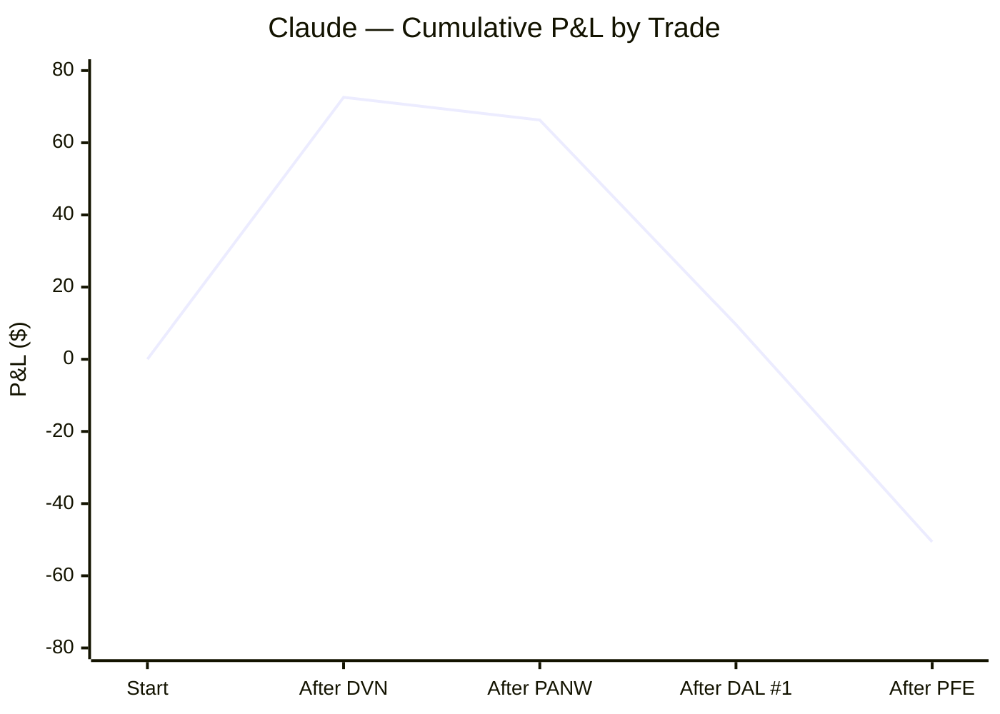
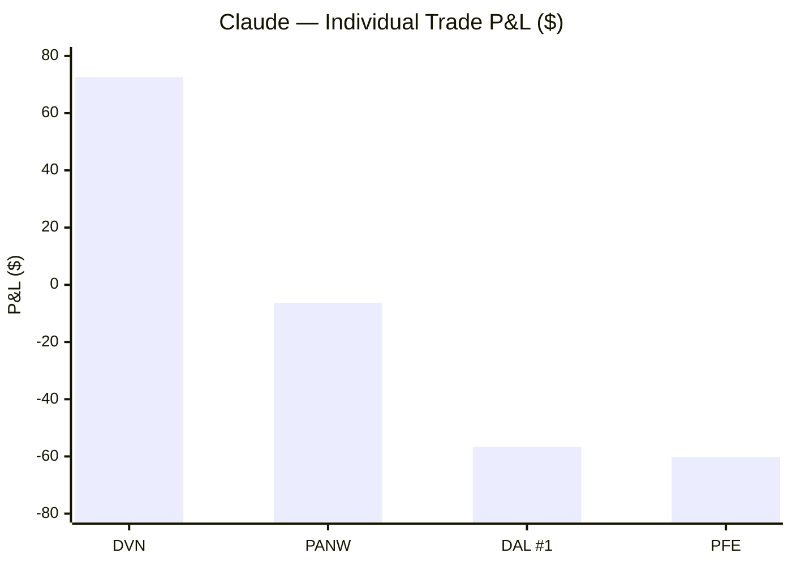
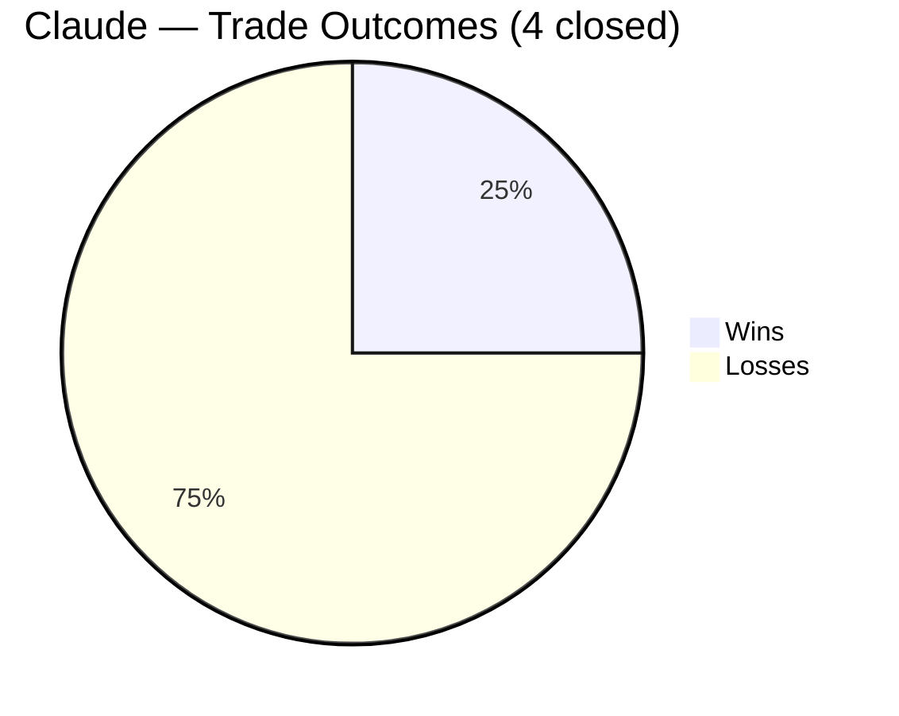
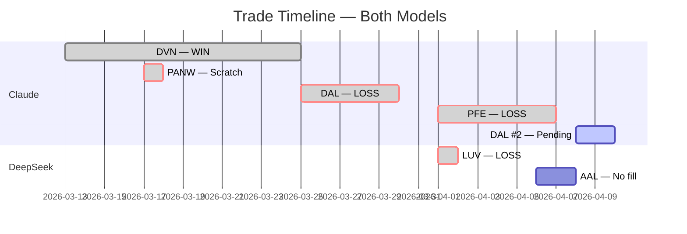

# AI Auto-Buy Thesis

> **Experiment:** Can an LLM autonomously direct profitable short-term equity trades — common stock long positions only, $1,000/position — with a human operator executing orders?

Two models are compared in parallel on the same live market data: **Claude (Anthropic)** and **DeepSeek**. Each makes fully independent decisions on trade selection, entry, stop, and target. The human only executes orders and supplies daily bar data.

**Last updated:** 2026-04-08 | **Market context:** US-Israel/Iran war (Feb 28 – ceasefire Apr 8, 2026)

---

## Overall Performance

| Metric | Claude | DeepSeek |
|---|---|---|
| Experiment start | 2026-03-13 | 2026-04-01 |
| Trades closed | 4 | 1 |
| Wins / Losses | 1 / 3 | 0 / 1 |
| Win rate | 25% | 0% |
| **Net P/L** | **-$50.60** | **-$53.82** |
| Best trade | DVN +$72.60 | — |
| Worst trade | PFE -$60.20 | LUV -$53.82 |
| Avg win | $72.60 | — |
| Avg loss | -$41.07 | -$53.82 |
| Profit factor | 0.59 | 0.00 |
| Open / pending | DAL #2 (buy stop placed) | None |

---

## Cumulative P&L

---

## Trade Timeline

---

## Claude — Full Trade Log

| # | Ticker | Entry | Exit | Days | Shares | Entry $ | Exit $ | P/L | R/R | Result |
|---|--------|-------|------|------|--------|---------|--------|-----|-----|--------|
| 1 | DVN | 2026-03-13 | 2026-03-25 | 12 | 22 | $46.05 | $49.35 | **+$72.60** | 1:1.84 | ✅ Win |
| 2 | PANW | 2026-03-17 | 2026-03-18 | 1 | 6 | $168.50 | $167.45 | **-$6.30** | — | ❌ Scratch |
| 3 | DAL | 2026-03-25 | 2026-03-30 | 5 | 14 | $67.53 | $63.48 | **-$56.70** | 1:0.89 | ❌ Loss |
| 4 | PFE | 2026-04-01 | 2026-04-07 | 6 | 35 | $28.27 | $26.55 | **-$60.20** | 1:0.86 | ❌ Loss |
| 5 | DAL | 2026-04-08 | — | — | 13 | $74.25† | — | TBD | 1:1.15 | ⏳ Pending |

†Buy stop placed; fill not confirmed as of session end.

### Claude — Cumulative P/L by Trade

| After | Ticker | Trade P/L | Running Total |
|-------|--------|-----------|---------------|
| Trade 1 | DVN | +$72.60 | +$72.60 |
| Trade 2 | PANW | -$6.30 | +$66.30 |
| Trade 3 | DAL #1 | -$56.70 | +$9.60 |
| Trade 4 | PFE | -$60.20 | **-$50.60** |

### Claude — Exit Reasons

| Trade | Exit Trigger |
|-------|-------------|
| DVN | Thesis reversal (oil falling on ceasefire), RSI 76.5, capital rotation to DAL |
| PANW | VSA CLOSE signal (two down bars + No Demand up bar = end-of-uptrend signal) |
| DAL #1 | Stop triggered at $63.48 — Iran rejected ceasefire proposal, oil reversed |
| PFE | Stop triggered at $26.55 — defensive-to-cyclical rotation on ceasefire day |

---

## DeepSeek — Full Trade Log

| # | Ticker | Entry | Exit | Days | Shares | Entry $ | Exit $ | P/L | R/R | Result |
|---|--------|-------|------|------|--------|---------|--------|-----|-----|--------|
| 1 | LUV | 2026-04-01 | 2026-04-02 | 1 | 26 | $37.99 | $35.92 | **-$53.82** | 1:1.26 | ❌ Loss |
| — | AAL | 2026-04-06 | — | — | 90 | $11.10† | — | — | 1:1.87 | ⛔ No fill |

†Buy stop placed 4/6, never triggered. Buy limit $11.30 placed and cancelled 4/8 when AAL gapped to $12.07.

### DeepSeek — Cumulative P/L by Trade

| After | Ticker | Trade P/L | Running Total |
|-------|--------|-----------|---------------|
| Trade 1 | LUV | -$53.82 | **-$53.82** |

### DeepSeek — Exit Reasons

| Trade | Exit Trigger |
|-------|-------------|
| LUV | Stop triggered at $35.92 — oil surged 8%+ on Trump Iran speech, crushed airlines at open |

---

## Benchmark Comparison

*Note: Claude experiment started 3/13; DeepSeek started 4/1. Benchmark periods differ.*

| Benchmark | Period | Return |
|-----------|--------|--------|
| S&P 500 | Mar 13 – Mar 31 | ~-7% |
| Nasdaq | Mar 13 – Mar 31 | ~-9% |
| Energy (XLE) | Mar 13 – Mar 31 | ~+12% |
| Dow | Mar 13 – Mar 31 | ~-7% |

---

## Discipline Log — Trades Avoided (Claude)

Trades considered but not taken, and what happened instead:

| Date | Ticker | Why Avoided | Outcome if Taken |
|------|--------|-------------|-----------------|
| 3/18 | Any | Fed day — binary risk, no monitoring | Market -1.36% post-hawkish Fed |
| 3/19 | NTR | Day order at $79.25 didn't fill | NTR fell to $76 next day (~$38 saved) |
| 3/20 | Any | Too ugly, no edge | S&P fell further |
| 3/24 | VLO/MPC/PSX | RSI 70+, showing distribution | Mixed |
| 3/24 | Any | Iran situation binary | Market whipsawed |
| 3/31 | AM | Buy stop $23.35 didn't fill (day order) | AM continued to deteriorate |

---

## Trading Rules Established

Rules developed and refined during the experiment:

| # | Rule | Established |
|---|------|-------------|
| 1 | Trade the dominant trend or stay in cash | Mar 13 |
| 2 | Unverifiable headlines are not a catalyst | Mar 30 (post-DAL) |
| 3 | When the target is hit, take profit | Mar 25 (DVN lesson) |
| 4 | Cash is a position — no trade is a valid choice | Mar 20 |
| 5 | Day-only orders prevent stale fills in changed conditions | Mar 19 (NTR) |
| 6 | Target $20–50/share stocks for meaningful dollar exposure | Mar 17 (CRWD lesson) |
| 7 | Respect VSA CLOSE signals immediately — no second-guessing | Mar 18 (PANW) |
| 8 | **Minimum 1:1.5 R/R on all new trades** | Apr 8 (post-PFE) |
| 9 | Defensive stocks become liabilities at inflection points | Apr 8 (post-PFE) |
| 10 | Do not chase pre-market gaps >10% — wait for pullback | Apr 8 (DeepSeek/AAL) |

---

## Market Context

The experiment ran during the **US-Israel war on Iran** (Feb 28 – Apr 8, 2026):

- **Strait of Hormuz** effectively closed → oil surged $60 → $100–120/bbl (Brent)
- **S&P 500** fell from 7,002 ATH to below 6,400; VIX ranged 25–31
- **Energy (XLE)** was the only positive S&P sector (+12%); all others negative
- **Ceasefire announced Apr 8** (brokered by Pakistan) → Brent crashed 13%+ overnight
- **Fed** held at 3.50–3.75%; only 1 cut expected in 2026; PPI came in hot (0.7% vs 0.3%)

---

## How to Update This File

After each daily session, update the following sections:

1. **Overall Performance table** — update trades closed, wins/losses, win rate, net P/L, avg loss, profit factor, open positions
2. **Claude or DeepSeek trade log** — add new row with entry/exit/P/L; update pending rows
3. **Cumulative P/L table** — add new row; update running total
4. **Exit Reasons table** — add row when a trade closes
5. **Mermaid charts** — update `line` and `bar` arrays with new values; update `pie` counts; extend gantt dates
6. **Discipline log** — add any notable avoided trades
7. **Trading rules** — add any new rules established
8. **Last updated date** at the top
