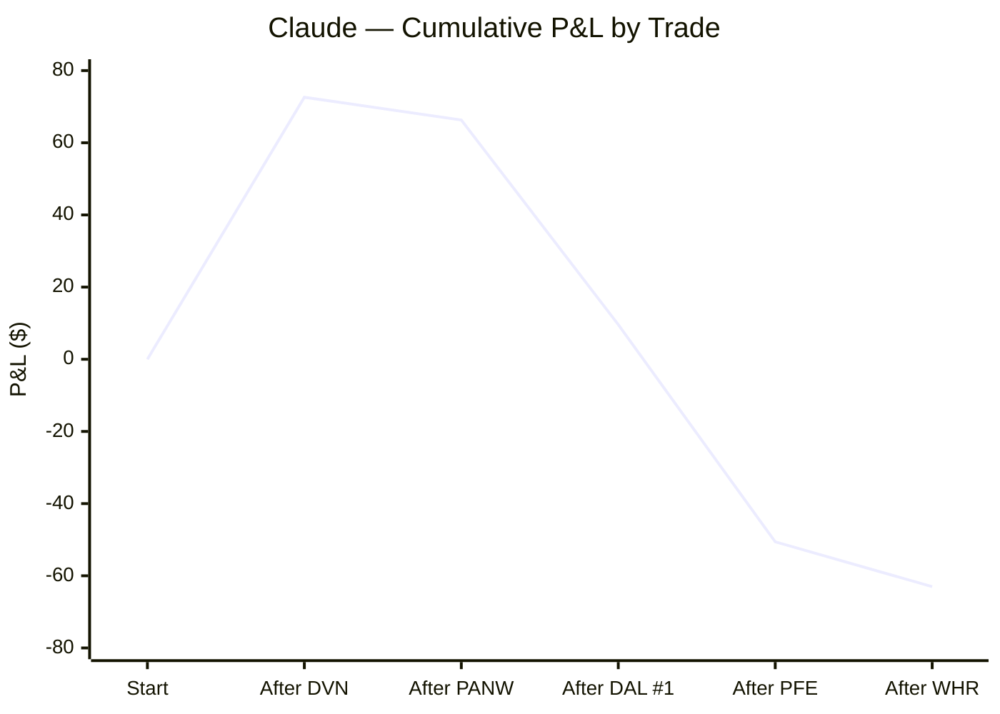
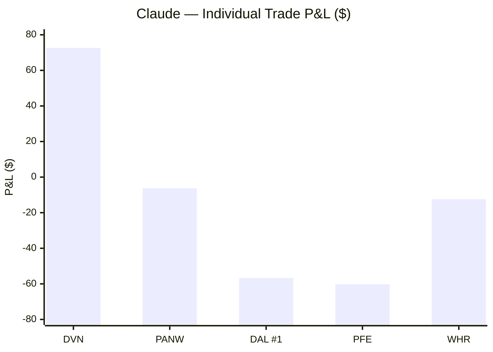
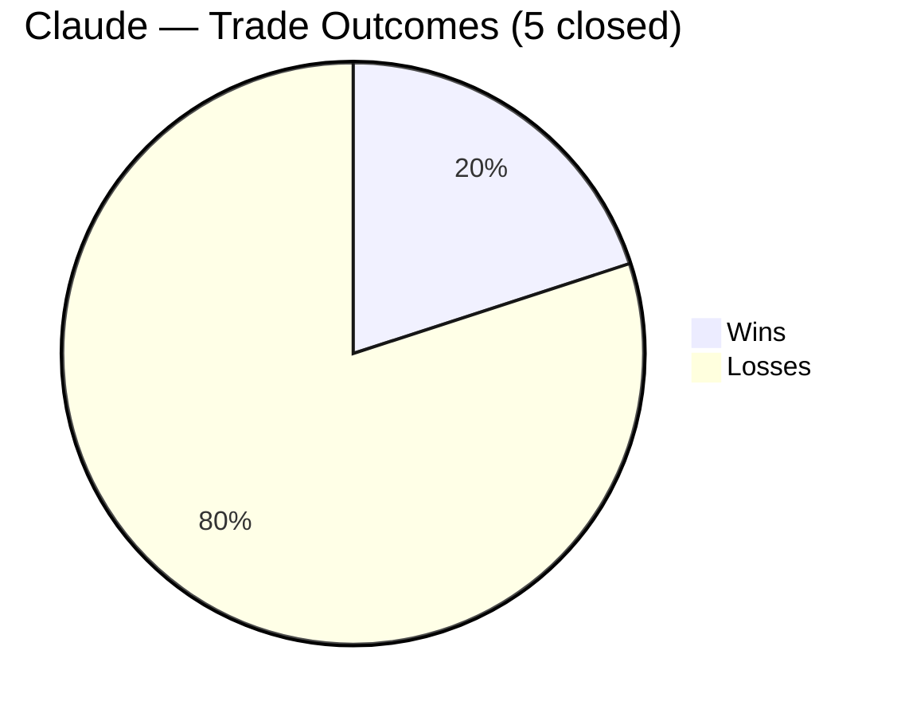
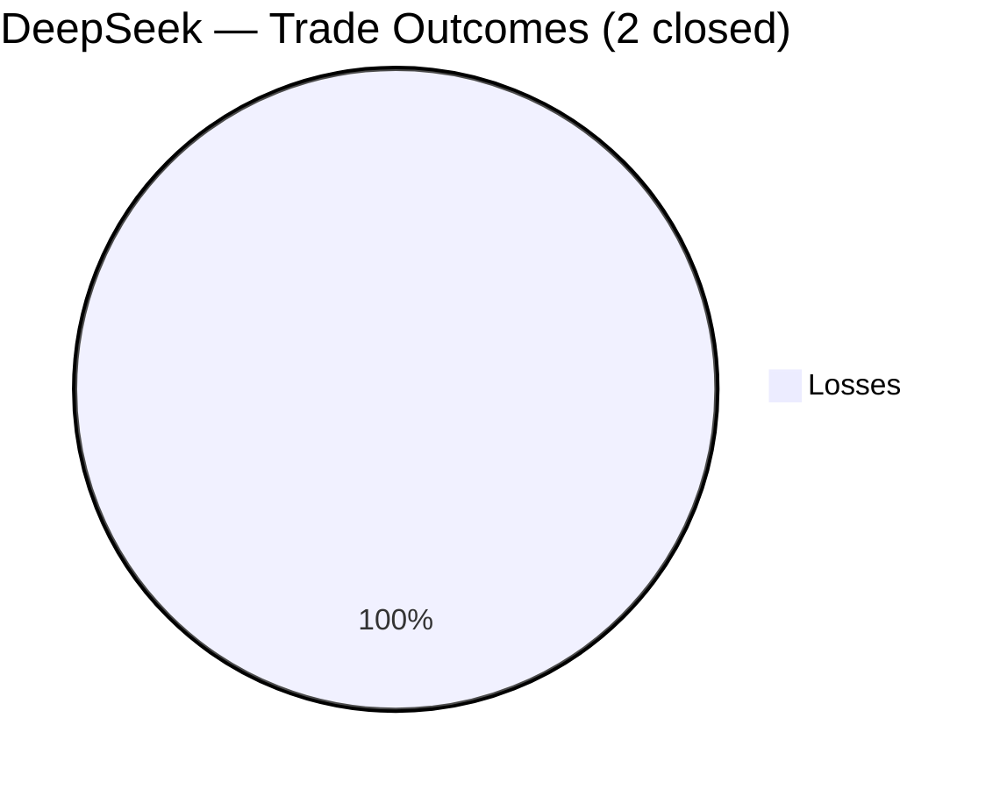
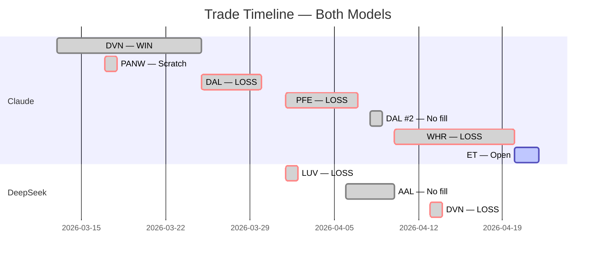

# AI Auto-Buy Thesis

> **Experiment:** Can an LLM autonomously direct profitable short-term equity trades — common stock long positions only, $1,000/position — with a human operator executing orders?

Two models are compared in parallel on the same live market data: **Claude (Anthropic)** and **DeepSeek**. Each makes fully independent decisions on trade selection, entry, stop, and target. The human only executes orders and supplies daily bar data.

**Last updated:** 2026-04-21 | **Market context:** Ceasefire deadline extended to "Wednesday evening" Washington time; mediators claim in-principle extension agreement but White House unconfirmed; Polymarket pricing extension at ~36%; Saturday was most violent Strait day (US Navy seized Iranian freighter); oil Brent slipped below $95, WTI ~$89; VIX ~21; S&P futures +0.3% cautiously positive; Claude holding ET (day 2: $18.91 close, coiling at POC $18.88, barely moved on extreme headlines — ceasefire-neutral thesis validated); DeepSeek in cash (XOM/AAL/DVN rejected — earnings event risk and technical damage)

---

## Overall Performance

| Metric | Claude | DeepSeek |
|---|---|---|
| Experiment start | 2026-03-13 | 2026-04-01 |
| Trades closed | 5 | 2 |
| Wins / Losses | 1 / 4 | 0 / 2 |
| Win rate | 20% | 0% |
| **Net P/L** | **-$63.01** | **-$79.22** |
| Best trade | DVN +$72.60 | — |
| Worst trade | PFE -$60.20 | LUV -$53.82 |
| Avg win | $72.60 | — |
| Avg loss | -$33.90 | -$39.61 |
| Profit factor | 0.54 | 0.00 |
| Open / pending | ET ($18.95 entry, stop $18.30, open) | — |

---

## Cumulative P&L

---

## Trade Timeline

---

## Claude — Full Trade Log

| # | Ticker | Entry | Exit | Days | Shares | Entry $ | Exit $ | P/L | R/R | Result |
|---|--------|-------|------|------|--------|---------|--------|-----|-----|--------|
| 1 | DVN | 2026-03-13 | 2026-03-25 | 12 | 22 | $46.05 | $49.35 | **+$72.60** | 1:1.84 | ✅ Win |
| 2 | PANW | 2026-03-17 | 2026-03-18 | 1 | 6 | $168.50 | $167.45 | **-$6.30** | — | ❌ Scratch |
| 3 | DAL | 2026-03-25 | 2026-03-30 | 5 | 14 | $67.53 | $63.48 | **-$56.70** | 1:0.89 | ❌ Loss |
| 4 | PFE | 2026-04-01 | 2026-04-07 | 6 | 35 | $28.27 | $26.55 | **-$60.20** | 1:0.86 | ❌ Loss |
| 5 | DAL | 2026-04-08 | 2026-04-08 | — | 13 | $74.25† | — | $0 | 1:1.15 | ⛔ No fill |
| 6 | WHR | 2026-04-10 | 2026-04-20 | 8 | 17 | $57.25‡ | $56.52 | **-$12.41** | 1:1.43 | ❌ Loss |
| 7 | ET | 2026-04-20 | — | — | 53 | $18.95§ | — | — | 1:1.23 | ⏳ Open |

†Day-only buy stop at $74.25. High was $74.19 — missed by 6 cents. DAL then collapsed to $68.08 (100% sell pressure, 20.7M vol). Order expired. Saved ~$80.

§Buy stop filled at $18.95. Midstream pipeline — ceasefire-neutral thesis: toll-road business model (fee-based, volume-driven) works in both outcomes. 93% buy reversal bar on 4/17 signaling seller exhaustion. POC at $18.88 as base. RSI 48 (neutral). ATR $0.40 (lowest volatility of any trade). 53 shares = best dollar exposure of experiment ($5.30 per $0.10 move). Max risk $34.45 — tightest of any trade. Stop $18.30, target $19.75. Represents strategic evolution: designed to profit regardless of geopolitical outcome. Day 2 (4/21): $18.91 close, premarket $18.91. Tight $0.19 range (half ATR) with 58% buy / 42% sell — coiling at POC $18.88. Volume 19.0M supportive. RSI 49.6 dead neutral. Saturday was the most violent day in the Strait since the crisis began (US Navy seized Iranian freighter, oil +6% overnight) — yet ET moved $0.05 total. Ceasefire-neutral thesis validated in real-time. Cash held on second $1,000 pending ceasefire resolution Wednesday evening.

‡Buy limit filled at $57.25. Consumer/housing recovery play — deeply oversold (-28% from 200d SMA), five days of institutional accumulation (68-85% buy), POC at $70.70 overhead. Stop $53.30. VSA: Bag Holding background strength + No Supply (most bullish combination seen in experiment). Premarket 4/13: $56.01 (-$21.08 unrealized). Premarket 4/14: $56.35 (-$15.30 unrealized). VSA upgraded trend from Consolidation → Markup on 4/14; background strength intact; holding through active naval blockade. Premarket 4/15: $56.35 (-$15.30 unrealized). Three consecutive sessions of clean HOLD — tightening range ($1.33 vs ATR $2.53), buy pressure returned to 65% on 4/13 despite 7% oil spike on blockade. Coiling pattern (compressed range + institutional support) typically resolves upward. Premarket 4/16: $56.04 (-$20.57 unrealized). Four consecutive HOLD sessions. Diplomatic backdrop improving: Israel-Lebanon historic leader call (first direct contact in 34 years) + US-Iran back-channel negotiations targeting second summit before ceasefire expires ~April 22. Day 5 (4/17): Stop trailed from $53.30 → $54.50 (below 4/14 and 4/15 lows of $54.54/$54.47); max risk tightened from ~$67 to ~$47. Premarket $56.88 — recovering from yesterday's 8%/92% distribution bar that hit $58.22 intraday then closed $55.99. Fifth consecutive HOLD; VSA background strength (Bag Holding, 6 bars ago) intact. Lebanon 10-day ceasefire began 4/16; Trump "very close" to Iran deal — strongest diplomatic signal to date. Hard exit deadline: before ceasefire expiration ~April 22.

### Claude — Cumulative P/L by Trade

| After | Ticker | Trade P/L | Running Total |
|-------|--------|-----------|---------------|
| Trade 1 | DVN | +$72.60 | +$72.60 |
| Trade 2 | PANW | -$6.30 | +$66.30 |
| Trade 3 | DAL #1 | -$56.70 | +$9.60 |
| Trade 4 | PFE | -$60.20 | -$50.60 |
| Trade 5 | WHR | -$12.41 | **-$63.01** |

### Claude — Exit Reasons

| Trade | Exit Trigger |
|-------|-------------|
| DVN | Thesis reversal (oil falling on ceasefire), RSI 76.5, capital rotation to DAL |
| PANW | VSA CLOSE signal (two down bars + No Demand up bar = end-of-uptrend signal) |
| DAL #1 | Stop triggered at $63.48 — Iran rejected ceasefire proposal, oil reversed |
| PFE | Stop triggered at $26.55 — defensive-to-cyclical rotation on ceasefire day |
| WHR | Manual exit at $56.52 ahead of ceasefire expiration (April 21-22) — VSA healthy (7 consecutive HOLDs, Bag Holding intact) but binary geopolitical risk overrode system signal; smallest loss of experiment |

---

## DeepSeek — Full Trade Log

| # | Ticker | Entry | Exit | Days | Shares | Entry $ | Exit $ | P/L | R/R | Result |
|---|--------|-------|------|------|--------|---------|--------|-----|-----|--------|
| 1 | LUV | 2026-04-01 | 2026-04-02 | 1 | 26 | $37.99 | $35.92 | **-$53.82** | 1:1.26 | ❌ Loss |
| — | AAL | 2026-04-06 | — | — | 90 | $11.10† | — | — | 1:1.87 | ⛔ No fill |
| 2 | DVN | 2026-04-13 | 2026-04-14 | 1 | 20 | $48.25 | $46.98 | **-$25.40** | 1:1.57 | ❌ Loss |

†Buy stop placed 4/6, never triggered. Buy limit $11.30 placed and cancelled 4/8 when AAL gapped to $12.07. April 8 bar: 96% sell on 100.3M volume — distribution signal confirmed, no further entry attempted.

### DeepSeek — Cumulative P/L by Trade

| After | Ticker | Trade P/L | Running Total |
|-------|--------|-----------|---------------|
| Trade 1 | LUV | -$53.82 | -$53.82 |
| Trade 2 | DVN | -$25.40 | **-$79.22** |

### DeepSeek — Exit Reasons

| Trade | Exit Trigger |
|-------|-------------|
| LUV | Stop triggered at $35.92 — oil surged 8%+ on Trump Iran speech, crushed airlines at open |
| DVN | Closed at market open — April 13 bar showed 75% sell pressure breaking prior low; pre-market weakness to $46.98 confirmed thesis failure; exited to preserve capital |

---

## Benchmark Comparison

*Note: Claude experiment started 3/13; DeepSeek started 4/1. Benchmark periods differ.*

| Benchmark | Period | Return |
|-----------|--------|--------|
| S&P 500 | Mar 13 – Mar 31 | ~-7% |
| Nasdaq | Mar 13 – Mar 31 | ~-9% |
| Energy (XLE) | Mar 13 – Mar 31 | ~+12% |
| Dow | Mar 13 – Mar 31 | ~-7% |

---

## Discipline Log — Trades Avoided (Claude)

Trades considered but not taken, and what happened instead:

| Date | Ticker | Why Avoided | Outcome if Taken |
|------|--------|-------------|-----------------|
| 3/18 | Any | Fed day — binary risk, no monitoring | Market -1.36% post-hawkish Fed |
| 3/19 | NTR | Day order at $79.25 didn't fill | NTR fell to $76 next day (~$38 saved) |
| 3/20 | Any | Too ugly, no edge | S&P fell further |
| 3/24 | VLO/MPC/PSX | RSI 70+, showing distribution | Mixed |
| 3/24 | Any | Iran situation binary | Market whipsawed |
| 3/31 | AM | Buy stop $23.35 didn't fill (day order) | AM continued to deteriorate |
| 4/8 | DAL | Day-only stop $74.25; high was $74.19 (6¢ short) | DAL collapsed to $68.08 with 100% sell pressure — avoided ~$80 loss |
| 4/10 | OPCH | Cherry-picked from portfolio list instead of independent macro analysis | Abandoned — corrected process to top-down macro screening |
| 4/10 | OLN | ATR $1.77 on $28 stock (6.3% daily range); POC below price, no overhead magnet | Not entered |
| 4/10 | KBH | Only 19 shares/$1,000; guidance cut citing war | Not entered |
| 4/10 | BLDR | Only 11 shares/$1,000; ATR $4.52 (entire risk budget in one day's range) | Not entered |
| 4/13 | All new entries | Islamabad talks failed after 21h; Trump naval blockade of Iranian ports (10am EST); IRGC called it ceasefire violation — binary headline risk, no edge | Avoided — cash preserved; WHR held on VSA HOLD |
| 4/14 | All new entries | Active US naval blockade; IRGC on maximum combat alert; Iran threatening Persian Gulf ports; US destroyers at the Strait — potential military incident = instant risk-off | Avoided — WHR held (VSA upgraded to Markup); no new capital deployed |
| 4/15 | All new entries (Claude) | Active naval blockade ongoing; risk of Strait confrontation; but market absorbing well — holding cash pending further stabilization | Avoided — WHR held (VSA 3rd straight HOLD, coiling); no new capital |
| 4/15 | AAL, DVN, DAL (DeepSeek) | Damaged patterns post-distribution; no VSA spring/test/bottom reversal setup on any candidate | Stayed in cash |
| 4/16 | All new entries (Claude) | Active naval blockade + ceasefire expiring in 6 days; one position open (WHR on day 4); no second $1,000 deployed until diplomatic picture clarifies | Avoided — WHR held (4th straight HOLD, Bag Holding); no new capital |
| 4/16 | AAL, DVN, XOM (DeepSeek) | AAL: 81% sell on 4/15 — distribution reversed prior day's rally; DVN: below all MAs, no spring, no accumulation; XOM: spring low ($150.98) violated on 4/14 ($146.72) — structure broken | Stayed in cash |
| 4/17 | All new entries (Claude) | S&P at all-time highs; every screened name in $20-50 range either overbought (CROX RSI 74.5, LEVI RSI 67.7) or showing 80-92% sell distribution bars (CCL 32M vol, CARR 17M vol); market up 15% in 15 days — no edge entering crowded recovery trade | Stayed in cash; WHR held (5th HOLD, stop trailed) |
| 4/17 | AAL (DeepSeek) | 81% sell pressure on 4/15 — distribution not healed; earnings due April 23 (event risk); no VSA spring or test; three-day Easter weekend ahead | Stayed in cash |
| 4/20 | AR (Claude) | RSI 38.1, below 20d SMA by $4; falling knife ($41→$36 in two weeks) despite two buying bars — trend clearly down | Not entered |
| 4/20 | FANG (Claude) | $180/share — only 5 shares on $1,000; disqualified by position sizing rule | Not entered |
| 4/20 | AAL (DeepSeek) | Pre-market -3% on merger rejection; oil surge headwind; earnings April 23 (event risk); technical damage from April 8 distribution unremedied; no VSA spring/test | Stayed in cash |
| 4/20 | XOM (DeepSeek) | Spring low ($150.98) violated April 14 ($146.72) — structure broken; earnings April 21 add event risk; no clean VSA setup | Stayed in cash |
| 4/20 | DVN (DeepSeek) | Below all key moving averages; prior accumulation pattern failed completely; no buy signal | Stayed in cash |
| 4/20 | Energy sector OXY/HAL/COP (DeepSeek) | Oil surging but stocks caught in broader risk-off downdraft; no VSA entry patterns identified | Stayed in cash |
| 4/21 | All new entries (Claude) | Ceasefire expires Wednesday evening (extended from Tuesday); mediators claim in-principle agreement but White House unconfirmed — binary outcome with no directional edge; holding cash until resolution | Stayed in cash; ET held (day 2, coiling at POC) |
| 4/21 | XOM (DeepSeek) | Earnings pre-market today — event risk too high to enter before release | Stayed in cash |
| 4/21 | AAL (DeepSeek) | Technical damage from April 8 distribution unremedied; earnings April 23 add event risk | Stayed in cash |
| 4/21 | DVN (DeepSeek) | Below key moving averages; no spring/test/bottom reversal setup | Stayed in cash |

---

## Trading Rules Established

Rules developed and refined during the experiment:

| # | Rule | Established |
|---|------|-------------|
| 1 | Trade the dominant trend or stay in cash | Mar 13 |
| 2 | Unverifiable headlines are not a catalyst | Mar 30 (post-DAL) |
| 3 | When the target is hit, take profit | Mar 25 (DVN lesson) |
| 4 | Cash is a position — no trade is a valid choice | Mar 20 |
| 5 | Day-only orders prevent stale fills in changed conditions | Mar 19 (NTR) |
| 6 | Target $20–50/share stocks for meaningful dollar exposure | Mar 17 (CRWD lesson) |
| 7 | Respect VSA CLOSE signals immediately — no second-guessing | Mar 18 (PANW) |
| 8 | **Minimum 1:1.5 R/R on all new trades** | Apr 8 (post-PFE) |
| 9 | Defensive stocks become liabilities at inflection points | Apr 8 (post-PFE) |
| 10 | Do not chase pre-market gaps >10% — wait for pullback | Apr 8 (DeepSeek/AAL) |
| 11 | Screen from the whole market top-down; never cherry-pick from existing portfolio | Apr 10 (OPCH lesson) |

---

## Market Context

The experiment ran during the **US-Israel war on Iran** (Feb 28 – Apr 8, 2026):

- **Strait of Hormuz** effectively closed → oil surged $60 → $100–120/bbl (Brent)
- **S&P 500** fell from 7,002 ATH to below 6,400; VIX ranged 25–31
- **Energy (XLE)** was the only positive S&P sector (+12%); all others negative
- **Ceasefire announced Apr 8** (brokered by Pakistan) → Brent crashed 13%+ overnight
- **Fed** held at 3.50–3.75%; only 1 cut expected in 2026; PPI came in hot (0.7% vs 0.3%)

---

## How to Update This File

After each daily session, update the following sections:

1. **Overall Performance table** — update trades closed, wins/losses, win rate, net P/L, avg loss, profit factor, open positions
2. **Claude or DeepSeek trade log** — add new row with entry/exit/P/L; update pending rows
3. **Cumulative P/L table** — add new row; update running total
4. **Exit Reasons table** — add row when a trade closes
5. **Mermaid charts** — update `line` and `bar` arrays with new values; update `pie` counts; extend gantt dates
6. **Discipline log** — add any notable avoided trades
7. **Trading rules** — add any new rules established
8. **Last updated date** at the top
